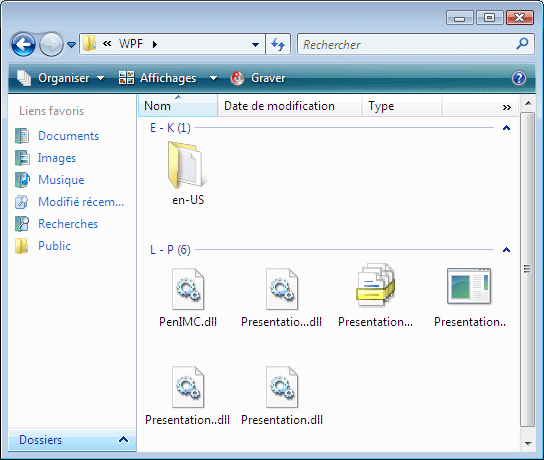

# Implémentation du modèle de contrôle Grid d’UI Automation
> [!NOTE]
>  Cette documentation s'adresse aux développeurs .NET Framework qui souhaitent utiliser les classes [!INCLUDE[TLA2#tla_uiautomation](../../../includes/tla2sharptla-uiautomation-md.md)] managées définies dans l'espace de noms <xref:System.Windows.Automation>. Pour plus d’informations sur [!INCLUDE[TLA2#tla_uiautomation](../../../includes/tla2sharptla-uiautomation-md.md)], consultez [Windows Automation API : UI Automation](https://go.microsoft.com/fwlink/?LinkID=156746).  
  
 Cette rubrique présente les conventions et directives à respecter pour implémenter <xref:System.Windows.Automation.Provider.IGridProvider>, notamment les informations sur les propriétés, les méthodes et les événements. Des liens vers des références supplémentaires sont répertoriés à la fin de la vue d'ensemble.  
  
 Le modèle de contrôle <xref:System.Windows.Automation.GridPattern> permet de prendre en charge les contrôles qui agissent comme des conteneurs pour une collection d’éléments enfants. Les enfants de cet élément doivent implémenter <xref:System.Windows.Automation.Provider.IGridItemProvider> et être organisés en un système de coordonnées logiques à deux dimensions, qui peut être parcouru par ligne et par colonne. Pour obtenir des exemples de contrôles implémentant ce modèle de contrôle, consultez [Control Pattern Mapping for UI Automation Clients](../../../docs/framework/ui-automation/control-pattern-mapping-for-ui-automation-clients.md).  
  
   
## Conventions et recommandations en matière d'implémentation  
 Quand vous implémentez le modèle de contrôle Grid, notez les conventions et recommandations suivantes :  
  
-   Les coordonnées de grille sont de base zéro, les coordonnées de la cellule supérieure gauche (ou supérieure droite en fonction des paramètres régionaux) ayant pour coordonnées (0, 0).  
  
-   Si une cellule est vide, un élément UI Automation doit être retourné pour permettre la prise en charge de la propriété <xref:System.Windows.Automation.Provider.IGridItemProvider.ContainingGrid%2A> de cette cellule. Cela est possible quand la disposition des éléments enfants de la grille est semblable à celle d’un tableau non justifié (consultez l’exemple ci-dessous).  
  
   
Exemple de contrôle Grid avec des coordonnées vides  
  
-   Une grille avec un seul élément est nécessaire pour implémenter <xref:System.Windows.Automation.Provider.IGridProvider> , s’il est logiquement considéré comme une grille. Le nombre d’éléments enfants de la grille est immatériel.  
  
-   Selon l’implémentation du fournisseur, les lignes et les colonnes masquées peuvent être chargées dans l’arborescence [!INCLUDE[TLA2#tla_uiautomation](../../../includes/tla2sharptla-uiautomation-md.md)] , et sont donc reflétées dans les propriétés <xref:System.Windows.Automation.GridPattern.GridPatternInformation.RowCount%2A> et <xref:System.Windows.Automation.GridPattern.GridPatternInformation.ColumnCount%2A> . Si les lignes et les colonnes masquées n’ont pas encore été chargées, elles ne doivent pas être comptabilisées.  
  
-   <xref:System.Windows.Automation.Provider.IGridProvider> n’active pas la manipulation active d’une grille. <xref:System.Windows.Automation.Provider.ITransformProvider> doit être implémenté pour activer cette fonctionnalité.  
  
-   Utilisez <xref:System.Windows.Automation.StructureChangedEventHandler> pour écouter les changements de structure ou de disposition apportés à la grille, par exemple quand des cellules sont ajoutées, supprimées ou fusionnées.  
  
-   Utilisez <xref:System.Windows.Automation.AutomationFocusChangedEventHandler> pour suivre le parcours des éléments ou des cellules d’une grille.  
  
   
## Membres obligatoires pour IGridProvider  
 Les propriétés et méthodes suivantes sont nécessaires à l’implémentation de l’interface IGridProvider.  
  
|Membres requis|Type|Notes|  
|----------------------|----------|-----------|  
|<xref:System.Windows.Automation.Provider.IGridProvider.RowCount%2A>|Propriété|Aucun.|  
|<xref:System.Windows.Automation.Provider.IGridProvider.ColumnCount%2A>|Propriété|Aucun.|  
|<xref:System.Windows.Automation.Provider.IGridProvider.GetItem%2A>|Méthode|Aucune|  
  
 Ce modèle de contrôle n’est associé aucun événement.  
  
   
## Exceptions  
 Les fournisseurs doivent lever les exceptions suivantes.  
  
|Type d'exception|Condition|  
|--------------------|---------------|  
|<xref:System.ArgumentOutOfRangeException>|<xref:System.Windows.Automation.Provider.IGridProvider.GetItem%2A>   -Si la coordonnée de la ligne demandée est supérieure à la <xref:System.Windows.Automation.Provider.IGridProvider.RowCount%2A> ou coordonnée de la colonne est supérieure à la <xref:System.Windows.Automation.Provider.IGridProvider.ColumnCount%2A>.|  
|<xref:System.ArgumentOutOfRangeException>|<xref:System.Windows.Automation.Provider.IGridProvider.GetItem%2A>   -Si soit de la ligne demandée ou la colonne coordonnées est inférieur à zéro.|  
  
## Voir aussi  
 [Vue d’ensemble des modèles de contrôle UI Automation](../../../docs/framework/ui-automation/ui-automation-control-patterns-overview.md)  
 [Prendre en charge des modèles de contrôle dans un fournisseur UI Automation](../../../docs/framework/ui-automation/support-control-patterns-in-a-ui-automation-provider.md)  
 [Modèles de contrôle UI Automation pour les clients](../../../docs/framework/ui-automation/ui-automation-control-patterns-for-clients.md)  
 [Implémentation du modèle de contrôle GridItem d’UI Automation](../../../docs/framework/ui-automation/implementing-the-ui-automation-griditem-control-pattern.md)  
 [Présentation de l’arborescence UI Automation](../../../docs/framework/ui-automation/ui-automation-tree-overview.md)  
 [Utiliser la mise en cache dans UI Automation](../../../docs/framework/ui-automation/use-caching-in-ui-automation.md)
