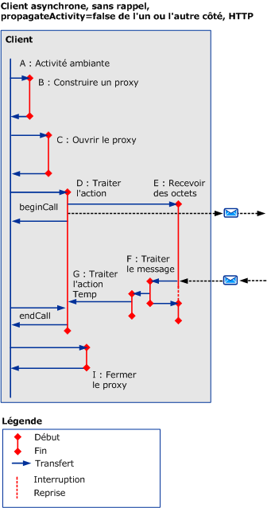

# Sc&#233;narios synchrones utilisant HTTP, TCP ou Canal nomm&#233;
Cette rubrique décrit les activités et transferts pour différents scénarios de demande\/réponse asynchrones, avec des demandes multithread utilisant une connexion HTTP, TCP ou de canal nommé.  
  
## Demande\/réponse asynchrone sans erreurs  
 Cette section décrit les activités et transferts pour un scénario de demande\/réponse asynchrone, avec des clients multithread.  
  
 L'activité de l'appelant se termine lorsque `beginCall` est retourné et `endCall` est retourné.Si un rappel est appelé, celui\-ci est retourné.  
  
 L'activité appelée se termine lorsque `beginCall` est retourné, `endCall` est retourné, ou lorsque le rappel est retourné s'il a été appelé à partir de cette activité.  
  
### Client asynchrone sans rappel  
  
#### La propagation est activée de chaque côté, avec HTTP  
   
  
 Figure 1.Client asynchrone, sans rappel, `propagateActivity`\=`true` de chaque côté, HTTP  
  
 Si `propagateActivity`\=`true`, ProcessMessage indique l'activité ProcessAction vers laquelle exécuter le transfert.  
  
 Pour les scénarios HTTP, l'activité ReceiveBytes est appelée sur le premier message à envoyer et existe pendant la durée de vie de la demande.  
  
#### La propagation est désactivée d'un côté ou de l'autre, avec HTTP  
 Si `propagateActivity`\=`false` d'un côté ou de l'autre, ProcessMessage n'indique pas l'activité ProcessAction vers laquelle exécuter le transfert.Par conséquent, une nouvelle activité ProcessAction temporaire avec un nouvel ID est appelée.Lorsque la réponse asynchrone est mise en correspondance avec la demande dans le code ServiceModel, l'ID d'activité peut être récupéré du contexte local.Cet ID permet d'effectuer un transfert vers l'activité ProcessAction réelle.  
  
   
  
 Figure 2.Client asynchrone, sans rappel, `propagateActivity`\=`false` d'un côté ou de l'autre, HTTP  
  
 Pour les scénarios HTTP, l'activité ReceiveBytes est appelée sur le premier message à envoyer et existe pendant la durée de vie de la demande.  
  
 Une activité Traiter l'action est créée sur un client asynchrone lorsque `propagateActivity`\=`false` au niveau de l'appelant ou de l'appelé, et lorsque le message de réponse n'inclut pas d'en\-tête Action header.  
  
#### La propagation est activée de chaque côté, avec TCP ou Canal nommé  
   
  
 Figure 3.Client asynchrone, sans rappel, `propagateActivity`\=`true` de chaque côté, canal nommé\/TCP  
  
 Pour un scénario Canal nommé ou TCP, l'activité ReceiveBytes est appelée lorsque le client est ouvert, et existe pendant la durée de vie de la connexion.  
  
 Identique à la figure 1, si `propagateActivity`\=`true`, ProcessMessage indique l'activité ProcessAction vers laquelle exécuter le transfert.  
  
#### La propagation est désactivée d'un côté ou de l'autre, avec TCP ou Canal nommé  
 Pour un scénario Canal nommé ou TCP, l'activité ReceiveBytes est appelée lorsque le client est ouvert, et existe pendant la durée de vie de la connexion.  
  
 Identique à la figure 2, si `propagateActivity`\=`false` d'un côté ou de l'autre, ProcessMessage n'indique pas l'activité ProcessAction vers laquelle exécuter le transfert.Par conséquent, une nouvelle activité ProcessAction temporaire avec un nouvel ID est appelée.Lorsque la réponse asynchrone est mise en correspondance avec la demande dans le code ServiceModel, l'ID d'activité peut être récupéré du contexte local.Cet ID permet d'effectuer un transfert vers l'activité ProcessAction réelle.  
  
   
  
 Figure 4.Client asynchrone, sans rappel, `propagateActivity`\=`false` d'un côté ou de l'autre, canal nommé\/TCP  
  
### Client asynchrone avec rappel  
 Ce scénario ajoute les activités G et A', pour le rappel et `endCall`, et leurs transferts entrants\/sortants.  
  
 Cette section montre seulement l'utilisation de HTTP lorsque `propragateActivity`\=`true`.Toutefois, les activités et transferts supplémentaires s'appliquent également aux autres cas \(c'est\-à\-dire, `propagateActivity`\=`false`, avec TCP ou Canal nommé\).  
  
 Le rappel crée une activité \(G\) lorsque le client appelle le code utilisateur pour notifier que les résultats sont prêts.Le code utilisateur appelle ensuite `endCall` dans le rappel \(comme indiqué à la figure 5\) ou hors de celui\-ci \(figure 6\).Étant donné que l'activité de l'utilisateur à partir de laquelle `endCall` est appelé n'est pas connue, celle\-ci est étiquetée `A’`.L'activité A' peut être identique ou différente de l'activité A.  
  
   
  
 Figure 5.Client asynchrone avec rappel, `endCall` à l'intérieur du rappel  
  
   
  
 Figure 6.Client asynchrone avec rappel, `endCall` hors du rappel  
  
### Serveur asynchrone avec rappel  
   
  
 Figure 7.Serveur asynchrone avec rappel  
  
 La pile de canaux rappelle le client à la réception des messages : les traces de ce processus sont émises dans l'activité ProcessRequest elle\-même.  
  
## Demande\/Réponse asynchrone avec erreurs  
 Des messages d'erreur sont reçus au cours de `endCall`.Sinon, les activités et transferts sont identiques aux scénarios précédents.  
  
## Communication unidirectionnelle asynchrone avec ou sans erreurs  
 Aucune réponse ou erreur n'est renvoyée au client.