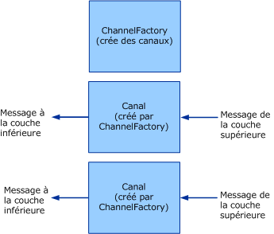

# <a name="client-channel-factories-and-channels"></a>Client : fabrications de canaux et canaux
Cette rubrique décrit la création de fabrications de canaux et de canaux.  
  
## <a name="channel-factories-and-channels"></a>Fabrications de canaux et canaux  
 Les fabrications de canaux sont chargées de créer des canaux. Les canaux créés par les fabrications de canaux sont utilisés pour l'envoi de messages. Ces canaux sont chargés d'obtenir le message de la couche supérieure, quel que soit le traitement nécessaire pour y arriver, puis de l'envoyer à la couche inférieure. Le graphique ci-dessous illustre ce processus.  
  
   
Une fabrication de canal crée des canaux.  
  
 Une fois fermées, les fabrications de canaux sont chargées de fermer tous les canaux qu'elles ont créés et qui ne sont pas déjà fermés. Notez que le modèle présenté ici est asymétrique car lorsqu'un écouteur de canal est fermé, il cesse seulement d'accepter de nouveaux canaux mais laisse les canaux existants ouverts afin qu'ils puissent continuer à recevoir des messages.  
  
 WCF fournit des Assistants de classe de base pour ce processus. (Pour un diagramme des classes d’assistance canal décrites dans cette rubrique, consultez [vue d’ensemble du modèle de canal](../../../../docs/framework/wcf/extending/channel-model-overview.md).)  
  
-   Le <xref:System.ServiceModel.Channels.CommunicationObject> la classe implémente <xref:System.ServiceModel.ICommunicationObject> et applique la machine à états décrite à l’étape 2 de [développement canaux](../../../../docs/framework/wcf/extending/developing-channels.md).  
  
-   Le <xref:System.ServiceModel.Channels.ChannelManagerBase> la classe implémente <xref:System.ServiceModel.Channels.CommunicationObject> et fournit une classe de base unifiée pour <xref:System.ServiceModel.Channels.ChannelFactoryBase?displayProperty=nameWithType> et <xref:System.ServiceModel.Channels.ChannelListenerBase?displayProperty=nameWithType>. La classe <xref:System.ServiceModel.Channels.ChannelManagerBase> fonctionne avec <xref:System.ServiceModel.Channels.ChannelBase>, qui est une classe de base implémentant <xref:System.ServiceModel.Channels.IChannel>.
  
-   Le <xref:System.ServiceModel.Channels.ChannelFactoryBase> la classe implémente <xref:System.ServiceModel.Channels.ChannelManagerBase> et <xref:System.ServiceModel.Channels.IChannelFactory> et regroupe les `CreateChannel` les surcharges en une seule `OnCreateChannel` méthode abstraite.
  
-   Le <xref:System.ServiceModel.Channels.ChannelListenerBase> la classe implémente <xref:System.ServiceModel.Channels.IChannelListener>. Elle se charge de la gestion d'état de base. 
  
 La discussion suivante est basée sur le [Transport : UDP](../../../../docs/framework/wcf/samples/transport-udp.md) exemple.  
  
### <a name="creating-a-channel-factory"></a>Création d'une fabrication de canal  
 `UdpChannelFactory` dérive de <xref:System.ServiceModel.Channels.ChannelFactoryBase>. L'exemple substitue <xref:System.ServiceModel.Channels.ChannelFactoryBase.GetProperty%2A> pour fournir un accès à la version du message de l'encodeur de message. L'exemple substitue également <xref:System.ServiceModel.Channels.ChannelFactoryBase.OnClose%2A> pour détruire notre instance de <xref:System.ServiceModel.Channels.BufferManager> lors des transitions d'ordinateurs d'état.  
  
#### <a name="the-udp-output-channel"></a>Canal de sortie UDP  
 `UdpOutputChannel` implémente <xref:System.ServiceModel.Channels.IOutputChannel>. Le constructeur valide les arguments et construit un objet <xref:System.Net.EndPoint> de destination reposant sur le <xref:System.ServiceModel.EndpointAddress> qui est passé.  
  
 La substitution de la méthode <xref:System.ServiceModel.Channels.CommunicationObject.OnOpen%2A> crée un socket qui est utilisé pour envoyer des messages à ce <xref:System.Net.EndPoint>.  
  
 `this.socket = new Socket(`  
  
 `this.remoteEndPoint.AddressFamily,`  
  
 `SocketType.Dgram,`  
  
 `ProtocolType.Udp`  
  
 `);`  
  
 Le canal peut être fermé de façon appropriée ou incorrecte. Si le canal est fermé de façon normale, le socket est fermé et un appel à la méthode `OnClose` de la classe de base est réalisé. Si une exception est alors levée, l'infrastructure appelle `Abort` pour veiller à ce que le canal soit nettoyé.  
  
```  
this.socket.Close();  
base.OnClose(timeout);  
```  
  
 Implémentez `Send()` et `BeginSend()` / `EndSend()`. Deux phases peuvent alors être distinguées. Tout d'abord, la sérialisation du message dans un tableau d'octets :  
  
```  
ArraySegment<byte> messageBuffer = EncodeMessage(message);  
```  
  
 Puis, l'envoi des données obtenues sur le câble :  
  
```  
this.socket.SendTo(  
  messageBuffer.Array,   
  messageBuffer.Offset,   
  messageBuffer.Count,   
  SocketFlags.None,   
  this.remoteEndPoint  
);  
```  
  
## <a name="see-also"></a>Voir aussi  
 [Développement de canaux](../../../../docs/framework/wcf/extending/developing-channels.md)
