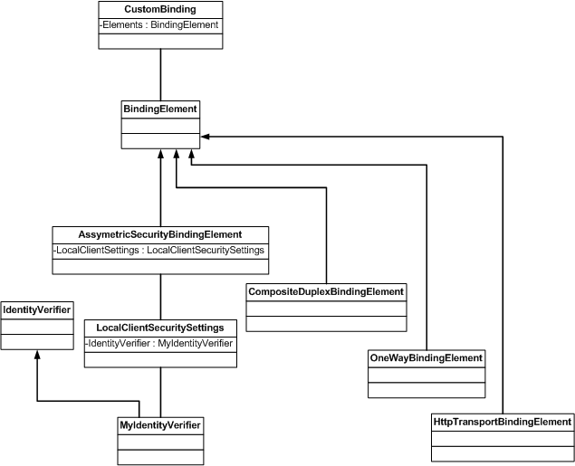

# Comment : utiliser des certificats X.509 distincts pour les signatures et le chiffrement
Cette rubrique montre comment configurer Windows Communication Foundation (WCF) pour utiliser différents certificats pour la signature et le cryptage sur le client et le service.  
  
 Pour activer des certificats à utiliser pour la signature et le chiffrement, un client personnalisé service credentials (ou) doit être créés car WCF ne fournit pas d’une API pour définir plusieurs certificats de client ou le service. En outre, un gestionnaire de jetons de sécurité doit être configuré pour permettre l'exploitation des informations de l'ensemble des certificats et la création d'un fournisseur de jetons de sécurité qui convienne à l'utilisation des clés et à la direction des messages spécifiées.  
  
 Le diagramme suivant montre les classes principales utilisées, les classes (indiquées par une flèche pointant vers le haut) desquelles ils héritent et les types de retour de certaines méthodes et propriétés.  
  
-   `MyClientCredentials` est une implémentation personnalisée de <xref:System.ServiceModel.Description.ClientCredentials>.  
  
    -   Toutes ses propriétés indiquées dans le diagramme retournent des instances de <xref:System.Security.Cryptography.X509Certificates.X509Certificate2>.  
  
    -   Sa méthode <xref:System.ServiceModel.Description.ClientCredentials.CreateSecurityTokenManager%2A> retourne une instance de `MyClientCredentialsSecurityTokenManager`.  
  
-   `MyClientCredentialsSecurityTokenManager` est une implémentation personnalisée de <xref:System.ServiceModel.ClientCredentialsSecurityTokenManager>.  
  
    -   Sa méthode <xref:System.ServiceModel.ClientCredentialsSecurityTokenManager.CreateSecurityTokenProvider%2A> retourne une instance de <xref:System.IdentityModel.Selectors.X509SecurityTokenProvider>.  
  
   
  
 Pour plus d’informations sur les informations d’identification personnalisées, consultez [procédure pas à pas : création d’un Client personnalisé et les informations d’identification du Service](../../../../docs/framework/wcf/extending/walkthrough-creating-custom-client-and-service-credentials.md).  
  
 De plus, vous devez créer un vérificateur d’identité personnalisé et le lier à un élément de liaison de sécurité dans une liaison personnalisée. Vous devez également utiliser les informations d'identification personnalisées au lieu des informations d'identification par défaut.  
  
 Le diagramme suivant indique les classes impliquées dans la liaison personnalisée, et comment le vérificateur d’identité personnalisé est lié. Plusieurs éléments de liaison sont impliqués, qui héritent tous de <xref:System.ServiceModel.Channels.BindingElement>. <xref:System.ServiceModel.Channels.AsymmetricSecurityBindingElement> a la propriété <xref:System.ServiceModel.Channels.LocalClientSecuritySettings>, qui retourne une instance de <xref:System.ServiceModel.Security.IdentityVerifier>, à partir de laquelle `MyIdentityVerifier` est personnalisé.  
  
   
  
 Pour plus d’informations sur la création d’un vérificateur d’identité personnalisé, consultez Comment : [Comment : créer un vérificateur d’identité Client personnalisé](../../../../docs/framework/wcf/extending/how-to-create-a-custom-client-identity-verifier.md).  
  
### Pour utiliser différents certificats dans les signatures et le chiffrement  
  
1.  Définissez une nouvelle classe d'informations d'identification client qui hérite de la classe <xref:System.ServiceModel.Description.ClientCredentials>. Implémentez quatre nouvelles propriétés pour autoriser la spécification de plusieurs certificats : `ClientSigningCertificate`, `ClientEncryptingCertificate`, `ServiceSigningCertificate` et `ServiceEncryptingCertificate`. Substituez également la méthode <xref:System.ServiceModel.Description.ClientCredentials.CreateSecurityTokenManager%2A> pour retourner une instance de la classe <xref:System.ServiceModel.ClientCredentialsSecurityTokenManager> personnalisée définie à l'étape suivante.  
  
     [!code-csharp[c_FourCerts#1](../../../../samples/snippets/csharp/VS_Snippets_CFX/c_fourcerts/cs/source.cs#1)]
     [!code-vb[c_FourCerts#1](../../../../samples/snippets/visualbasic/VS_Snippets_CFX/c_fourcerts/vb/source.vb#1)]  
  
2.  Définissez un nouveau gestionnaire de jetons de sécurité client qui hérite de la classe <xref:System.ServiceModel.ClientCredentialsSecurityTokenManager>. Remplacez la méthode <xref:System.ServiceModel.ClientCredentialsSecurityTokenManager.CreateSecurityTokenProvider%2A> pour créer un fournisseur de jetons de sécurité approprié. Le paramètre `requirement`, qui correspond à un type <xref:System.IdentityModel.Selectors.SecurityTokenRequirement>, indique la direction des messages et spécifie les paramètres d'utilisation des clés.  
  
     [!code-csharp[c_FourCerts#2](../../../../samples/snippets/csharp/VS_Snippets_CFX/c_fourcerts/cs/source.cs#2)]
     [!code-vb[c_FourCerts#2](../../../../samples/snippets/visualbasic/VS_Snippets_CFX/c_fourcerts/vb/source.vb#2)]  
  
3.  Définissez une nouvelle classe d'informations d'identification de service qui hérite de la classe <xref:System.ServiceModel.Description.ServiceCredentials>. Implémentez quatre nouvelles propriétés pour autoriser la spécification de plusieurs certificats : `ClientSigningCertificate`, `ClientEncryptingCertificate`, `ServiceSigningCertificate` et `ServiceEncryptingCertificate`. Substituez également la méthode <xref:System.ServiceModel.Description.ServiceCredentials.CreateSecurityTokenManager%2A> pour retourner une instance de la classe <xref:System.ServiceModel.Security.ServiceCredentialsSecurityTokenManager> personnalisée définie à l'étape suivante.  
  
     [!code-csharp[c_FourCerts#3](../../../../samples/snippets/csharp/VS_Snippets_CFX/c_fourcerts/cs/source.cs#3)]
     [!code-vb[c_FourCerts#3](../../../../samples/snippets/visualbasic/VS_Snippets_CFX/c_fourcerts/vb/source.vb#3)]  
  
4.  Définissez un nouveau gestionnaire de jetons de sécurité service qui hérite de la classe <xref:System.ServiceModel.Security.ServiceCredentialsSecurityTokenManager>. Remplacez la méthode <xref:System.ServiceModel.Security.ServiceCredentialsSecurityTokenManager.CreateSecurityTokenProvider%2A> pour créer un fournisseur de jetons de sécurité qui convienne à la direction passée des messages et aux paramètres d'utilisation des clés.  
  
     [!code-csharp[c_FourCerts#4](../../../../samples/snippets/csharp/VS_Snippets_CFX/c_fourcerts/cs/source.cs#4)]
     [!code-vb[c_FourCerts#4](../../../../samples/snippets/visualbasic/VS_Snippets_CFX/c_fourcerts/vb/source.vb#4)]  
  
### Pour utiliser plusieurs certificats sur le client  
  
1.  Créez une liaison personnalisée. L’élément de liaison de sécurité doit fonctionner en mode duplex pour permettre aux différents fournisseurs de jetons de sécurité d’être présents pendant les requêtes et les réponses. Pour ce faire, utilisez des méthodes de transfert compatibles avec le mode duplex ou utilisez l'élément <xref:System.ServiceModel.Channels.CompositeDuplexBindingElement>, tel qu'illustré dans le code suivant. Liez le <xref:System.ServiceModel.Security.IdentityVerifier> personnalisé défini à l'étape suivante à l'élément de liaison de sécurité. Remplacez les informations d'identification du client par défaut par les informations d'identification du client personnalisées créées précédemment.  
  
     [!code-csharp[c_FourCerts#5](../../../../samples/snippets/csharp/VS_Snippets_CFX/c_fourcerts/cs/source.cs#5)]
     [!code-vb[c_FourCerts#5](../../../../samples/snippets/visualbasic/VS_Snippets_CFX/c_fourcerts/vb/source.vb#5)]  
  
2.  Définissez un <xref:System.ServiceModel.Security.IdentityVerifier> personnalisé. Le service dispose de plusieurs identités, différents certificats étant utilisés pour chiffrer la demande et signer la réponse.  
  
    > [!NOTE]
    >  Dans l'exemple suivant, le vérificateur d'identité personnalisé spécifié n'effectue pas de contrôle d'identité de point de terminaison à des fins d'authentification. Cette pratique est déconseillée lors de la rédaction d'un code de production.  
  
     [!code-csharp[c_FourCerts#6](../../../../samples/snippets/csharp/VS_Snippets_CFX/c_fourcerts/cs/source.cs#6)]
     [!code-vb[c_FourCerts#6](../../../../samples/snippets/visualbasic/VS_Snippets_CFX/c_fourcerts/vb/source.vb#6)]  
  
### Pour utiliser plusieurs certificats sur le service  
  
1.  Créez une liaison personnalisée. L’élément de liaison de sécurité doit fonctionner en mode duplex pour permettre aux différents fournisseurs de jetons de sécurité d’être présents pendant les requêtes et les réponses. Comme pour le client, utilisez des méthodes de transfert compatibles avec le mode duplex ou utilisez l'élément <xref:System.ServiceModel.Channels.CompositeDuplexBindingElement>, tel qu'illustré dans le code suivant. Remplacez les informations d'identification du service par défaut par les informations d'identification du service personnalisées créées précédemment.  
  
     [!code-csharp[c_FourCerts#7](../../../../samples/snippets/csharp/VS_Snippets_CFX/c_fourcerts/cs/source.cs#7)]
     [!code-vb[c_FourCerts#7](../../../../samples/snippets/visualbasic/VS_Snippets_CFX/c_fourcerts/vb/source.vb#7)]  
  
## Voir aussi  
 <xref:System.ServiceModel.Description.ClientCredentials>  
 <xref:System.ServiceModel.Description.ServiceCredentials>  
 <xref:System.ServiceModel.ClientCredentialsSecurityTokenManager>  
 <xref:System.ServiceModel.Security.ServiceCredentialsSecurityTokenManager>  
 <xref:System.ServiceModel.Security.IdentityVerifier>  
 [Procédure pas à pas : création d’informations d’identification de client et de service personnalisées](../../../../docs/framework/wcf/extending/walkthrough-creating-custom-client-and-service-credentials.md)
