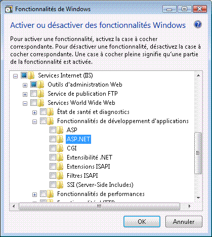

# Configuration des services Internet (IIS)&#160;7.0 pour Windows Communication Foundation
Les services Internet \(IIS\) 7.0 sont conçus de manière modulaire vous permettant ainsi d'installer uniquement les composants dont vous avez besoin.Leur conception s'appuie sur la nouvelle technologie multi\-composant orientée manifeste, utilisée pour la première fois dans [!INCLUDE[wv](../../../../includes/wv-md.md)].[!INCLUDE[iisver](../../../../includes/iisver-md.md)] comporte plus de 40 composants autonomes pouvant être installés indépendamment.Cela permet aux professionnels de l'informatique de personnaliser plus facilement leur installation en fonction de leurs besoins.Cette rubrique contient des instructions permettant de configurer [!INCLUDE[iisver](../../../../includes/iisver-md.md)] en vue d'une utilisation avec [!INCLUDE[indigo1](../../../../includes/indigo1-md.md)] et d'identifier les composants requis.  
  
## Installation minimale : installation du service WAS  
 L'installation minimale de [!INCLUDE[iisver](../../../../includes/iisver-md.md)] consiste à installer uniquement le service WAS \(Windows Process Activation Service\).Le service WAS, qui est une fonctionnalité autonome, est la seule fonctionnalité de [!INCLUDE[iisver](../../../../includes/iisver-md.md)] disponible, quel que soit le système d'exploitation [!INCLUDE[wv](../../../../includes/wv-md.md)] utilisé \(Home Basic, Home Premium, Business, and Ultimate and Enterprise\).  
  
 À partir du panneau de configuration, cliquez sur **Programmes**, puis sur **Activer ou désactiver des fonctionnalités Windows** sous **Programmes et fonctionnalités**, le composant WAS s'affiche dans la liste, comme illustré sur l'image suivante.  
  
   
  
 Cette fonctionnalité intègre les sous\-composants suivants :  
  
-   Environnement .NET  
  
-   Interfaces API de configuration  
  
-   Modèle de processus  
  
 Si vous sélectionnez le nœud racine WAS, seul le sous\-nœud **Modèle de processus** est vérifié par défaut.Remarque : dans le cadre de la présente installation, seul le service WAS est installé car la prise en charge d'un serveur Web n'est pas assurée.  
  
 Pour permettre le fonctionnement de [!INCLUDE[indigo2](../../../../includes/indigo2-md.md)] ou de toutes applications [!INCLUDE[vstecasp](../../../../includes/vstecasp-md.md)], cochez la case à cocher **Environnement .NET**.Cela signifie que tous les composants du service WAS sont requis pour assurer le bon fonctionnement de [!INCLUDE[indigo2](../../../../includes/indigo2-md.md)] et de [!INCLUDE[vstecasp](../../../../includes/vstecasp-md.md)].Ces composants sont automatiquement activés dès lors que l'un d'entre eux est installé.  
  
## IIS 7.0 : installation par défaut  
 L'activation de la fonctionnalité **Services Internet \(IIS\)** active automatiquement certains sous\-nœuds, comme illustré sur l'image suivante.  
  
   
  
 Il s'agit de l'installation par défaut de [!INCLUDE[iisver](../../../../includes/iisver-md.md)].Dans le cadre de cette installation, vous pouvez utiliser [!INCLUDE[iisver](../../../../includes/iisver-md.md)] pour fournir du contenu statique \(pages HTML et autres contenus, par exemple\).Toutefois, vous ne pouvez pas exécuter [!INCLUDE[vstecasp](../../../../includes/vstecasp-md.md)] ni d'applications CGI ni de services [!INCLUDE[indigo2](../../../../includes/indigo2-md.md)] hôtes.  
  
## IIS 7.0 : installation avec prise en charge ASP.NET  
 Vous devez installer [!INCLUDE[vstecasp](../../../../includes/vstecasp-md.md)] pour qu'il fonctionne sur IIS 7.0.Une fois **ASP.NET** vérifié, votre écran doit ressembler à l'illustration suivante.  
  
   
  
 Il s'agit de l'environnement minimal requis permettant aux applications [!INCLUDE[indigo2](../../../../includes/indigo2-md.md)] ainsi qu'aux applications [!INCLUDE[vstecasp](../../../../includes/vstecasp-md.md)] de fonctionner dans [!INCLUDE[iisver](../../../../includes/iisver-md.md)].  
  
## IIS 7.0 : installation avec les composants de compatibilité IIS 6.0  
 Lors de l'installation de [!INCLUDE[iisver](../../../../includes/iisver-md.md)] sur un système avec Visual Studio 2005 ou avec d'autres scripts ou outils d'automatisation \(tels que Adsutil.vbs\) qui configurent des applications virtuelles, lesquelles utilisent l'API de métabase [!INCLUDE[iis601](../../../../includes/iis601-md.md)], n'oubliez pas de cocher l'option **Outils de script**[!INCLUDE[iis601](../../../../includes/iis601-md.md)].Cette opération active automatiquement tous les autres sous\-nœuds de l'option **Compatibilité avec la gestion** [!INCLUDE[iis601](../../../../includes/iis601-md.md)].Cette opération effectuée, votre écran doit se présenter comme illustré sur l'image suivante.  
  
   
  
 Grâce à cette installation, vous disposez de tous les éléments requis pour pouvoir utiliser les fonctionnalités [!INCLUDE[iisver](../../../../includes/iisver-md.md)], [!INCLUDE[vstecasp](../../../../includes/vstecasp-md.md)] et [!INCLUDE[indigo2](../../../../includes/indigo2-md.md)] ainsi que les exemples disponibles sur le Web.  
  
## Limites de la demande  
 Sur [!INCLUDE[wv](../../../../includes/wv-md.md)] avec IIS 7, la valeur par défaut des paramètres `maxUri` et `maxQueryStringSize` a été modifiée.Par défaut, le filtrage de demande dans IIS 7.0 autorise une URL d'une longueur de 4096 caractères et une longueur de chaîne de 2048 caractères.Pour modifier ces valeurs par défaut, ajoutez l'élément XML suivant au fichier App.config.  
  
 `<system.webServer>`  
  
 `<security>`  
  
 `<requestFiltering>`  
  
 `<requestLimits maxUrl=”8192” maxQueryString=”8192” />`  
  
 `</requestFiltering>`  
  
 `</security>`  
  
 `</system.webServer>`  
  
## Voir aussi  
 [Architecture d'activation WAS](../../../../docs/framework/wcf/feature-details/was-activation-architecture.md)   
 [Configuration du service WAS pour une utilisation avec WCF](../../../../docs/framework/wcf/feature-details/configuring-the-wpa--service-for-use-with-wcf.md)   
 [Comment : installer et configurer des composants d'activation WCF](../../../../docs/framework/wcf/feature-details/how-to-install-and-configure-wcf-activation-components.md)   
 [Fonctionnalités d'hébergement de Windows Server AppFabric](http://go.microsoft.com/fwlink/?LinkId=201276)