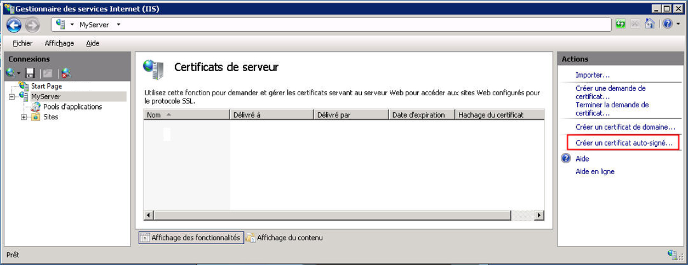
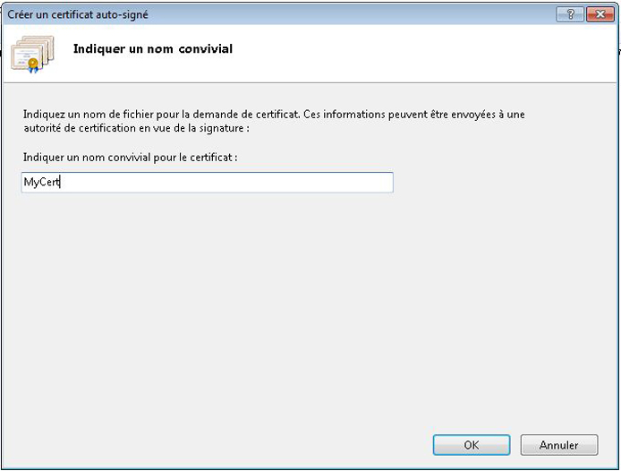
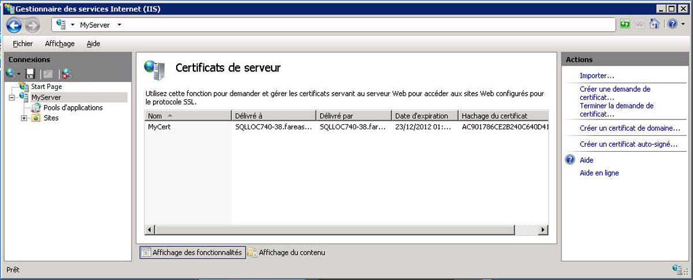

# <a name="how-to-configure-an-iis-hosted-wcf-service-with-ssl"></a>Procédure : configurer un service WCF hébergé par IIS avec SSL
Cette rubrique décrit comment installer un service WCF hébergé par IIS pour utiliser la sécurité de transport HTTP. La sécurité de transport HTTP requiert un certificat SSL à enregistrer avec IIS. Si vous n’avez pas de certificat SSL, vous pouvez utiliser IIS pour générer un certificat de test. Vous devez ensuite ajouter une liaison SSL au site web et configurer les propriétés d’authentification du site web. Enfin, vous devez configurer le service WCF pour utiliser HTTPS.  
  
### <a name="creating-a-self-signed-certificate"></a>Création d'un certificat auto-signé  
  
1.  Ouvrez le Gestionnaire des services IIS (inetmgr.exe), puis choisissez le nom de votre ordinateur dans l’arborescence à gauche. Du côté droit de l'écran, sélectionnez Certificats de serveur.  
  
       
  
2.  Dans la fenêtre certificats de serveur, cliquez sur le **créer un certificat auto-signé...** Lien.  
  
       
  
3.  Entrez un nom convivial pour le certificat auto-signé et cliquez sur **OK**.  
  
       
  
     Les détails du certificat auto-signé nouvellement créé sont maintenant affichés dans le **certificats de serveur** fenêtre.  
  
       
  
     Le certificat généré est installé dans le magasin d'Autorités de certification racines de confiance.  
  
### <a name="add-ssl-binding"></a>Ajouter une liaison SSL  
  
1.  Toujours dans le Gestionnaire des Services Internet, développez le **Sites** dossier, puis le **Site Web par défaut** dossier dans l’arborescence sur le côté gauche de l’écran.  
  
2.  Cliquez sur le **liaisons...** Lien dans le **Actions** section dans la partie supérieure droite de la fenêtre.  
  
       
  
3.  Dans la fenêtre liaisons de Site, cliquez sur le **ajouter** bouton.  
  
       
  
4.  Dans le **ajouter la liaison de Site** boîte de dialogue, sélectionnez le protocole https pour le type et le nom convivial du certificat auto-signé que vous avez créé.  
  
       
  
### <a name="configure-virtual-directory-for-ssl"></a>Configurer le répertoire virtuel pour SSL  
  
1.  Toujours dans le Gestionnaire des services IIS, sélectionnez le répertoire virtuel qui contient votre service sécurisé WCF.  
  
2.  Dans le volet central de la fenêtre, sélectionnez **paramètres SSL** dans la section IIS.  
  
       
  
3.  Dans le volet Paramètres SSL, sélectionnez le **exiger SSL** case à cocher et cliquez sur le **appliquer** lien dans le **Actions** section sur le côté droit de l’écran.  
  
       
  
### <a name="configure-wcf-service-for-http-transport-security"></a>Configurer le service WCF pour la sécurité de transport HTTP  
  
1.  Dans le fichier web.config du service WCF, configurez la liaison HTTP pour utiliser la sécurité de transport, comme indiqué dans le code XML suivant.  
  
    ```xml  
    <bindings>  
          <basicHttpBinding>  
            <binding name="secureHttpBinding">  
              <security mode="Transport">  
                <transport clientCredentialType="None"/>  
              </security>  
            </binding>  
          </basicHttpBinding>  
    </bindings>  
    ```  
  
2.  Spécifiez votre service et point de terminaison de service comme indiqué dans le code XML suivant.  
  
    ```xml  
    <services>  
          <service name="MySecureWCFService.Service1">  
            <endpoint address=""  
                      binding="basicHttpBinding"  
                      bindingConfiguration="secureHttpBinding"  
                      contract="MySecureWCFService.IService1"/>  
  
            <endpoint address="mex"  
                      binding="mexHttpsBinding"  
                      contract="IMetadataExchange" />  
          </service>  
    </services>  
    ```  
  
## <a name="example"></a>Exemple  
 Voici un exemple complet d'un fichier web.config pour un service WCF utilisant la sécurité de transport HTTP.  
  
```xml  
<?xml version="1.0"?>  
<configuration>  
  
  <system.web>  
    <compilation debug="true" targetFramework="4.0" />  
  </system.web>  
  <system.serviceModel>  
    <services>  
      <service name="MySecureWCFService.Service1">  
        <endpoint address=""  
                  binding="basicHttpBinding"  
                  bindingConfiguration="secureHttpBinding"  
                  contract="MySecureWCFService.IService1"/>  
  
        <endpoint address="mex"  
                  binding="mexHttpsBinding"  
                  contract="IMetadataExchange" />  
      </service>  
    </services>  
    <bindings>  
      <basicHttpBinding>  
        <binding name="secureHttpBinding">  
          <security mode="Transport">  
            <transport clientCredentialType="None"/>  
          </security>  
        </binding>  
      </basicHttpBinding>  
    </bindings>  
    <behaviors>  
      <serviceBehaviors>  
        <behavior>  
          <!-- To avoid disclosing metadata information, set the value below to false and remove the metadata endpoint above before deployment -->  
          <serviceMetadata httpsGetEnabled="true"/>  
          <!-- To receive exception details in faults for debugging purposes, set the value below to true.  Set to false before deployment to avoid disclosing exception information -->  
          <serviceDebug includeExceptionDetailInFaults="false"/>  
        </behavior>  
      </serviceBehaviors>  
    </behaviors>  
    <serviceHostingEnvironment multipleSiteBindingsEnabled="true" />  
  </system.serviceModel>  
  <system.webServer>  
    <modules runAllManagedModulesForAllRequests="true"/>  
  </system.webServer>  
  
</configuration>  
```  
  
## <a name="see-also"></a>Voir aussi

- [Hébergement dans les services IIS (Internet Information Services)](../../../../docs/framework/wcf/feature-details/hosting-in-internet-information-services.md)
- [Instructions relatives à l'hébergement dans les Services Internet (IIS)](../../../../docs/framework/wcf/samples/internet-information-service-hosting-instructions.md)
- [Meilleures pratiques pour l'hébergement dans Internet Information Services](../../../../docs/framework/wcf/feature-details/internet-information-services-hosting-best-practices.md)
- [IIS Hosting Using Inline Code](../../../../docs/framework/wcf/samples/iis-hosting-using-inline-code.md)
