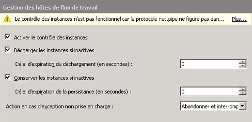
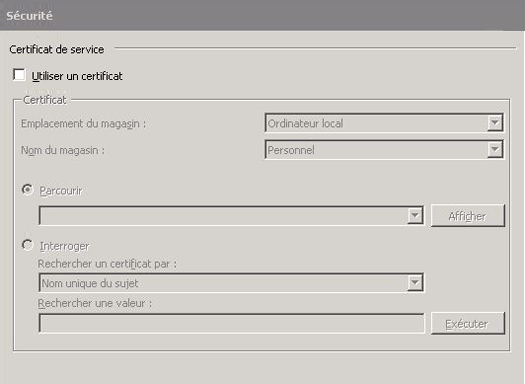

# Proc&#233;dure&#160;: h&#233;berger un service de workflow avec Windows Server App Fabric
L'hébergement de services de workflow dans App Fabric est similaire à l'hébergement sous IIS\/WAS.La seule différence réside dans les outils que propose App Fabric pour déployer, surveiller et gérer les services de workflow.Cette rubrique utilise le service de workflow créé dans la rubrique [Création d'un service de workflow de longue durée](../../../../docs/framework/wcf/feature-details/creating-a-long-running-workflow-service.md).Celle\-ci vous guide dans la création d'un service de workflow.La présente rubrique explique comment héberger le service de workflow à l'aide d'App Fabric.[!INCLUDE[crabout](../../../../includes/crabout-md.md)] Windows Server App Fabric, consultez la [documentation Windows Server App Fabric](http://go.microsoft.com/fwlink/?LinkID=193037&clcid=0x409).Avant de réaliser les étapes suivantes, vérifiez que Windows Server App Fabric est installé.Pour cela, ouvrez Internet Information Services \(inetmgr.exe\), cliquez sur le nom de votre serveur dans la vue **Connexions**, puis sur Sites et sur **Site Web par défaut**.Dans la partie droite de l'écran, vous devez voir une section intitulée **App Fabric**.Si cette section ne s'affiche pas \(en haut du volet droit\), AppFabric n'est pas installé.[!INCLUDE[crabout](../../../../includes/crabout-md.md)] l'installation de Windows Server AppFabric, consultez [Installation de Windows Server AppFabric](http://go.microsoft.com/fwlink/?LinkId=193136).  
  
### Création d'un service de workflow simple  
  
1.  Ouvrez [!INCLUDE[vs_current_long](../../../../includes/vs-current-long-md.md)] et chargez la solution OrderProcessing que vous avez créée dans la rubrique [Création d'un service de workflow de longue durée](../../../../docs/framework/wcf/feature-details/creating-a-long-running-workflow-service.md).  
  
2.  Cliquez avec le bouton droit sur le projet **OrderService** et sélectionnez **Propriétés**, puis l'onglet **Web**.  
  
3.  Dans la section **Action de démarrage** de la page de propriétés, sélectionnez **Page spécifique** et tapez Service1.xamlx dans la zone d'édition.  
  
4.  Dans la section **Serveurs** de la page de propriétés, sélectionnez **Utiliser le serveur Web IIS local** et tapez l'URL suivante : `http://localhost/OrderService`.  
  
5.  Cliquez sur le bouton **Créer un répertoire virtuel**.Cette opération crée un répertoire virtuel et configure le projet de sorte que les fichiers nécessaires soient copiés dans ce répertoire virtuel lorsque le projet est généré.Vous avez toutefois la possibilité de copier manuellement les fichiers .xamlx, web.config et les DLL requises dans le répertoire virtuel.  
  
### Configuration d'un service de workflow hébergé dans Windows Server App Fabric  
  
1.  Ouvrez le Gestionnaire des services IIS \(inetmgr.exe\).  
  
2.  Accédez au répertoire virtuel OrderService dans le volet **Connexions**.  
  
3.  Cliquez avec le bouton droit sur OrderService et sélectionnez **Gérer les services WCF et WF**, puis **Configurer**.La boîte de dialogue **Configurer WCF et WF pour l'application** s'affiche.  
  
4.  Sélectionnez l'onglet **Général** pour afficher des informations d'ordre général sur l'application, comme illustré dans la capture d'écran suivante.  
  
       
  
5.  Sélectionnez l'onglet **Surveillance**.Celui\-ci présente les divers paramètres de surveillance, comme illustré dans la capture d'écran suivante.  
  
       
  
     [!INCLUDE[crabout](../../../../includes/crabout-md.md)] la configuration de la surveillance des services de workflow dans App Fabric, consultez [Configuration de la surveillance](http://go.microsoft.com/fwlink/?LinkId=193153).  
  
6.  Sélectionnez l'onglet **Persistance des flux de travail**.Il vous permet de configurer votre application pour l'utilisation du fournisseur de persistance par défaut d'App Fabric, comme illustré dans la capture d'écran suivante.  
  
       
  
     [!INCLUDE[crabout](../../../../includes/crabout-md.md)] la configuration de la persistance des workflows dans Windows Server App Fabric, consultez [Configuration de la persistance des flux de travail](http://go.microsoft.com/fwlink/?LinkId=193148).  
  
7.  Sélectionnez l'onglet **Gestion des hôtes de flux de travail**.Il vous permet de spécifier quand les instances de services de workflow inactives doivent être déchargées et rendues persistantes, comme illustré dans la capture d'écran suivante.  
  
       
  
     [!INCLUDE[crabout](../../../../includes/crabout-md.md)] la configuration de la gestion des hôtes de workflow dans App Fabric, consultez [Configuration de la gestion des hôtes de flux de travail](http://go.microsoft.com/fwlink/?LinkId=193151).  
  
8.  Sélectionnez l'onglet **Démarrage automatique**.Il vous permet de spécifier les paramètres de démarrage automatique des services de workflow dans l'application, comme illustré dans la capture d'écran suivante.  
  
       
  
     [!INCLUDE[crabout](../../../../includes/crabout-md.md)] la configuration du démarrage automatique avec App Fabric, consultez [Configuration du démarrage automatique](http://go.microsoft.com/fwlink/?LinkId=193150).  
  
9. Sélectionnez l'onglet **Limitation**.Il vous permet de configurer les paramètres de limitation du service de workflow, comme illustré dans la capture d'écran suivante.  
  
       
  
     [!INCLUDE[crabout](../../../../includes/crabout-md.md)] la configuration de la limitation avec App Fabric, consultez [Configuration de la limitation](http://go.microsoft.com/fwlink/?LinkId=193149).  
  
10. Cliquez sur l'onglet **Sécurité**.Il vous permet de configurer les paramètres de sécurité de l'application, comme illustré dans la capture d'écran suivante.  
  
       
  
     [!INCLUDE[crabout](../../../../includes/crabout-md.md)] la configuration de la sécurité avec Windows Server App Fabric, consultez [Configuration de la sécurité](http://go.microsoft.com/fwlink/?LinkId=193152).  
  
### Utilisation de Windows Server App Fabric  
  
1.  Générez la solution pour copier les fichiers nécessaires dans le répertoire virtuel.  
  
2.  Cliquez avec le bouton droit sur le projet OrderClient et sélectionnez **Débogage**, puis **Démarrer une nouvelle instance** pour lancer l'application cliente.  
  
3.  Le client s'exécute et Visual Studio affiche une boîte de dialogue **Attacher un avertissement de sécurité**. Cliquez sur le bouton **Ne pas attacher**.Cela indique à Visual Studio de ne pas attacher le débogueur au processus IIS pour le débogage.  
  
4.  L'application cliente appelle immédiatement le service de workflow, puis attend.Le service de workflow devient inactif, puis est rendu persistant.Vous pouvez le vérifier en démarrant Internet Information Services \(inetmgr.exe\), en accédant à OrderService dans le volet Connexions, puis en le sélectionnant.Ensuite, cliquez sur l'icône Tableau de bord d'AppFabric dans le volet droit.Sous Instances WF persistantes, vous verrez qu'une instance de service de workflow a été rendue persistante, comme illustré dans la capture d'écran suivante.  
  
       
  
     L'**Historique des instances WF** fournit des informations sur le service de workflow, comme son nombre d'activations, d'exécutions d'instances et d'instances avec échecs.Sous Instances actives ou inactives, un lien s'affiche. Il suffit de cliquer dessus pour afficher plus d'informations sur les instances de workflow inactives, comme illustré dans la capture d'écran suivante.  
  
       
  
     Pour plus d'informations sur les fonctionnalités de Windows Server AppFabric et la façon de les utiliser, consultez [Fonctionnalités d'hébergement d'AppFabric](http://go.microsoft.com/fwlink/?LinkID=193143&clcid=0x409).  
  
## Voir aussi  
 [Création d'un service de workflow de longue durée](../../../../docs/framework/wcf/feature-details/creating-a-long-running-workflow-service.md)   
 [Fonctionnalités d'hébergement d'AppFabric](http://go.microsoft.com/fwlink/?LinkId=193143)   
 [Installation de Windows Server AppFabric](http://go.microsoft.com/fwlink/?LinkId=193136)   
 [Documentation Windows Server App Fabric](http://go.microsoft.com/fwlink/?LinkID=193037&clcid=0x409)