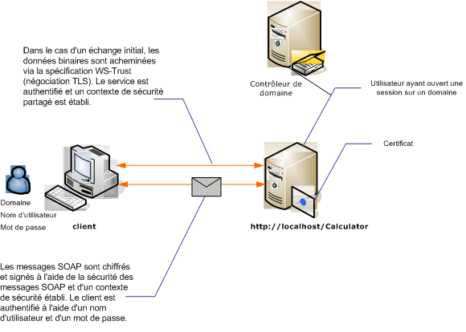

# <a name="message-security-with-a-user-name-client"></a>Sécurité de message avec un client de type Nom d'utilisateur
L'illustration suivante présente un service [!INCLUDE[indigo1](../../../../includes/indigo1-md.md)] et le client sécurisé à l'aide de la sécurité au niveau du message. Le service est authentifié à l'aide d'un certificat X.509. Le client s'authentifie à l'aide d'un nom d'utilisateur et d'un mot de passe.  
  
 Pour un exemple d’application, consultez [nom d’utilisateur de sécurité de Message](../../../../docs/framework/wcf/samples/message-security-user-name.md).  
  
   
  
|Caractéristique|Description|  
|--------------------|-----------------|  
|Mode de sécurité|Message|  
|Interopérabilité|[!INCLUDE[indigo1](../../../../includes/indigo1-md.md)] uniquement|  
|Authentification (serveur)|La négociation initiale requiert l'authentification du serveur|  
|Authentification (client)|Nom d'utilisateur/mot de passe|  
|Intégrité|Oui, à l'aide du contexte de sécurité partagé|  
|Confidentialité|Oui, à l'aide du contexte de sécurité partagé|  
|Transport|HTTP|  
|Binding|<xref:System.ServiceModel.WSHttpBinding>|  
  
## <a name="service"></a>Service  
 La configuration et le code ci-dessous sont conçus pour s'exécuter indépendamment. Effectuez l’une des opérations suivantes :  
  
-   Créez un service autonome à l'aide du code sans configuration.  
  
-   Créez un service à l'aide de la configuration fournie, mais ne définissez pas de point de terminaison.  
  
### <a name="code"></a>Code  
 Le code suivant montre comment créer un point de terminaison de service qui utilise la sécurité de message.  
  
 [!code-csharp[C_SecurityScenarios#9](../../../../samples/snippets/csharp/VS_Snippets_CFX/c_securityscenarios/cs/source.cs#9)]
 [!code-vb[C_SecurityScenarios#9](../../../../samples/snippets/visualbasic/VS_Snippets_CFX/c_securityscenarios/vb/source.vb#9)]  
  
### <a name="configuration"></a>Configuration  
 La configuration suivante peut être utilisée à la place du code :  
  
```xml  
<?xml version="1.0" encoding="utf-8"?>  
<configuration>  
  <system.serviceModel>  
    <behaviors>  
      <serviceBehaviors>  
        <behavior name="ServiceCredentialsBehavior">  
          <serviceCredentials>  
            <serviceCertificate findValue="Contoso.com"   
                                storeLocation="LocalMachine"  
                                storeName="My"     
                                x509FindType="FindBySubjectName" />  
          </serviceCredentials>  
        </behavior>  
      </serviceBehaviors>  
    </behaviors>  
    <services>  
      <service behaviorConfiguration="ServiceCredentialsBehavior"  
               name="ServiceModel.Calculator">  
        <endpoint address="http://localhost/Calculator"  
                  binding="wsHttpBinding"  
                  bindingConfiguration="MessageAndUserName"  
                  name="SecuredByTransportEndpoint"  
                  contract="ServiceModel.ICalculator" />  
      </service>  
    </services>  
    <bindings>  
      <wsHttpBinding>  
        <binding name="MessageAndUserName">  
          <security mode="Message">              
            <message clientCredentialType="UserName" />  
          </security>  
        </binding>  
      </wsHttpBinding>  
    </bindings>  
    <client />  
  </system.serviceModel>  
</configuration>  
```  
  
## <a name="client"></a>Client  
  
### <a name="code"></a>Code  
 Le code ci-dessous crée le client. La liaison s'effectue avec la sécurité en mode de message et le type d'informations d'identification client a la valeur `UserName`. Le nom d'utilisateur et le mot de passe peuvent uniquement être spécifiés à l'aide du code (cela n'est pas configurable). Le code permettant de retourner le nom d'utilisateur et le mot de passe n'est pas indiqué dans ce cas car il doit être exécuté au niveau de l'application. Par exemple, utilisez une boîte de dialogue Windows Forms pour demander les données à l'utilisateur.  
  
 [!code-csharp[C_SecurityScenarios#16](../../../../samples/snippets/csharp/VS_Snippets_CFX/c_securityscenarios/cs/source.cs#16)]
 [!code-vb[C_SecurityScenarios#16](../../../../samples/snippets/visualbasic/VS_Snippets_CFX/c_securityscenarios/vb/source.vb#16)]  
  
### <a name="configuration"></a>Configuration  
 Le code ci-dessous configure le client. La liaison s'effectue avec la sécurité en mode de message et le type d'informations d'identification client a la valeur `UserName`. Le nom d'utilisateur et le mot de passe peuvent uniquement être spécifiés à l'aide du code (cela n'est pas configurable).  
  
```xml  
<?xml version="1.0" encoding="utf-8"?>  
<configuration>  
  <system.serviceModel>  
    <bindings>  
      <wsHttpBinding>  
        <binding name="WSHttpBinding_ICalculator" >  
          <security mode="Message">  
            <message clientCredentialType="UserName" />  
          </security>  
        </binding>  
      </wsHttpBinding>  
    </bindings>  
    <client>  
      <endpoint address="http://machineName/Calculator"   
                binding="wsHttpBinding"  
                bindingConfiguration="WSHttpBinding_ICalculator"   
                contract="ICalculator"  
                name="WSHttpBinding_ICalculator">  
        <identity>  
          <dns value ="Contoso.com" />  
        </identity>  
      </endpoint>  
    </client>  
  </system.serviceModel>  
</configuration>  
```  
  
## <a name="see-also"></a>Voir aussi  
 [Vue d’ensemble de la sécurité](../../../../docs/framework/wcf/feature-details/security-overview.md)  
 [Nom d’utilisateur de sécurité de message](../../../../docs/framework/wcf/samples/message-security-user-name.md)  
 [L’authentification et identité de Service](../../../../docs/framework/wcf/feature-details/service-identity-and-authentication.md)  
 [\<identité >](../../../../docs/framework/configure-apps/file-schema/wcf/identity.md)  
 [Modèle de sécurité pour Windows Server AppFabric](http://go.microsoft.com/fwlink/?LinkID=201279&clcid=0x409)
