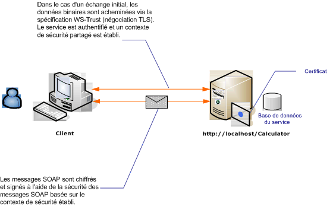

# <a name="message-security-with-an-anonymous-client"></a>Sécurité de message avec un client anonyme
Le scénario suivant montre un client / service sécurisé par la sécurité de message Windows Communication Foundation (WCF). L'un des objectifs de conception consiste à utiliser la sécurité de message plutôt que la sécurité de transport, afin qu'à l'avenir il puisse prendre en charge un modèle plus riche basé sur les revendications. Pour plus d’informations sur l’utilisation de revendications riches pour l’autorisation, consultez [la gestion des revendications et autorisation avec le modèle d’identité](../../../../docs/framework/wcf/feature-details/managing-claims-and-authorization-with-the-identity-model.md).  
  
 Pour un exemple d’application, consultez [Message Security Anonymous](../../../../docs/framework/wcf/samples/message-security-anonymous.md).  
  
   
  
|Caractéristique|Description|  
|--------------------|-----------------|  
|Mode de sécurité|Message|  
|Interopérabilité|WCF uniquement|  
|Authentification (serveur)|La négociation initiale requiert l'authentification du serveur, mais pas l'authentification du client|  
|Authentification (client)|None|  
|Intégrité|Oui, à l'aide du contexte de sécurité partagé|  
|Confidentialité|Oui, à l'aide du contexte de sécurité partagé|  
|Transport|HTTP|  
  
## <a name="service"></a>Service  
 La configuration et le code ci-dessous sont conçus pour s'exécuter indépendamment. Effectuez l’une des opérations suivantes :  
  
-   Créez un service autonome à l'aide du code sans configuration.  
  
-   Créez un service à l'aide de la configuration fournie, mais ne définissez pas de point de terminaison.  
  
### <a name="code"></a>Code  
 Le code suivant montre comment créer un point de terminaison de service qui utilise la sécurité de message.  
  
 [!code-csharp[C_SecurityScenarios#8](../../../../samples/snippets/csharp/VS_Snippets_CFX/c_securityscenarios/cs/source.cs#8)]
 [!code-vb[C_SecurityScenarios#8](../../../../samples/snippets/visualbasic/VS_Snippets_CFX/c_securityscenarios/vb/source.vb#8)]  
  
### <a name="configuration"></a>Configuration  
 La configuration ci-dessous peut être utilisée à la place du code. L'élément de comportement du service est utilisé pour spécifier un certificat servant à authentifier le service auprès du client. L'élément de service doit spécifier le comportement à l'aide de l'attribut `behaviorConfiguration`. L'élément de liaison spécifie que le type d'informations d'identification du client est `None`, ce qui permet aux clients anonymes d'utiliser le service.  
  
```xml  
<?xml version="1.0" encoding="utf-8"?>  
<configuration>  
  <system.serviceModel>  
    <behaviors>  
      <serviceBehaviors>  
        <behavior name="ServiceCredentialsBehavior">  
          <serviceCredentials>  
            <serviceCertificate findValue="contoso.com"   
                                storeLocation="LocalMachine"  
                                storeName="My" />  
          </serviceCredentials>  
        </behavior>  
      </serviceBehaviors>  
    </behaviors>  
    <services>  
      <service behaviorConfiguration="ServiceCredentialsBehavior"   
               name="ServiceModel.Calculator">  
        <endpoint address="http://localhost/Calculator"   
                  binding="wsHttpBinding"  
                  bindingConfiguration="WSHttpBinding_ICalculator"   
                  name="CalculatorService"  
                  contract="ServiceModel.ICalculator" />  
      </service>  
    </services>  
    <bindings>  
      <wsHttpBinding>  
        <binding name="WSHttpBinding_ICalculator" >  
          <security mode="Message">  
            <message clientCredentialType="None" />  
          </security>  
        </binding>  
      </wsHttpBinding>  
    </bindings>  
    <client />  
  </system.serviceModel>  
</configuration>  
```  
  
## <a name="client"></a>Client  
 La configuration et le code ci-dessous sont conçus pour s'exécuter indépendamment. Effectuez l’une des opérations suivantes :  
  
-   Créez un client autonome à l'aide du code (et du code client).  
  
-   Créez un client qui ne définit pas d'adresse de point de terminaison. Au lieu de cela, utilisez le constructeur client qui accepte le nom de configuration comme argument. Par exemple :  
  
     [!code-csharp[C_SecurityScenarios#0](../../../../samples/snippets/csharp/VS_Snippets_CFX/c_securityscenarios/cs/source.cs#0)]
     [!code-vb[C_SecurityScenarios#0](../../../../samples/snippets/visualbasic/VS_Snippets_CFX/c_securityscenarios/vb/source.vb#0)]  
  
### <a name="code"></a>Code  
 Le code suivant crée une instance du client. La liaison utilise le mode de sécurité au niveau du message, et le type d'informations d'identification du client a la valeur Aucun.  
  
 [!code-csharp[C_SecurityScenarios#15](../../../../samples/snippets/csharp/VS_Snippets_CFX/c_securityscenarios/cs/source.cs#15)]
 [!code-vb[C_SecurityScenarios#15](../../../../samples/snippets/visualbasic/VS_Snippets_CFX/c_securityscenarios/vb/source.vb#15)]  
  
### <a name="configuration"></a>Configuration  
 Le code ci-dessous configure le client.  
  
```xml  
<?xml version="1.0" encoding="utf-8"?>  
<configuration>  
  <system.serviceModel>  
    <bindings>  
      <wsHttpBinding>  
        <binding name="WSHttpBinding_ICalculator" >  
          <security mode="Message">  
            <message clientCredentialType="None" />  
          </security>  
        </binding>  
      </wsHttpBinding>  
    </bindings>  
    <client>  
      <endpoint address="http://machineName/Calculator"  
        binding="wsHttpBinding"  
        bindingConfiguration="WSHttpBinding_ICalculator"   
        contract="ICalculator"  
        name="WSHttpBinding_ICalculator">  
        <identity>  
          <dns value="contoso.com" />  
        </identity>  
      </endpoint>  
    </client>  
  </system.serviceModel>  
</configuration>  
```  
  
## <a name="see-also"></a>Voir aussi  
 [Vue d’ensemble de la sécurité](../../../../docs/framework/wcf/feature-details/security-overview.md)  
 [Sécurité des applications distribuées](../../../../docs/framework/wcf/feature-details/distributed-application-security.md)  
 [Sécurité de message anonyme](../../../../docs/framework/wcf/samples/message-security-anonymous.md)  
 [Identité du service et authentification](../../../../docs/framework/wcf/feature-details/service-identity-and-authentication.md)  
 [Modèle de sécurité pour Windows Server AppFabric](https://go.microsoft.com/fwlink/?LinkID=201279&clcid=0x409)
