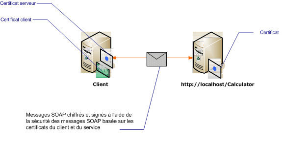

# S&#233;curit&#233; de message avec certificats mutuels
Le scénario ci\-dessous montre un service et un client [!INCLUDE[indigo1](../../../../includes/indigo1-md.md)] sécurisés à l'aide du mode de sécurité de message.Le client et le service sont authentifiés à l'aide de certificats.  
  
 Ce scénario est interopérable car il utilise WS\-Security avec le profil de jeton de certificat X.509.  
  
> [!NOTE]
>  Ce scénario n'effectue pas la négociation du certificat de service.Le certificat de service doit être fourni au client avant toute communication.Le certificat de serveur peut être distribué avec l'application ou fourni dans une communication hors plage.  
  
   
  
|Caractéristique|Description|  
|---------------------|-----------------|  
|Mode de sécurité|Message|  
|Interopérabilité|Oui, avec WS\-Security et des clients et des services compatibles avec le profil de jeton de certificat X.509.|  
|Authentification|Authentification mutuelle du serveur et du client.|  
|Intégrité|Oui|  
|Confidentialité|Oui|  
|Transport|HTTP|  
|Liaison|<xref:System.ServiceModel.WSHttpBinding>|  
  
## Service  
 La configuration et le code ci\-dessous sont conçus pour s'exécuter indépendamment.Effectuez l'une des opérations suivantes :  
  
-   Créez un service autonome à l'aide du code sans configuration.  
  
-   Créez un service à l'aide de la configuration fournie, mais ne définissez pas de point de terminaison.  
  
### Code  
 Le code ci\-dessous crée un point de terminaison de service qui utilise la sécurité de message.Le service requiert un certificat pour s'authentifier.  
  
 [!code-csharp[C_SecurityScenarios#13](../../../../samples/snippets/csharp/VS_Snippets_CFX/c_securityscenarios/cs/source.cs#13)]
 [!code-vb[C_SecurityScenarios#13](../../../../samples/snippets/visualbasic/VS_Snippets_CFX/c_securityscenarios/vb/source.vb#13)]  
  
### Configuration  
 La configuration ci\-dessous peut être utilisée à la place du code pour créer le même service.  
  
```  
<?xml version="1.0" encoding="utf-8"?>  
<configuration>  
  <system.serviceModel>  
    <behaviors>  
      <serviceBehaviors>  
        <behavior name="serviceCredentialBehavior">  
          <serviceCredentials>  
            <serviceCertificate findValue="Contoso.com"   
                                storeLocation="LocalMachine"  
                                storeName="My"   
                                x509FindType="FindBySubjectName" />  
          </serviceCredentials>  
        </behavior>  
      </serviceBehaviors>  
    </behaviors>  
    <services>  
      <service behaviorConfiguration="serviceCredentialBehavior"   
               name="ServiceModel.Calculator">  
        <endpoint address="http://localhost/Calculator"   
                  binding="wsHttpBinding"  
                  bindingConfiguration="InteropCertificateBinding"  
                  name="WSHttpBinding_ICalculator"  
                  contract="ServiceModel.ICalculator" />  
      </service>  
    </services>  
    <bindings>  
      <wsHttpBinding>  
        <binding name="InteropCertificateBinding">  
          <security mode="Message">  
            <message clientCredentialType="Certificate"  
                     negotiateServiceCredential="false"  
                     establishSecurityContext="false" />  
          </security>  
        </binding>  
      </wsHttpBinding>  
    </bindings>  
    <client />  
  </system.serviceModel>  
</configuration>  
```  
  
## Client  
 La configuration et le code ci\-dessous sont destinés à s'exécuter indépendamment.Effectuez l'une des opérations suivantes :  
  
-   Créez un client autonome à l'aide du code \(et du code client\).  
  
-   Créez un client qui ne définit pas d'adresse de point de terminaison.Au lieu de cela, utilisez le constructeur client qui accepte le nom de configuration comme argument.Par exemple :  
  
     [!code-csharp[C_SecurityScenarios#0](../../../../samples/snippets/csharp/VS_Snippets_CFX/c_securityscenarios/cs/source.cs#0)]
     [!code-vb[C_SecurityScenarios#0](../../../../samples/snippets/visualbasic/VS_Snippets_CFX/c_securityscenarios/vb/source.vb#0)]  
  
### Code  
 Le code ci\-dessous crée le client.Le mode de sécurité a la valeur Message et le type d'informations d'identification client a la valeur Certificat.  
  
 [!code-csharp[C_SecurityScenarios#20](../../../../samples/snippets/csharp/VS_Snippets_CFX/c_securityscenarios/cs/source.cs#20)]
 [!code-vb[C_SecurityScenarios#20](../../../../samples/snippets/visualbasic/VS_Snippets_CFX/c_securityscenarios/vb/source.vb#20)]  
  
### Configuration  
 Les éléments ci\-dessous configurent le client.Un certificat client doit être spécifié à l'aide du [\<clientCertificate\>](../../../../docs/framework/configure-apps/file-schema/wcf/clientcertificate-of-clientcredentials-element.md).En outre, le certificat de service est spécifié à l'aide du [\<defaultCertificate\>](../../../../docs/framework/configure-apps/file-schema/wcf/defaultcertificate-element.md).  
  
```  
<?xml version="1.0" encoding="utf-8"?>  
<configuration>  
  <system.serviceModel>  
    <behaviors>  
      <endpointBehaviors>  
        <behavior name="ClientCredentialsBehavior">  
          <clientCredentials>  
            <clientCertificate findValue="Cohowinery.com"   
                 storeLocation="CurrentUser"  
                 storeName="My"  
                 x509FindType="FindBySubjectName" />  
            <serviceCertificate>  
              <defaultCertificate findValue="Contoso.com"   
                                  storeLocation="CurrentUser"  
                                  storeName="TrustedPeople"  
                                  x509FindType="FindBySubjectName" />  
            </serviceCertificate>  
          </clientCredentials>  
        </behavior>  
      </endpointBehaviors>  
    </behaviors>  
    <bindings>  
      <wsHttpBinding>  
        <binding name="WSHttpBinding_ICalculator" >  
          <security mode="Message">  
            <message clientCredentialType="Certificate"   
                     negotiateServiceCredential="false"  
                     establishSecurityContext="false" />  
          </security>  
        </binding>  
      </wsHttpBinding>  
    </bindings>  
    <client>  
      <endpoint address="http://machineName/Calculator"   
                behaviorConfiguration="ClientCredentialsBehavior"  
                binding="wsHttpBinding"   
                bindingConfiguration="WSHttpBinding_ICalculator"  
                contract="ICalculator"  
                name="WSHttpBinding_ICalculator">  
        <identity>  
          <certificate encodedValue="Encoded_Value_Not_Shown" />  
        </identity>  
      </endpoint>  
    </client>  
  </system.serviceModel>  
</configuration>  
```  
  
## Voir aussi  
 [Vue d'ensemble de la sécurité](../../../../docs/framework/wcf/feature-details/security-overview.md)   
 [Modèle de sécurité pour Windows Server AppFabric](http://go.microsoft.com/fwlink/?LinkID=201279&clcid=0x409)   
 [Procédure : créer et installer des certificats temporaires dans WCF pour la sécurité du transport pendant le développement](http://go.microsoft.com/fwlink/?LinkId=244264)