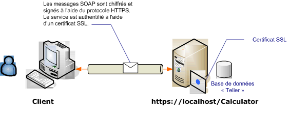

# <a name="transport-security-with-an-anonymous-client"></a><span data-ttu-id="3f8b5-102">Sécurité de transport avec un client anonyme</span><span class="sxs-lookup"><span data-stu-id="3f8b5-102">Transport security with an anonymous client</span></span>

<span data-ttu-id="3f8b5-103">Ce scénario de Windows Communication Foundation (WCF) utilise la sécurité du transport (HTTPS) pour garantir la confidentialité et l’intégrité.</span><span class="sxs-lookup"><span data-stu-id="3f8b5-103">This Windows Communication Foundation (WCF) scenario uses transport security (HTTPS) to ensure confidentiality and integrity.</span></span> <span data-ttu-id="3f8b5-104">Le serveur doit être authentifié à l'aide d'un certificat SSL (Secure Sockets Layer). Les clients doivent ensuite faire confiance à ce certificat.</span><span class="sxs-lookup"><span data-stu-id="3f8b5-104">The server must be authenticated with a Secure Sockets Layer (SSL) certificate, and the clients must trust the server's certificate.</span></span> <span data-ttu-id="3f8b5-105">Aucun mécanisme n'authentifie les clients, ceux-ci restent donc anonymes.</span><span class="sxs-lookup"><span data-stu-id="3f8b5-105">The client is not authenticated by any mechanism and is, therefore, anonymous.</span></span>

<span data-ttu-id="3f8b5-106">Pour un exemple d’application, consultez [sécurité du Transport WS](../samples/ws-transport-security.md).</span><span class="sxs-lookup"><span data-stu-id="3f8b5-106">For a sample application, see [WS Transport Security](../samples/ws-transport-security.md).</span></span> <span data-ttu-id="3f8b5-107">Pour plus d’informations sur la sécurité de transport, consultez [vue d’ensemble de sécurité de Transport](transport-security-overview.md).</span><span class="sxs-lookup"><span data-stu-id="3f8b5-107">For more information about transport security, see [Transport Security Overview](transport-security-overview.md).</span></span>

<span data-ttu-id="3f8b5-108">Pour plus d’informations sur l’utilisation d’un certificat avec un service, consultez [Working with Certificates](working-with-certificates.md) et [Comment : Configurer un Port avec un certificat SSL](how-to-configure-a-port-with-an-ssl-certificate.md).</span><span class="sxs-lookup"><span data-stu-id="3f8b5-108">For more information about using a certificate with a service, see [Working with Certificates](working-with-certificates.md) and [How to: Configure a Port with an SSL Certificate](how-to-configure-a-port-with-an-ssl-certificate.md).</span></span>



|<span data-ttu-id="3f8b5-110">Caractéristique</span><span class="sxs-lookup"><span data-stu-id="3f8b5-110">Characteristic</span></span>|<span data-ttu-id="3f8b5-111">Description</span><span class="sxs-lookup"><span data-stu-id="3f8b5-111">Description</span></span>|
|--------------------|-----------------|
|<span data-ttu-id="3f8b5-112">Mode de sécurité</span><span class="sxs-lookup"><span data-stu-id="3f8b5-112">Security Mode</span></span>|<span data-ttu-id="3f8b5-113">Transport</span><span class="sxs-lookup"><span data-stu-id="3f8b5-113">Transport</span></span>|
|<span data-ttu-id="3f8b5-114">Interopérabilité</span><span class="sxs-lookup"><span data-stu-id="3f8b5-114">Interoperability</span></span>|<span data-ttu-id="3f8b5-115">Avec les services Web et les clients existants</span><span class="sxs-lookup"><span data-stu-id="3f8b5-115">With existing Web services and clients</span></span>|
|<span data-ttu-id="3f8b5-116">Authentification (serveur)</span><span class="sxs-lookup"><span data-stu-id="3f8b5-116">Authentication (Server)</span></span><br /><br /> <span data-ttu-id="3f8b5-117">Authentification (client)</span><span class="sxs-lookup"><span data-stu-id="3f8b5-117">Authentication (Client)</span></span>|<span data-ttu-id="3f8b5-118">Oui</span><span class="sxs-lookup"><span data-stu-id="3f8b5-118">Yes</span></span><br /><br /> <span data-ttu-id="3f8b5-119">Niveau de l’application (aucune prise en charge WCF)</span><span class="sxs-lookup"><span data-stu-id="3f8b5-119">Application level (no WCF support)</span></span>|
|<span data-ttu-id="3f8b5-120">Intégrité</span><span class="sxs-lookup"><span data-stu-id="3f8b5-120">Integrity</span></span>|<span data-ttu-id="3f8b5-121">Oui</span><span class="sxs-lookup"><span data-stu-id="3f8b5-121">Yes</span></span>|
|<span data-ttu-id="3f8b5-122">Confidentialité</span><span class="sxs-lookup"><span data-stu-id="3f8b5-122">Confidentiality</span></span>|<span data-ttu-id="3f8b5-123">Oui</span><span class="sxs-lookup"><span data-stu-id="3f8b5-123">Yes</span></span>|
|<span data-ttu-id="3f8b5-124">Transport</span><span class="sxs-lookup"><span data-stu-id="3f8b5-124">Transport</span></span>|<span data-ttu-id="3f8b5-125">HTTPS</span><span class="sxs-lookup"><span data-stu-id="3f8b5-125">HTTPS</span></span>|
|<span data-ttu-id="3f8b5-126">Binding</span><span class="sxs-lookup"><span data-stu-id="3f8b5-126">Binding</span></span>|<xref:System.ServiceModel.WSHttpBinding>|

## <a name="service"></a><span data-ttu-id="3f8b5-127">Service</span><span class="sxs-lookup"><span data-stu-id="3f8b5-127">Service</span></span>

<span data-ttu-id="3f8b5-128">La configuration et le code ci-dessous sont conçus pour s'exécuter indépendamment.</span><span class="sxs-lookup"><span data-stu-id="3f8b5-128">The following code and configuration are meant to run independently.</span></span> <span data-ttu-id="3f8b5-129">Effectuez l’une des opérations suivantes :</span><span class="sxs-lookup"><span data-stu-id="3f8b5-129">Do one of the following:</span></span>

- <span data-ttu-id="3f8b5-130">Créez un service autonome à l'aide du code sans configuration.</span><span class="sxs-lookup"><span data-stu-id="3f8b5-130">Create a stand-alone service using the code with no configuration.</span></span>

- <span data-ttu-id="3f8b5-131">Créez un service à l'aide de la configuration fournie, mais ne définissez pas de point de terminaison.</span><span class="sxs-lookup"><span data-stu-id="3f8b5-131">Create a service using the supplied configuration, but do not define any endpoints.</span></span>

### <a name="code"></a><span data-ttu-id="3f8b5-132">Code</span><span class="sxs-lookup"><span data-stu-id="3f8b5-132">Code</span></span>

<span data-ttu-id="3f8b5-133">Le code suivant illustre comment créer un point de terminaison à l'aide de la sécurité de transport :</span><span class="sxs-lookup"><span data-stu-id="3f8b5-133">The following code shows how to create an endpoint using transport security:</span></span>

[!code-csharp[c_SecurityScenarios#5](~/samples/snippets/csharp/VS_Snippets_CFX/c_securityscenarios/cs/source.cs#5)]
[!code-vb[c_SecurityScenarios#5](~/samples/snippets/visualbasic/VS_Snippets_CFX/c_securityscenarios/vb/source.vb#5)]

### <a name="configuration"></a><span data-ttu-id="3f8b5-134">Configuration</span><span class="sxs-lookup"><span data-stu-id="3f8b5-134">Configuration</span></span>

<span data-ttu-id="3f8b5-135">Le code ci-dessous configure le même point de terminaison en utilisant la configuration.</span><span class="sxs-lookup"><span data-stu-id="3f8b5-135">The following code sets up the same endpoint using configuration.</span></span> <span data-ttu-id="3f8b5-136">Aucun mécanisme n'authentifie les clients, ceux-ci restent donc anonymes.</span><span class="sxs-lookup"><span data-stu-id="3f8b5-136">The client is not authenticated by any mechanism, and is therefore anonymous.</span></span>

```xml
<?xml version="1.0" encoding="utf-8"?>
<configuration>
  <system.serviceModel>
    <services>
      <service name="ServiceModel.Calculator">
        <endpoint address="https://localhost/Calculator"
                  binding="wsHttpBinding"
                  bindingConfiguration="WSHttpBinding_ICalculator"
                  name="SecuredByTransportEndpoint"
                  contract="ServiceModel.ICalculator" />
      </service>
    </services>
    <bindings>
      <wsHttpBinding>
        <binding name="WSHttpBinding_ICalculator">
          <security mode="Transport">
            <transport clientCredentialType="None" />
          </security>
        </binding>
      </wsHttpBinding>
    </bindings>
    <client />
  </system.serviceModel>
</configuration>
```

## <a name="client"></a><span data-ttu-id="3f8b5-137">Client</span><span class="sxs-lookup"><span data-stu-id="3f8b5-137">Client</span></span>

<span data-ttu-id="3f8b5-138">La configuration et le code ci-dessous sont conçus pour s'exécuter indépendamment.</span><span class="sxs-lookup"><span data-stu-id="3f8b5-138">The following code and configuration are meant to run independently.</span></span> <span data-ttu-id="3f8b5-139">Effectuez l’une des opérations suivantes :</span><span class="sxs-lookup"><span data-stu-id="3f8b5-139">Do one of the following:</span></span>

- <span data-ttu-id="3f8b5-140">Créez un client autonome à l'aide du code (et du code client).</span><span class="sxs-lookup"><span data-stu-id="3f8b5-140">Create a stand-alone client using the code (and client code).</span></span>

- <span data-ttu-id="3f8b5-141">Créez un client qui ne définit pas d'adresse de point de terminaison.</span><span class="sxs-lookup"><span data-stu-id="3f8b5-141">Create a client that does not define any endpoint addresses.</span></span> <span data-ttu-id="3f8b5-142">Au lieu de cela, utilisez le constructeur client qui accepte le nom de configuration comme argument.</span><span class="sxs-lookup"><span data-stu-id="3f8b5-142">Instead, use the client constructor that takes the configuration name as an argument.</span></span> <span data-ttu-id="3f8b5-143">Par exemple :</span><span class="sxs-lookup"><span data-stu-id="3f8b5-143">For example:</span></span>

     [!code-csharp[C_SecurityScenarios#0](~/samples/snippets/csharp/VS_Snippets_CFX/c_securityscenarios/cs/source.cs#0)]
     [!code-vb[C_SecurityScenarios#0](~/samples/snippets/visualbasic/VS_Snippets_CFX/c_securityscenarios/vb/source.vb#0)]

### <a name="code"></a><span data-ttu-id="3f8b5-144">Code</span><span class="sxs-lookup"><span data-stu-id="3f8b5-144">Code</span></span>

[!code-csharp[c_SecurityScenarios#6](~/samples/snippets/csharp/VS_Snippets_CFX/c_securityscenarios/cs/source.cs#6)]
[!code-vb[c_SecurityScenarios#6](~/samples/snippets/visualbasic/VS_Snippets_CFX/c_securityscenarios/vb/source.vb#6)]

### <a name="configuration"></a><span data-ttu-id="3f8b5-145">Configuration</span><span class="sxs-lookup"><span data-stu-id="3f8b5-145">Configuration</span></span>

<span data-ttu-id="3f8b5-146">La configuration suivante peut être utilisée à la place du code pour paramétrer le service :</span><span class="sxs-lookup"><span data-stu-id="3f8b5-146">The following configuration can be used instead of the code to set up the service.</span></span>

```xml
<configuration>
  <system.serviceModel>
    <bindings>
      <wsHttpBinding>
        <binding name="WSHttpBinding_ICalculator" >
          <security mode="Transport">
            <transport clientCredentialType="None" />
          </security>
        </binding>
      </wsHttpBinding>
    </bindings>
    <client>
      <endpoint address="https://machineName/Calculator"
                binding="wsHttpBinding"
                bindingConfiguration="WSHttpBinding_ICalculator"
                contract="ICalculator"
                name="WSHttpBinding_ICalculator" />
    </client>
  </system.serviceModel>
</configuration>
```

## <a name="see-also"></a><span data-ttu-id="3f8b5-147">Voir aussi</span><span class="sxs-lookup"><span data-stu-id="3f8b5-147">See also</span></span>

- [<span data-ttu-id="3f8b5-148">Vue d’ensemble de la sécurité</span><span class="sxs-lookup"><span data-stu-id="3f8b5-148">Security Overview</span></span>](security-overview.md)
- [<span data-ttu-id="3f8b5-149">Sécurité de transport WS</span><span class="sxs-lookup"><span data-stu-id="3f8b5-149">WS Transport Security</span></span>](../samples/ws-transport-security.md)
- [<span data-ttu-id="3f8b5-150">Vue d’ensemble de la sécurité de transport</span><span class="sxs-lookup"><span data-stu-id="3f8b5-150">Transport Security Overview</span></span>](transport-security-overview.md)
- <span data-ttu-id="3f8b5-151">[Modèle de sécurité pour Windows Server AppFabric](https://docs.microsoft.com/previous-versions/appfabric/ee677202(v=azure.10))</span><span class="sxs-lookup"><span data-stu-id="3f8b5-151">[Security Model for Windows Server App Fabric](https://docs.microsoft.com/previous-versions/appfabric/ee677202(v=azure.10))</span></span>