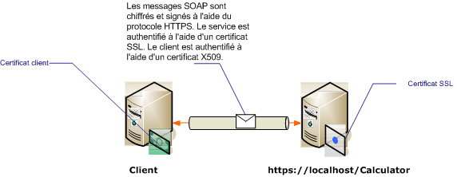

# <a name="transport-security-with-certificate-authentication"></a>Sécurité de transport avec l'authentification par certificat
Cette rubrique décrit l'utilisation des certificats X.509 pour l'authentification du serveur et du client lorsque vous utilisez la sécurité de transport. Pour plus d’informations sur les certificats X.509, consultez [Certificats de clé publique X.509](https://msdn.microsoft.com/library/bb540819\(VS.85\).aspx). Certificats doivent être émis par une autorité de certification, qui est souvent un tiers émetteur de certificats. Dans un domaine Windows Server, les services de certificats Active Directory peuvent être utilisés pour émettre des certificats pour les ordinateurs clients figurant sur le domaine. Pour plus d’informations, consultez [Services de certificats Windows 2008 R2](https://go.microsoft.com/fwlink/?LinkID=209949&clcid=0x409). Dans ce scénario, le service est hébergé sous Internet Information Services (IIS) qui est configuré avec SSL (Secure Sockets Layer). Le service est configuré avec un certificat SSL (X.509) pour permettre aux clients de vérifier l'identité du serveur. Le client est également configuré avec un certificat X.509 qui permet au service de vérifier l'identité du client. Le certificat du serveur doit être approuvé par le client et le certificat du client doit être approuvé par le serveur. Le mécanisme réel de vérification par le service et le client de leurs identités réciproques n'est pas traité dans cette rubrique. Pour plus d’informations, consultez [Signature numérique sur Wikipedia](https://go.microsoft.com/fwlink/?LinkId=253157).  
  
 Ce scénario implémente un modèle de message de demande/réponse comme illustré dans le schéma suivant.  
  
   
  
 Pour plus d’informations sur l’utilisation d’un certificat avec un service, consultez [Working with Certificates](../../../../docs/framework/wcf/feature-details/working-with-certificates.md) et [Comment : configurer un Port avec un certificat SSL](../../../../docs/framework/wcf/feature-details/how-to-configure-a-port-with-an-ssl-certificate.md). Le tableau suivant décrit les différentes caractéristiques du scénario.  
  
|Caractéristique|Description|  
|--------------------|-----------------|  
|Mode de sécurité|Transport|  
|Interopérabilité|Avec les clients de service Web et les services existants.|  
|Authentification (serveur)<br /><br /> Authentification (client)|Oui (à l’aide d’un certificat SSL)<br /><br /> Oui (à l'aide d'un certificat X.509)|  
|Intégrité des données|Oui|  
|Confidentialité des données|Oui|  
|Transport|HTTPS|  
|Liaison|<xref:System.ServiceModel.WSHttpBinding>|  
  
## <a name="configure-the-service"></a>Configuration du service  
 Puisque le service dans ce scénario est hébergé sous IIS, il est configuré à l'aide d'un fichier web.config. La configuration Web suivante illustre comment configurer le <xref:System.ServiceModel.WSHttpBinding> pour utiliser la sécurité de transport et les informations d'identification du client X.509.  
  
```xml  
<configuration>  
  <system.serviceModel>  
    <protocolMapping>  
      <add scheme="https" binding="wsHttpBinding" />  
    </protocolMapping>  
    <bindings>  
      <wsHttpBinding>  
        <!-- configure wsHttp binding with Transport security mode and clientCredentialType as Certificate -->  
        <binding>  
          <security mode="Transport">  
            <transport clientCredentialType="Certificate"/>              
          </security>  
        </binding>  
      </wsHttpBinding>  
    </bindings>  
    <!--For debugging purposes set the includeExceptionDetailInFaults attribute to true-->  
    <behaviors>  
      <serviceBehaviors>  
        <behavior>            
           <serviceDebug includeExceptionDetailInFaults="True" />  
        </behavior>  
      </serviceBehaviors>  
    </behaviors>  
  </system.serviceModel>  
</configuration>  
```  
  
## <a name="configure-the-client"></a>Configuration du client  
 Le client peut être configuré en code ou dans un fichier app.config. L'exemple suivant indique comment configurer le client en code.  
  
```vb  
// Create the binding.  
WSHttpBinding myBinding = new WSHttpBinding();  
myBinding.Security.Mode = SecurityMode.Transport;  
myBinding.Security.Transport.ClientCredentialType =  
   HttpClientCredentialType.Certificate;  
  
// Create the endpoint address. Note that the machine name   
// must match the subject or DNS field of the X.509 certificate  
// used to authenticate the service.   
EndpointAddress ea = new  
   EndpointAddress("https://localhost/CalculatorService/service.svc");  
  
// Create the client. The code for the calculator   
// client is not shown here. See the sample applications  
// for examples of the calculator code.  
CalculatorClient cc =  
   new CalculatorClient(myBinding, ea);  
  
// The client must specify a certificate trusted by the server.  
cc.ClientCredentials.ClientCertificate.SetCertificate(  
    StoreLocation.CurrentUser,  
    StoreName.My,  
    X509FindType.FindBySubjectName,  
    "contoso.com");  
  
// Begin using the client.  
Console.WriteLine(cc.Add(100, 1111));  
//...  
cc.Close();  
```  
  
 Vous pouvez aussi configurer le client dans un fichier app.config, comme indiqué dans l'exemple suivant :  
  
```xml  
<configuration>  
  <system.serviceModel>  
    <client>  
      <!-- this endpoint has an https: address -->  
      <endpoint address=" https://localhost/CalculatorService/service.svc "   
                behaviorConfiguration="endpointCredentialBehavior"  
                binding="wsHttpBinding"   
                bindingConfiguration="Binding1"   
                contract="Microsoft.Samples.TransportSecurity.ICalculator"/>  
    </client>  
    <behaviors>  
      <endpointBehaviors>  
        <behavior name="endpointCredentialBehavior">  
          <clientCredentials>  
            <clientCertificate findValue="contoso.com"  
                               storeLocation="CurrentUser"  
                               storeName="My"  
                               x509FindType="FindBySubjectName" />  
          </clientCredentials>  
        </behavior>  
      </endpointBehaviors>  
    </behaviors>  
    <bindings>  
      <wsHttpBinding>  
        <!-- configure wsHttpbinding with Transport security mode  
                   and clientCredentialType as Certificate -->  
        <binding name="Binding1">  
          <security mode="Transport">  
            <transport clientCredentialType="Certificate"/>  
          </security>  
        </binding>  
      </wsHttpBinding>  
    </bindings>  
  </system.serviceModel>  
  
<startup><supportedRuntime version="v4.0" sku=".NETFramework,Version=v4.0"/></startup></configuration>  
```  
  
## <a name="see-also"></a>Voir aussi  
 [Vue d’ensemble de la sécurité](../../../../docs/framework/wcf/feature-details/security-overview.md)  
 [Modèle de sécurité pour Windows Server AppFabric](https://go.microsoft.com/fwlink/?LinkID=201279&clcid=0x409)
