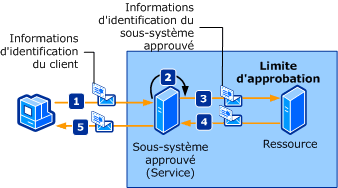

# <a name="trusted-subsystem"></a>Sous-système approuvé
Un client accède à un ou plusieurs services Web distribués sur un réseau. Les services Web sont conçus afin que l'accès aux ressources supplémentaires (telles que les bases de données ou autres services Web) soit encapsulé dans la logique métier du service Web. Ces ressources doivent être protégées contre tout accès non autorisé. L'illustration suivante présente un processus de sous-système approuvé.  
  
   
  
 Les étapes suivantes décrivent le processus de sous-système approuvé tel qu'il est présenté :  
  
1.  Le client envoie une demande au sous-système approuvé, accompagnée des informations d'identification.  
  
2.  Le sous-système approuvé authentifie et autorise l'utilisateur.  
  
3.  Le sous-système approuvé envoie un message de demande à la ressource distante. Cette demande est accompagnée des informations d'identification du sous-système approuvé (ou le compte de service sous lequel le processus de sous-système approuvé est exécuté).  
  
4.  La ressource principale authentifie et autorise le sous-système approuvé. Elle traite ensuite la demande et envoie une réponse au sous-système approuvé.  
  
5.  Le sous-système approuvé traite la réponse et envoie sa propre réponse au client.  
  
|Caractéristique|Description|  
|--------------------|-----------------|  
|Mode de sécurité|Message|  
|Interopérabilité|Windows Communication Foundation (WCF) uniquement.|  
|Authentification (service)|Le service de jeton de sécurité authentifie et autorise des clients.|  
|Authentification (client)|Le sous-système approuvé authentifie le client et la ressource authentifie le service du sous-système approuvé.|  
|Intégrité|Oui|  
|Confidentialité|Oui|  
|Transport|HTTP entre client et le service du sous-système approuvé.<br /><br /> NET.TCP entre le service du sous-système approuvé et la ressource (service principal).|  
|Liaison|<xref:System.ServiceModel.WSHttpBinding> and <xref:System.ServiceModel.NetTcpBinding>[\<wsFederationHttpBinding>](../../../../docs/framework/configure-apps/file-schema/wcf/wsfederationhttpbinding.md)|  
  
## <a name="resource-back-end-service"></a>Ressource (service principal)  
  
### <a name="code"></a>Code  
 Le code suivant indique comment créer un point de terminaison de service pour la ressource, qui utilise la sécurité de transport sur le protocole de transport TCP.  
  
 [!code-csharp[TrustedSubSystemsResource#1](../../../../samples/snippets/csharp/VS_Snippets_CFX/trustedsubsystemsresource/cs/source.cs#1)]
 [!code-vb[TrustedSubSystemsResource#1](../../../../samples/snippets/visualbasic/VS_Snippets_CFX/trustedsubsystemsresource/vb/source.vb#1)]  
  
### <a name="configuration"></a>Configuration  
 La configuration suivante configure le même point de terminaison en utilisant la configuration.  
  
```xml  
<?xml version="1.0" encoding="utf-8" ?>  
<configuration>  
  <system.serviceModel>  
    <services>  
      <service name="Microsoft.ServiceModel.Samples.BackendService"  
               behaviorConfiguration="BackendServiceBehavior">  
        <endpoint address="net.tcp://localhost.com:8001/BackendService"  
                  binding="customBinding"  
                  bindingConfiguration="Binding1"  
                  contract="Microsoft.ServiceModel.Samples.ICalculator"/>  
      </service>  
    </services>  
    <bindings>  
      <customBinding>  
        <binding name="Binding1">  
          <security authenticationMode="UserNameOverTransport"/>  
          <windowsStreamSecurity/>  
          <tcpTransport/>  
        </binding>  
      </customBinding>  
    </bindings>  
    <behaviors>  
      <serviceBehaviors>  
        <behavior name="BackendServiceBehavior">  
          <serviceCredentials>  
            <userNameAuthentication userNamePasswordValidationMode="Custom"  
                                    customUserNamePasswordValidatorType="Microsoft.ServiceModel.Samples.MyUserNamePasswordValidator, BackendService"/>  
          </serviceCredentials>  
        </behavior>  
      </serviceBehaviors>  
    </behaviors>  
  </system.serviceModel>  
</configuration>  
```  
  
## <a name="trusted-subsystem"></a>Sous-système approuvé  
  
### <a name="code"></a>Code  
 Le code suivant indique comment créer un point de terminaison de service pour le sous-système approuvé qui utilise la sécurité de message sur le protocole HTTP ainsi qu'un nom d'utilisateur et un mot de passe pour l'authentification.  
  
 [!code-csharp[TrustedSubSystems#1](../../../../samples/snippets/csharp/VS_Snippets_CFX/trustedsubsystems/cs/source.cs#1)]
 [!code-vb[TrustedSubSystems#1](../../../../samples/snippets/visualbasic/VS_Snippets_CFX/trustedsubsystems/vb/source.vb#1)]  
  
 Le code suivant affiche un service dans un sous-système approuvé qui communique avec un service principal en utilisant la sécurité de transport sur le protocole de transport TCP.  
  
 [!code-csharp[TrustedSubSystems#2](../../../../samples/snippets/csharp/VS_Snippets_CFX/trustedsubsystems/cs/source.cs#2)]
 [!code-vb[TrustedSubSystems#2](../../../../samples/snippets/visualbasic/VS_Snippets_CFX/trustedsubsystems/vb/source.vb#2)]  
  
### <a name="configuration"></a>Configuration  
 La configuration suivante configure le même point de terminaison en utilisant la configuration. Notez les deux liaisons : Une sécurise le service hébergé dans le sous-système approuvé et l’autre communique entre le sous-système approuvé et le service back-end.  
  
```xml  
<?xml version="1.0" encoding="utf-8" ?>  
<configuration>  
  <system.serviceModel>  
    <services>  
      <service name="Microsoft.ServiceModel.Samples.FacadeService"  
               behaviorConfiguration="FacadeServiceBehavior">  
        <host>  
          <baseAddresses>  
            <add baseAddress="http://localhost:8000/FacadeService"/>  
          </baseAddresses>  
        </host>  
        <endpoint address="http://localhost:8000/FacadeService"  
                  binding="wsHttpBinding"  
                  bindingConfiguration="Binding1"  
                  contract="Microsoft.ServiceModel.Samples.ICalculator"/>  
      </service>  
    </services>  
    <client>  
      <endpoint name=""   
                address="net.tcp://contoso.com:8001/BackendService"  
                binding="customBinding"  
                bindingConfiguration="ClientBinding"  
                contract="Microsoft.ServiceModel.Samples.ICalculator"/>  
    </client>  
    <bindings>  
      <wsHttpBinding>  
        <binding name="Binding1">  
          <security mode="Message">  
            <message clientCredentialType="UserName"/>  
          </security>  
        </binding>  
      </wsHttpBinding>  
      <customBinding>  
        <binding name="ClientBinding">  
          <security authenticationMode="UserNameOverTransport"/>  
          <windowsStreamSecurity/>  
          <tcpTransport/>  
        </binding>  
      </customBinding>  
    </bindings>  
    <behaviors>  
      <serviceBehaviors>  
        <behavior name="FacadeServiceBehavior">  
          <serviceMetadata httpGetEnabled="True"/>  
          <serviceCredentials>  
            <serviceCertificate findValue="Contoso.com"  
                                storeLocation="LocalMachine"  
                                storeName="My"  
                                x509FindType="FindBySubjectName" />  
            <userNameAuthentication userNamePasswordValidationMode="Custom"  
                                    customUserNamePasswordValidatorType="Microsoft.ServiceModel.Samples.MyUserNamePasswordValidator, FacadeService"/>  
          </serviceCredentials>  
        </behavior>  
      </serviceBehaviors>  
    </behaviors>  
  </system.serviceModel>  
</configuration>  
```  
  
## <a name="client"></a>Client  
  
### <a name="code"></a>Code  
 Le code suivant indique comment créer le client qui communique avec le sous-système approuvé en utilisant la sécurité de message sur le protocole HTTP ainsi qu'un nom d'utilisateur et un mot de passe pour l'authentification.  
  
 [!code-csharp[TrustedSubSystemsClient#1](../../../../samples/snippets/csharp/VS_Snippets_CFX/trustedsubsystemsclient/cs/source.cs#1)]
 [!code-vb[TrustedSubSystemsClient#1](../../../../samples/snippets/visualbasic/VS_Snippets_CFX/trustedsubsystemsclient/vb/source.vb#1)]  
  
### <a name="configuration"></a>Configuration  
 Le code suivant configure le client pour qu'il utilise la sécurité de message sur le protocole HTTP ainsi qu'un nom d'utilisateur et un mot de passe pour l'authentification. Le nom d'utilisateur et le mot de passe peuvent uniquement être spécifiés à l'aide du code (cela n'est pas configurable).  
  
```xml  
<?xml version="1.0" encoding="utf-8" ?>  
<configuration>  
  <system.serviceModel>  
    <client>  
        <endpoint name=""   
                  address="http://www.cohowinery.com:8000/FacadeService"  
                  binding="wsHttpBinding"  
                  bindingConfiguration="Binding1"  
                  behaviorConfiguration="ClientUserNameBehavior"  
                  contract="Microsoft.ServiceModel.Samples.ICalculator"/>  
    </client>  
    <bindings>  
      <wsHttpBinding>  
        <binding name="Binding1">  
          <security mode="Message">  
            <message clientCredentialType="UserName"/>  
          </security>  
        </binding>  
      </wsHttpBinding>  
    </bindings>  
    <behaviors>  
      <endpointBehaviors>  
        <behavior name="ClientUserNameBehavior">  
          <clientCredentials>  
            <serviceCertificate>  
              <authentication certificateValidationMode="PeerOrChainTrust"/>  
            </serviceCertificate>  
          </clientCredentials>  
        </behavior>  
      </endpointBehaviors>  
    </behaviors>  
  </system.serviceModel>  
</configuration>  
```  
  
## <a name="see-also"></a>Voir aussi

- [Vue d'ensemble de la sécurité](../../../../docs/framework/wcf/feature-details/security-overview.md)
- [Modèle de sécurité pour Windows Server AppFabric](https://go.microsoft.com/fwlink/?LinkID=201279&clcid=0x409)
