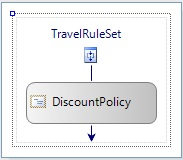

# Interop&#233;rabilit&#233; avec l&#39;ensemble de r&#232;gles&#160;3.5
Cet exemple montre l'utilisation de l'activité <xref:System.Activities.Statements.Interop> pour une intégration avec une activité personnalisée dans [!INCLUDE[netfx35_short](../../../../includes/netfx35-short-md.md)] à l'aide de <xref:System.Workflow.Activities.Policy> et de règles.  Il passe des données à l'activité personnalisée en liant des variables [!INCLUDE[netfx_current_long](../../../../includes/netfx-current-long-md.md)] aux propriétés de dépendance exposées par l'activité personnalisée.  
  
## Configuration requise  
  
1.  [!INCLUDE[vs_current_long](../../../../includes/vs-current-long-md.md)]  
  
2.  [!INCLUDE[netfx_current_long](../../../../includes/netfx-current-long-md.md)]  
  
3.  [!INCLUDE[netfx35_long](../../../../includes/netfx35-long-md.md)]  
  
## Démonstrations  
 Activité <xref:System.Activities.Statements.Interop>, activité <xref:System.Workflow.Activities.Policy> dans [!INCLUDE[netfx35_short](../../../../includes/netfx35-short-md.md)] avec des propriétés de dépendance  
  
## Discussion  
 L'exemple illustre l'un des scénarios d'intégration pour l'intégration avec une activité [!INCLUDE[netfx35_short](../../../../includes/netfx35-short-md.md)].  Cet exemple inclut une activité personnalisée [!INCLUDE[netfx35_short](../../../../includes/netfx35-short-md.md)] qui appelle une activité <xref:System.Workflow.Activities.Policy>.  
  
## TravelRuleLibrary  
 L'ouverture de TravelRuleSet.cs dans le concepteur affiche une activité séquentielle personnalisée qui contient une activité Policy telles que la suivante :  
  
   
  
 Double\-cliquez sur l'activité de stratégie **DiscountPolicy** pour examiner les règles.  L'éditeur de règles semble afficher les règles.  
  
   
  
 Cliquez avec le bouton droit sur l'activité **DiscountPolicy**, puis sélectionnez l'option **Afficher le code** pour examiner le code C\# code\-beside qui va avec cette activité.  Observez le paramètre de propriété de dépendance pour `DiscountLevel`.  Cela est équivalent à un <xref:System.Activities.Argument> dans [!INCLUDE[netfx_current_short](../../../../includes/netfx-current-short-md.md)].  
  
```  
public static DependencyProperty DiscountLevelProperty = DependencyProperty.Register("DiscountLevel", typeof(int), typeof(TravelRuleSet));  
  
[DescriptionAttribute("DiscountLevel")]  
[CategoryAttribute("DiscountLevel Category")]  
[BrowsableAttribute(true)]  
[DesignerSerializationVisibilityAttribute(DesignerSerializationVisibility.Visible)]  
public int DiscountLevel  
{  
   get  
   {  
return ((int)base.GetValue(TravelRuleSet.DiscountLevelProperty)));  
   }  
   set  
   {  
base.SetValue(TravelRuleSet.DiscountLevelProperty, value);  
   }  
}  
```  
  
## InteropWith35RuleSet  
 C'est un projet de workflow séquentiel [!INCLUDE[netfx_current_short](../../../../includes/netfx-current-short-md.md)] qui utilise l'activité <xref:System.Activities.Statements.Interop> pour une intégration à l'ensemble de règles personnalisé créé dans le projet TravelRuleLibrary.  Les variables sont créées sur le <xref:System.Activities.Statements.Sequence> de niveau supérieur, comme suit.  
  
   
  
   
  
 Pour finir, l'activité <xref:System.Activities.Statements.Interop> est utilisée pour s'intégrer à TravelRuleSet.  Les variables qui ont été déclarées précédemment sur <xref:System.Activities.Statements.Sequence> sont utilisées pour créer une liaison aux propriétés de dépendance.  
  
   
  
   
  
   
  
> [!IMPORTANT]
>  Les exemples peuvent déjà être installés sur votre ordinateur.  Recherchez le répertoire \(par défaut\) suivant avant de continuer.  
>   
>  `<LecteurInstall>:\WF_WCF_Samples`  
>   
>  Si ce répertoire n'existe pas, accédez à la page des [exemples Windows Communication Foundation \(WCF\) et Windows Workflow Foundation \(WF\) pour .NET Framework 4](http://go.microsoft.com/fwlink/?LinkId=150780) pour télécharger tous les exemples [!INCLUDE[indigo1](../../../../includes/indigo1-md.md)] et [!INCLUDE[wf1](../../../../includes/wf1-md.md)].  Cet exemple se trouve dans le répertoire suivant.  
>   
>  `<LecteurInstall>:\WF_WCF_Samples\WF\Basic\Built-InActivities\InteropWith35RuleSet`