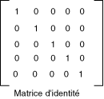

# Comment : utiliser une matrice de couleurs pour transformer une couleur unique
[!INCLUDE[ndptecgdiplus](../../../../includes/ndptecgdiplus-md.md)] Fournit la <xref:System.Drawing.Image> et <xref:System.Drawing.Bitmap> classes pour le stockage et la manipulation d’images. <xref:System.Drawing.Image> et <xref:System.Drawing.Bitmap> objets stockent la couleur de chaque pixel comme un nombre 32 bits : 8 bits pour le rouge, vert, bleu et alpha. Chacun des quatre composants est un nombre compris entre 0 et 255, où 0 représente aucune intensité et une intensité maximale de 255. Le composant alpha spécifie la transparence de la couleur : 0 est totalement transparent et 255 est complètement opaque.  
  
 Un vecteur de couleur est un 4-tuple de forme (rouge, vert, bleu, alpha). Par exemple, le vecteur de couleur (0, 255, 0, 255) représente une couleur opaque qui n’a ni rouge bleu, mais a vert à intensité complète.  
  
 Une autre convention de représentation des couleurs utilise le numéro 1 pour l’intensité maximale. À l’aide de cette convention, la couleur décrite dans le paragraphe précédent va être représentée par le vecteur (0, 1, 0, 1). [!INCLUDE[ndptecgdiplus](../../../../includes/ndptecgdiplus-md.md)] utilise la convention de 1 comme intensité complète lorsqu’il exécute des transformations de couleur.  
  
 Vous pouvez appliquer des transformations linéaires (rotation, mise à l’échelle, etc.) aux vecteurs de couleurs en multipliant ces vecteurs par une matrice 4 × 4. Toutefois, vous ne pouvez pas utiliser une matrice 4 × 4 pour effectuer une traduction (non linéaire). Si vous ajoutez une cinquième coordonnée fictive (par exemple, le nombre 1) à chaque vecteur de couleur, vous pouvez utiliser une matrice 5 x 5 pour appliquer des combinaisons de transformations linéaires et les traductions. Une transformation comprenant une transformation linéaire suivie d’une traduction est appelée une transformation affine.  
  
 Par exemple, supposons que vous souhaitez démarrer avec la couleur (0.2, 0.0, 0,4, 1.0) et appliquer les transformations suivantes :  
  
1.  Doubler la composante rouge  
  
2.  Ajouter 0,2 aux composants rouges, verts et bleus  
  
 La multiplication des matrices suivante va effectuer la paire de transformations dans l’ordre indiqué.  
  
   
  
 Les éléments d’une matrice de couleurs sont indexés (base zéro) par ligne et de colonne. Par exemple, l’entrée dans la cinquième ligne et la troisième colonne de la matrice M est représentée par M [4] [2].  
  
 La matrice d’identité 5 x 5 (indiqué dans l’illustration suivante) a 1 sur la diagonale et 0 partout ailleurs. Si vous multipliez un vecteur de couleur par la matrice d’identité, le vecteur de couleur ne change pas. Un moyen pratique de former la matrice d’une transformation de couleur consiste à commencer par la matrice d’identité et d’apporter une petite modification qui produit la transformation souhaitée.  
  
   
  
 Pour obtenir une présentation plus détaillée des matrices et des transformations, consultez [systèmes de coordonnées et Transformations](../../../../docs/framework/winforms/advanced/coordinate-systems-and-transformations.md).  
  
## Exemple  
 L’exemple suivant prend une image qui est une couleur (0.2, 0.0, 0,4, 1.0) et applique la transformation décrite dans les paragraphes précédents.  
  
 L’illustration suivante montre l’image d’origine sur la gauche et l’image transformée sur la droite.  
  
   
  
 Le code dans l’exemple suivant utilise les étapes suivantes pour effectuer le recoloriage :  
  
1.  Initialiser un <xref:System.Drawing.Imaging.ColorMatrix> objet.  
  
2.  Créer un <xref:System.Drawing.Imaging.ImageAttributes> de l’objet et de passer le <xref:System.Drawing.Imaging.ColorMatrix> de l’objet à la <xref:System.Drawing.Imaging.ImageAttributes.SetColorMatrix%2A> méthode de la <xref:System.Drawing.Imaging.ImageAttributes> objet.  
  
3.  Passer la <xref:System.Drawing.Imaging.ImageAttributes> de l’objet à la <xref:System.Drawing.Graphics.DrawImage%2A> méthode d’un <xref:System.Drawing.Graphics> objet.  
  
 [!code-csharp[System.Drawing.RecoloringImages#21](../../../../samples/snippets/csharp/VS_Snippets_Winforms/System.Drawing.RecoloringImages/CS/Class1.cs#21)]
 [!code-vb[System.Drawing.RecoloringImages#21](../../../../samples/snippets/visualbasic/VS_Snippets_Winforms/System.Drawing.RecoloringImages/VB/Class1.vb#21)]  
  
## Compilation du code  
 L'exemple précédent est conçu pour une utilisation avec Windows Forms et nécessite <xref:System.Windows.Forms.PaintEventArgs> `e`, qui est un paramètre du gestionnaire d'événements <xref:System.Windows.Forms.Control.Paint>.  
  
## Voir aussi  
 [Recoloriage des images](../../../../docs/framework/winforms/advanced/recoloring-images.md)  
 [Systèmes de coordonnées et transformations](../../../../docs/framework/winforms/advanced/coordinate-systems-and-transformations.md)
