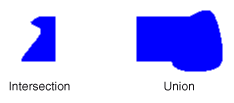

# Régions dans GDI+
Une région est une partie de la zone d’affichage d’un périphérique de sortie. Régions peuvent être simple (un rectangle) ou complexe (combinaison de polygones et de courbes fermées). L’illustration suivante montre deux régions : une construite à partir d’un rectangle et l’autre construite à partir d’un chemin d’accès.  
  
   
  
## Utilisation de régions  
 Les régions sont souvent utilisées pour le découpage et le test de positionnement. Le découpage consiste à restreindre le dessin à une certaine région de la zone d’affichage, généralement la partie qui doit être mis à jour. Un test de positionnement implique la vérification pour déterminer si le curseur se trouve dans une région donnée de l’écran lorsqu’un bouton de la souris est enfoncé.  
  
 Vous pouvez construire une région à partir d’un rectangle ou un chemin d’accès. Vous pouvez également créer des régions complexes en combinant des régions existantes. Le <xref:System.Drawing.Region> classe fournit les méthodes suivantes pour combiner des régions : <xref:System.Drawing.Region.Intersect%2A>, <xref:System.Drawing.Region.Union%2A>, <xref:System.Drawing.Region.Xor%2A>, <xref:System.Drawing.Region.Exclude%2A>, et <xref:System.Drawing.Region.Complement%2A>.  
  
 L’intersection de deux régions est l’ensemble de tous les points qui appartiennent aux deux régions. L’union est l’ensemble de tous les points appartenant à une ou l’autre ou les deux régions. Le complément d’une région est l’ensemble de tous les points qui ne sont pas dans la région. L’illustration suivante montre l’intersection et l’union de deux régions indiqué dans l’illustration précédente.  
  
   
  
 Le <xref:System.Drawing.Region.Xor%2A> méthode appliquée à deux régions, produit une région qui contient tous les points qui appartiennent à une région ou l’autre, mais pas les deux. Le <xref:System.Drawing.Region.Exclude%2A> méthode appliquée à deux régions, produit une région qui contient tous les points de la première région qui ne sont pas dans la deuxième zone. L’illustration suivante montre les régions qui résultent de l’application de la <xref:System.Drawing.Region.Xor%2A> et <xref:System.Drawing.Region.Exclude%2A> méthodes aux deux régions illustrées au début de cette rubrique.  
  
   
  
 Pour remplir une région, vous avez besoin une <xref:System.Drawing.Graphics> objet, un <xref:System.Drawing.Brush> objet et un <xref:System.Drawing.Region> objet. Le <xref:System.Drawing.Graphics> objet fournit le <xref:System.Drawing.Graphics.FillRegion%2A> (méthode) et le <xref:System.Drawing.Brush> objet stocke les attributs de remplissage, telles que la couleur ou un motif. L’exemple suivant remplit une zone avec une couleur unie.  
  
 [!code-csharp[LinesCurvesAndShapes#61](../../../../samples/snippets/csharp/VS_Snippets_Winforms/LinesCurvesAndShapes/CS/Class1.cs#61)]
 [!code-vb[LinesCurvesAndShapes#61](../../../../samples/snippets/visualbasic/VS_Snippets_Winforms/LinesCurvesAndShapes/VB/Class1.vb#61)]  
  
## Voir aussi  
 <xref:System.Drawing.Region?displayProperty=nameWithType>  
 [Lignes, courbes et formes](../../../../docs/framework/winforms/advanced/lines-curves-and-shapes.md)  
 [Utilisation de régions](../../../../docs/framework/winforms/advanced/using-regions.md)
