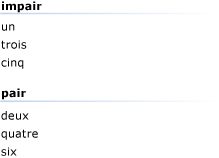

# Procédure : Grouper des éléments dans un contrôle de ListView Windows Forms à l’aide du Concepteur
La fonctionnalité de regroupement de la <xref:System.Windows.Forms.ListView> contrôle vous permet d’afficher les jeux d’éléments liés en groupes. Ces groupes sont séparés sur l’écran par des en-têtes de groupe horizontal qui contiennent les titres de groupe. Vous pouvez utiliser <xref:System.Windows.Forms.ListView> groupes pour faciliter la navigation dans les longues listes en regroupant les éléments par ordre alphabétique, par date, ou par tout autre regroupement logique. L’illustration suivante montre des éléments regroupés.  
  
   
  
 La procédure suivante nécessite un **Windows Application** projet avec un formulaire contenant un <xref:System.Windows.Forms.ListView> contrôle. Pour plus d’informations sur la configuration d’un tel projet, consultez [Comment : Créer un projet d’application Windows Forms](/visualstudio/ide/step-1-create-a-windows-forms-application-project) et [Comment : Ajouter des contrôles aux Windows Forms](how-to-add-controls-to-windows-forms.md).  
  
 Pour activer le regroupement, vous devez d’abord créer un ou plusieurs <xref:System.Windows.Forms.ListViewGroup> objets dans le concepteur ou par programme. Une fois qu’un groupe a été défini, vous pouvez affecter des éléments à ce dernier.  
  
> [!NOTE]
>  <xref:System.Windows.Forms.ListView> les groupes sont disponibles uniquement sur [!INCLUDE[WinXpFamily](../../../../includes/winxpfamily-md.md)] lorsque votre application appelle la <xref:System.Windows.Forms.Application.EnableVisualStyles%2A?displayProperty=nameWithType> (méthode). Sur les systèmes d’exploitation antérieurs, tout code relatif aux groupes n’a aucun effet et les groupes n’apparaîtra pas. Pour plus d'informations, consultez <xref:System.Windows.Forms.ListView.Groups%2A?displayProperty=nameWithType>.  
>   
>  Les boîtes de dialogue et les commandes de menu qui s'affichent peuvent être différentes de celles qui sont décrites dans l'aide, en fonction de vos paramètres actifs ou de l'édition utilisée. Pour modifier vos paramètres, choisissez **Importation et exportation de paramètres** dans le menu **Outils** . Pour plus d’informations, consultez [Personnaliser l’IDE Visual Studio](/visualstudio/ide/personalizing-the-visual-studio-ide).  
  
### Pour ajouter ou supprimer des groupes dans le Concepteur  
  
1.  Dans le **propriétés** fenêtre, cliquez sur le **points de suspension** () situé en regard le <xref:System.Windows.Forms.ListView.Groups%2A> propriété.  
  
     Le **éditeur de collections ListViewGroup** s’affiche.  
  
2.  Pour ajouter un groupe, cliquez sur le **ajouter** bouton. Vous pouvez ensuite définir les propriétés du nouveau groupe, tel que le <xref:System.Windows.Forms.ListViewGroup.Header%2A> et <xref:System.Windows.Forms.ListViewGroup.HeaderAlignment%2A> propriétés. Pour supprimer un groupe, sélectionnez-le et cliquez sur le **supprimer** bouton.  
  
### Pour affecter des éléments aux groupes dans le Concepteur  
  
1.  Dans le **propriétés** fenêtre, cliquez sur le **points de suspension** () situé en regard le <xref:System.Windows.Forms.ListView.Items%2A> propriété.  
  
     Le **éditeur de collections ListViewItem** s’affiche.  
  
2.  Pour ajouter un nouvel élément, cliquez sur le **ajouter** bouton. Vous pouvez ensuite définir les propriétés du nouvel élément, tel que le <xref:System.Windows.Forms.ListViewItem.Text%2A> et <xref:System.Windows.Forms.ListViewItem.ImageIndex%2A> propriétés.  
  
3.  Sélectionnez le <xref:System.Windows.Forms.ListViewItem.Group%2A> propriété et choisissez un groupe dans la liste déroulante.  
  
## Voir aussi
- <xref:System.Windows.Forms.ListView>
- <xref:System.Windows.Forms.ListView.Groups%2A>
- <xref:System.Windows.Forms.ListViewGroup>
- [Contrôle ListView](listview-control-windows-forms.md)
- [Vue d’ensemble du contrôle ListView](listview-control-overview-windows-forms.md)
- [Guide pratique pour Ajouter et supprimer des éléments avec le contrôle ListView Windows Forms](how-to-add-and-remove-items-with-the-windows-forms-listview-control.md)
