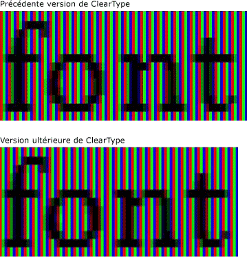

# Vue d'ensemble de ClearType
Cette rubrique propose une vue d’ensemble de la technologie [!INCLUDE[TLA#tla_ct](../../../../includes/tlasharptla-ct-md.md)] rencontrée dans [!INCLUDE[TLA#tla_winclient](../../../../includes/tlasharptla-winclient-md.md)].  
  
  
   
## Vue d’ensemble de la technologie  
 [!INCLUDE[TLA2#tla_ct](../../../../includes/tla2sharptla-ct-md.md)] est une technologie logicielle développée par [!INCLUDE[TLA#tla_ms](../../../../includes/tlasharptla-ms-md.md)] qui améliore la lisibilité du texte sur les affichages à cristaux liquides (LCD) existants, tels que les écrans d’ordinateurs portables, les écrans de Pocket PC et les écrans plats.  [!INCLUDE[TLA2#tla_ct](../../../../includes/tla2sharptla-ct-md.md)] fonctionne en accédant aux éléments individuels de la bande de couleur verticale dans chaque pixel d’un écran LCD. Avant [!INCLUDE[TLA2#tla_ct](../../../../includes/tla2sharptla-ct-md.md)], le plus petit niveau de détail que pouvait afficher un ordinateur était un pixel unique, mais grâce à l’exécution de [!INCLUDE[TLA2#tla_ct](../../../../includes/tla2sharptla-ct-md.md)] sur un moniteur LCD, il est désormais possible d’afficher des fonctionnalités de texte de l’ordre d’une fraction de pixel. Cette résolution accrue augmente la netteté des détails dans l’affichage textuel, ce qui facilite grandement la lecture sur de longues périodes.  
  
 La technologie [!INCLUDE[TLA2#tla_ct](../../../../includes/tla2sharptla-ct-md.md)] disponible dans [!INCLUDE[TLA#tla_winclient](../../../../includes/tlasharptla-winclient-md.md)] est la dernière version de [!INCLUDE[TLA2#tla_ct](../../../../includes/tla2sharptla-ct-md.md)]. Elle présente plusieurs améliorations par rapport à celle proposée dans [!INCLUDE[TLA#tla_gdi](../../../../includes/tlasharptla-gdi-md.md)].  
  
   
## Positionnement du sous-pixel  
 L’une des principales améliorations par rapport à la précédente version de [!INCLUDE[TLA2#tla_ct](../../../../includes/tla2sharptla-ct-md.md)] est l’utilisation du positionnement du sous-pixel. Contrairement à l’implémentation de [!INCLUDE[TLA2#tla_ct](../../../../includes/tla2sharptla-ct-md.md)] proposée dans [!INCLUDE[TLA2#tla_gdi](../../../../includes/tla2sharptla-gdi-md.md)], la version de [!INCLUDE[TLA2#tla_ct](../../../../includes/tla2sharptla-ct-md.md)] disponible dans [!INCLUDE[TLA#tla_winclient](../../../../includes/tlasharptla-winclient-md.md)] permet aux glyphes de démarrer à l’intérieur du pixel et pas simplement à sa limite de début. Grâce à cette résolution supérieure du positionnement des glyphes, l’espacement et les proportions des glyphes sont plus précis et cohérents.  
  
 Les deux exemples suivants montrent de quelle manière les glyphes peuvent commencer sur une limite de sous-pixel quand le positionnement du sous-pixel est utilisé. L’exemple de gauche est restitué à l’aide de la version antérieure du convertisseur [!INCLUDE[TLA2#tla_ct](../../../../includes/tla2sharptla-ct-md.md)], qui n’utilisait pas le positionnement du sous-pixel. L’exemple de droite est restitué à l’aide de la nouvelle version du convertisseur [!INCLUDE[TLA2#tla_ct](../../../../includes/tla2sharptla-ct-md.md)], qui utilise le positionnement du sous-pixel. Comme vous pouvez le constater, les lettres **e** et **l** de l’image de droite sont restituées de manière légèrement différente car elles démarrent toutes sur un sous-pixel différent. Quand vous affichez le texte à sa taille normale sur l’écran, cette différence n’est pas visible en raison du contraste élevé de l’image de glyphe. Ce résultat est uniquement possible grâce au filtrage de couleur sophistiqué incorporé dans [!INCLUDE[TLA2#tla_ct](../../../../includes/tla2sharptla-ct-md.md)].  
  
   
Texte affiché avec l’ancienne et la nouvelle version de ClearType  
  
 Les deux exemples suivants comparent la sortie de l’ancien convertisseur [!INCLUDE[TLA2#tla_ct](../../../../includes/tla2sharptla-ct-md.md)] et à celle de la nouvelle version du convertisseur [!INCLUDE[TLA2#tla_ct](../../../../includes/tla2sharptla-ct-md.md)]. Le positionnement du sous-pixel, illustré à droite, améliore considérablement l’espacement de type sur l’écran, en particulier à de petites tailles, quand la différence entre un sous-pixel et un pixel entier représente une proportion importante de la largeur du glyphe. Notez que l’espacement entre les lettres est plus régulier dans la deuxième image. L’avantage cumulatif du positionnement du sous-pixel sur l’apparence générale d’un écran de texte est considérablement renforcé et constitue une évolution significative de la technologie [!INCLUDE[TLA2#tla_ct](../../../../includes/tla2sharptla-ct-md.md)].  
  
   
Texte avec l’ancienne et la nouvelle version de ClearType  
  
   
## Anticrénelage de direction y  
 Une autre amélioration de [!INCLUDE[TLA2#tla_ct](../../../../includes/tla2sharptla-ct-md.md)] dans [!INCLUDE[TLA#tla_winclient](../../../../includes/tlasharptla-winclient-md.md)] est l’anticrénelage de direction y. La version de [!INCLUDE[TLA2#tla_ct](../../../../includes/tla2sharptla-ct-md.md)] disponible dans [!INCLUDE[TLA2#tla_gdi](../../../../includes/tla2sharptla-gdi-md.md)] sans l’anticrénelage de direction y offre une résolution supérieure sur l’axe x, mais pas sur l’axe y. Sur le haut et le bas des courbes marquées, les bords dentelés diminuent la lisibilité.  
  
 L’exemple suivant montre le résultat obtenu en l’absence d’anticrénelage de direction y. Dans ce cas, les bords dentelés sur le haut et le bas de la lettre sont apparents.  
  
   
Texte avec bords dentelés sur les courbes marquées  
  
 La version de [!INCLUDE[TLA2#tla_ct](../../../../includes/tla2sharptla-ct-md.md)] utilisée dans [!INCLUDE[TLA#tla_winclient](../../../../includes/tlasharptla-winclient-md.md)] utilise l’anticrénelage de direction y pour lisser les bords dentelés. Cette fonctionnalité est particulièrement importante pour améliorer la lisibilité des langues d’Extrême-Orient, dont les idéogrammes comptent quasiment autant de courbes marquées horizontales que verticales.  
  
 L’exemple suivant montre le résultat de l’anticrénelage de direction y. Dans ce cas, le haut et le bas de la lettre affichent une courbe lissée.  
  
   
Texte avec anticrénelage ClearType dans la direction y  
  
   
## Accélération matérielle  
 La version de [!INCLUDE[TLA2#tla_ct](../../../../includes/tla2sharptla-ct-md.md)] disponible dans [!INCLUDE[TLA#tla_winclient](../../../../includes/tlasharptla-winclient-md.md)] peut tirer parti de l’accélération matérielle pour améliorer les performances et réduire la charge de l’UC et les exigences concernant la mémoire système. Grâce à l’utilisation des nuanceurs de pixels et de la mémoire vidéo d’une carte graphique, [!INCLUDE[TLA2#tla_ct](../../../../includes/tla2sharptla-ct-md.md)] accélère le rendu du texte, en particulier quand une animation est utilisée.  
  
 La version de [!INCLUDE[TLA2#tla_ct](../../../../includes/tla2sharptla-ct-md.md)] dans [!INCLUDE[TLA#tla_winclient](../../../../includes/tlasharptla-winclient-md.md)] ne modifie pas les paramètres de [!INCLUDE[TLA2#tla_ct](../../../../includes/tla2sharptla-ct-md.md)] à l’échelle du système. La désactivation de [!INCLUDE[TLA2#tla_ct](../../../../includes/tla2sharptla-ct-md.md)] dans [!INCLUDE[TLA#tla_mswin](../../../../includes/tlasharptla-mswin-md.md)] fait basculer l’anticrénelage de [!INCLUDE[TLA#tla_winclient](../../../../includes/tlasharptla-winclient-md.md)] dans le mode nuances de gris. En outre, la version de [!INCLUDE[TLA2#tla_ct](../../../../includes/tla2sharptla-ct-md.md)] dans [!INCLUDE[TLA#tla_winclient](../../../../includes/tlasharptla-winclient-md.md)] ne modifie pas les paramètres de [ClearType Tuner PowerToy](https://www.microsoft.com/typography/ClearTypePowerToy.mspx).  
  
 En ce qui concerne la conception architecturale de [!INCLUDE[TLA#tla_winclient](../../../../includes/tlasharptla-winclient-md.md)], il a notamment été décidé d’améliorer la prise en charge par la disposition indépendante de la résolution des moniteurs DPI de résolution supérieure, qui sont de plus en plus répandus. De ce fait, [!INCLUDE[TLA#tla_winclient](../../../../includes/tlasharptla-winclient-md.md)] ne prend pas en charge le rendu de texte crénelé ni les bitmaps de certaines polices d’Extrême-Orient, qui sont tous deux dépendants de la résolution.  
  
   
## Informations complémentaires  
 [Informations sur ClearType](https://www.microsoft.com/typography/ClearTypeInfo.mspx)  
  
 [ClearType Tuner PowerToy](https://www.microsoft.com/typography/ClearTypePowerToy.mspx)  
  
## Voir aussi  
 [Paramètres du Registre ClearType](../../../../docs/framework/wpf/advanced/cleartype-registry-settings.md)
