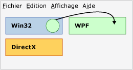
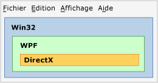

# Vue d'ensemble des régions de technologie
Si plusieurs technologies de présentation sont utilisées dans une application (par exemple, WPF, Win32 ou DirectX), elles doivent partager les zones de rendu dans une fenêtre de niveau supérieur commune. Cette rubrique décrit les problèmes qui peuvent avoir un impact sur la présentation et les entrées de votre application d’interopérabilité WPF.  
  
## Régions  
 Dans une fenêtre de niveau supérieur, vous pouvez conceptualiser que chaque HWND avec l’une des technologies d’une application d’interopérabilité dispose de sa propre région (également appelée espace de rendu, ou « airspace » en anglais). Chaque pixel de la fenêtre appartient à un seul HWND, qui constitue la région de ce HWND. (En réalité, il existe plusieurs régions [!INCLUDE[TLA2#tla_winclient](../../../../includes/tla2sharptla-winclient-md.md)] s’il y a plusieurs [!INCLUDE[TLA2#tla_winclient](../../../../includes/tla2sharptla-winclient-md.md)] HWND, mais pour les besoins de cette discussion, vous pouvez supposer qu’il n’en existe qu’une seule.) Le concept de région implique que toutes les couches ou autres fenêtres qui tentent d’effectuer un rendu par-dessus ce pixel pendant la durée de vie de l’application doivent utiliser la même technologie de niveau de rendu. Toute tentative de rendu de pixels [!INCLUDE[TLA2#tla_winclient](../../../../includes/tla2sharptla-winclient-md.md)] sur [!INCLUDE[TLA2#tla_win32](../../../../includes/tla2sharptla-win32-md.md)] entraîne des résultats indésirables et doit être évitée dans la mesure du possible dans les [!INCLUDE[TLA2#tla_api#plural](../../../../includes/tla2sharptla-apisharpplural-md.md)] d’interopérabilité.  
  
### Exemples de régions  
 L’illustration suivante montre une application qui combine des régions [!INCLUDE[TLA2#tla_win32](../../../../includes/tla2sharptla-win32-md.md)], [!INCLUDE[TLA2#tla_dx](../../../../includes/tla2sharptla-dx-md.md)] et [!INCLUDE[TLA2#tla_winclient](../../../../includes/tla2sharptla-winclient-md.md)]. Chaque technologie utilise son propre jeu distinct de pixels, sans chevauchement, ce qui évite les problèmes entre les régions.  
  
   
  
 Supposez que cette application utilise la position du pointeur de la souris pour créer une animation qui tente de s’afficher sur l’une de ces trois régions. Quelle que soit la technologie responsable de l’animation proprement dite, cette technologie donne lieu à une violation des deux autres régions. L’illustration suivante montre une tentative de rendu d’un cercle WPF sur une région Win32.  
  
   
  
 Si vous essayez d’utiliser la transparence ou simulation de transparence entre des technologies différentes, cela constitue également une violation.  L’illustration suivante montre une violation des régions [!INCLUDE[TLA2#tla_win32](../../../../includes/tla2sharptla-win32-md.md)] et [!INCLUDE[TLA2#tla_dx](../../../../includes/tla2sharptla-dx-md.md)] de la part de la zone [!INCLUDE[TLA2#tla_winclient](../../../../includes/tla2sharptla-winclient-md.md)]. Comme les pixels dans cette zone [!INCLUDE[TLA2#tla_winclient](../../../../includes/tla2sharptla-winclient-md.md)] sont semi-transparents, ils doivent normalement être détenus par les régions [!INCLUDE[TLA2#tla_dx](../../../../includes/tla2sharptla-dx-md.md)] et [!INCLUDE[TLA2#tla_winclient](../../../../includes/tla2sharptla-winclient-md.md)], ce qui n’est pas possible.  Cela constitue donc une autre violation, le rendu ne peut pas être effectué.  
  
   
  
 Les trois exemples précédents ont utilisé des régions rectangulaires, mais des formes différentes sont possibles.  Par exemple, une région peut présenter un espace. L’illustration suivante montre une région [!INCLUDE[TLA2#tla_win32](../../../../includes/tla2sharptla-win32-md.md)] qui comporte un espace rectangulaire de la taille des régions [!INCLUDE[TLA2#tla_winclient](../../../../includes/tla2sharptla-winclient-md.md)] et [!INCLUDE[TLA2#tla_dx](../../../../includes/tla2sharptla-dx-md.md)] combinées.  
  
   
  
 Les régions peuvent également avoir une forme non rectangulaire, ou toute autre forme qui peut être décrite par un HRGN [!INCLUDE[TLA2#tla_win32](../../../../includes/tla2sharptla-win32-md.md)] (région).  
  
   
  
## Transparence et fenêtres de niveau supérieur  
 Le Gestionnaire de fenêtrage Windows ne traite vraiment que les HWND [!INCLUDE[TLA2#tla_win32](../../../../includes/tla2sharptla-win32-md.md)]. Par conséquent, chaque [!INCLUDE[TLA2#tla_winclient](../../../../includes/tla2sharptla-winclient-md.md)] <xref:System.Windows.Window> est un HWND. Le <xref:System.Windows.Window> HWND doit respecter les règles générales de tout HWND. Dans ce HWND, le code [!INCLUDE[TLA2#tla_winclient](../../../../includes/tla2sharptla-winclient-md.md)] peut faire tout ce que les [!INCLUDE[TLA2#tla_api#plural](../../../../includes/tla2sharptla-apisharpplural-md.md)] [!INCLUDE[TLA2#tla_winclient](../../../../includes/tla2sharptla-winclient-md.md)] globales prennent en charge. Pour les interactions avec d’autres HWND sur les postes de travail, [!INCLUDE[TLA2#tla_winclient](../../../../includes/tla2sharptla-winclient-md.md)] doit se conformer aux règles de traitement et de rendu de [!INCLUDE[TLA2#tla_win32](../../../../includes/tla2sharptla-win32-md.md)].  [!INCLUDE[TLA2#tla_winclient](../../../../includes/tla2sharptla-winclient-md.md)] prend en charge les fenêtres non rectangulaires par le biais des [!INCLUDE[TLA2#tla_api#plural](../../../../includes/tla2sharptla-apisharpplural-md.md)] [!INCLUDE[TLA2#tla_win32](../../../../includes/tla2sharptla-win32-md.md)] (des HRGN pour les fenêtres non rectangulaires et des fenêtres superposées pour un alpha par pixel).  
  
 Les clés de couleur et les valeurs alpha constantes ne sont pas prises en charge.  Les fonctionnalités de fenêtre superposée de [!INCLUDE[TLA2#tla_win32](../../../../includes/tla2sharptla-win32-md.md)] varient selon la plateforme.  
  
 Les fenêtres superposées peuvent rendre toute la fenêtre translucide (semi-transparente) en spécifiant une valeur alpha à appliquer à chaque pixel de la fenêtre.  (En fait, [!INCLUDE[TLA2#tla_win32](../../../../includes/tla2sharptla-win32-md.md)] prend en charge l’alpha par pixel, mais il est très difficile à utiliser concrètement dans les programmes, car dans ce mode, vous devez dessiner les enfants HWND vous-même, y compris les boîtes de dialogue et les menus déroulants.)  
  
 [!INCLUDE[TLA2#tla_winclient](../../../../includes/tla2sharptla-winclient-md.md)] prend en charge les HRGN, mais il n’existe pas d’[!INCLUDE[TLA2#tla_api#plural](../../../../includes/tla2sharptla-apisharpplural-md.md)] managées pour cette fonctionnalité. Vous pouvez utiliser la plateforme appeler et <xref:System.Windows.Interop.HwndSource> pour appeler les [!INCLUDE[TLA2#tla_win32](../../../../includes/tla2sharptla-win32-md.md)] [!INCLUDE[TLA2#tla_api#plural](../../../../includes/tla2sharptla-apisharpplural-md.md)]. Pour plus d’informations, consultez [Appel à des fonctions natives à partir de code managé](/cpp/dotnet/calling-native-functions-from-managed-code).  
  
 Les fenêtres superposées [!INCLUDE[TLA2#tla_winclient](../../../../includes/tla2sharptla-winclient-md.md)] ont des fonctionnalités différentes en fonction des systèmes d’exploitation. Cela est dû au fait que [!INCLUDE[TLA2#tla_winclient](../../../../includes/tla2sharptla-winclient-md.md)] utilise [!INCLUDE[TLA2#tla_dx](../../../../includes/tla2sharptla-dx-md.md)] pour effectuer le rendu et que les fenêtres superposées ont principalement été conçues pour le rendu [!INCLUDE[TLA2#tla_gdi](../../../../includes/tla2sharptla-gdi-md.md)], et non pour le rendu [!INCLUDE[TLA2#tla_dx](../../../../includes/tla2sharptla-dx-md.md)].  
  
-   [!INCLUDE[TLA2#tla_winclient](../../../../includes/tla2sharptla-winclient-md.md)] prend en charge les fenêtres superposées à accélération matérielle sur [!INCLUDE[TLA#tla_longhorn](../../../../includes/tlasharptla-longhorn-md.md)] et versions ultérieures. Les fenêtres superposées à accélération matérielle sur [!INCLUDE[TLA2#tla_winxp](../../../../includes/tla2sharptla-winxp-md.md)] nécessitent la prise en charge de [!INCLUDE[TLA#tla_dx](../../../../includes/tlasharptla-dx-md.md)]. Les fonctionnalités disponibles varient donc en fonction de la version de [!INCLUDE[TLA#tla_dx](../../../../includes/tlasharptla-dx-md.md)] installée sur la machine.  
  
-   [!INCLUDE[TLA2#tla_winclient](../../../../includes/tla2sharptla-winclient-md.md)] ne prend pas en charge les clés de couleur de transparence, car [!INCLUDE[TLA2#tla_winclient](../../../../includes/tla2sharptla-winclient-md.md)] ne peut pas garantir l’affichage de la couleur exacte demandée, surtout s’il s’agit d’un rendu à accélération matérielle.  
  
-   Si votre application s’exécute sur [!INCLUDE[TLA2#tla_winxp](../../../../includes/tla2sharptla-winxp-md.md)], les fenêtres superposées sur des surfaces [!INCLUDE[TLA2#tla_dx](../../../../includes/tla2sharptla-dx-md.md)] scintillent lors du rendu de l’application [!INCLUDE[TLA2#tla_dx](../../../../includes/tla2sharptla-dx-md.md)].  (La véritable séquence de rendu est la suivante : [!INCLUDE[TLA#tla_gdi](../../../../includes/tlasharptla-gdi-md.md)] masque la fenêtre superposée, puis [!INCLUDE[TLA2#tla_dx](../../../../includes/tla2sharptla-dx-md.md)] dessine, puis [!INCLUDE[TLA#tla_gdi](../../../../includes/tlasharptla-gdi-md.md)] rétablit la fenêtre superposée.)  Les fenêtres superposées autres que [!INCLUDE[TLA2#tla_winclient](../../../../includes/tla2sharptla-winclient-md.md)] ont également cette limitation.  
  
## Voir aussi  
 [Interopérabilité WPF et Win32](../../../../docs/framework/wpf/advanced/wpf-and-win32-interoperation.md)  
 [Procédure pas à pas : hébergement d'un WPF Clock dans Win32](../../../../docs/framework/wpf/advanced/walkthrough-hosting-a-wpf-clock-in-win32.md)  
 [Hébergement de contenu Win32 dans WPF](../../../../docs/framework/wpf/advanced/hosting-win32-content-in-wpf.md)
