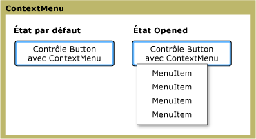

# ContextMenu
Le <xref:System.Windows.Controls.ContextMenu> permet un contrôle afficher un <xref:System.Windows.Controls.Menu> qui est spécifique au contexte du contrôle. En règle générale, les <xref:System.Windows.Controls.ContextMenu> est exposée dans le [!INCLUDE[TLA#tla_ui](../../../../includes/tlasharptla-ui-md.md)] via le bouton droit de la souris ou via le bouton de menu du clavier.  
  
 La figure suivante illustre un <xref:System.Windows.Controls.ContextMenu> dans deux états différents : l’état par défaut et l’état ouvert. Dans l’état par défaut, le contrôle est réduit. Lorsque le bouton droit de la souris est enfoncé sur le parent du menu, le contrôle se développe et affiche les éléments de menu.  
  
   
ContextMenu dans différents États  
  
## Dans cette section  
 [Vue d’ensemble de ContextMenu](../../../../docs/framework/wpf/controls/contextmenu-overview.md)  
  
## Référence  
 <xref:System.Windows.Controls.ContextMenu>  
  
## Rubriques connexes
