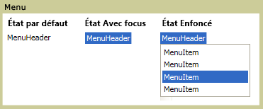

# Menu
Un <xref:System.Windows.Controls.Menu> est un contrôle permettant une organisation hiérarchique d'éléments associés à des commandes ou des gestionnaires d'événements.  Chaque <xref:System.Windows.Controls.Menu> peut contenir plusieurs contrôles <xref:System.Windows.Controls.MenuItem>.  Chaque <xref:System.Windows.Controls.MenuItem> peut appeler une commande ou un gestionnaire d'événements `Click`.  Un <xref:System.Windows.Controls.MenuItem> peut également avoir plusieurs éléments <xref:System.Windows.Controls.MenuItem> comme enfants, formant un sous\-menu.  
  
 L'illustration suivante montre les trois états différents d'un contrôle de menu.  L'état par défaut est lorsque aucun périphérique tel qu'un pointeur de la souris ne repose sur le <xref:System.Windows.Controls.Menu>.  L'état de focus se produit lorsque le pointeur de la souris est positionné au dessus du <xref:System.Windows.Controls.Menu> et l'état enfoncé se produit lorsque l'on clique sur un bouton de la souris sur le <xref:System.Windows.Controls.Menu>.  
  
   
Menus dans différents états  
  
## Dans cette section  
 [Vue d'ensemble de Menu](../../../../docs/framework/wpf/controls/menu-overview.md)  
  
## Référence  
 <xref:System.Windows.Controls.Menu>  
 <xref:System.Windows.Controls.MenuItem>  
 <xref:System.Windows.Controls.Primitives.MenuBase>  
 <xref:System.Windows.Controls.ContextMenu>  
  
## Rubriques connexes