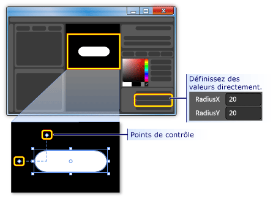
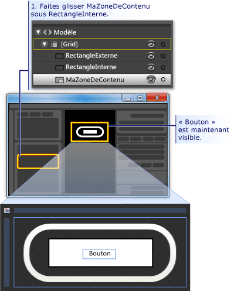
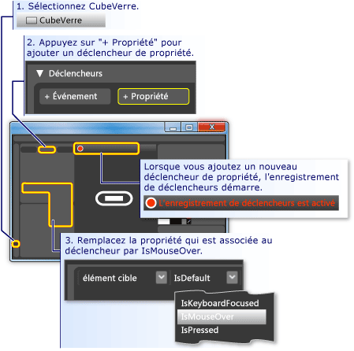
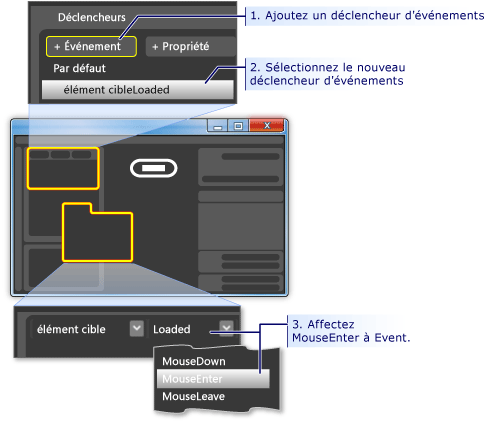
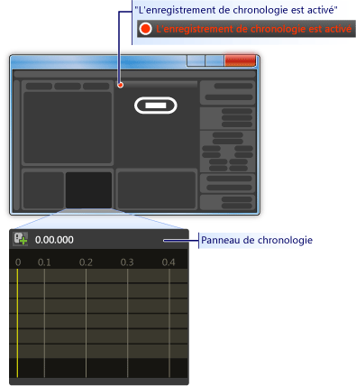
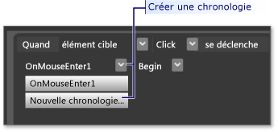

# Proc&#233;dure pas &#224; pas&#160;: cr&#233;ation d&#39;un bouton &#224; l&#39;aide de Microsoft Expression Blend
Cette procédure pas à pas décrit le processus de création d'un bouton personnalisé [!INCLUDE[TLA2#tla_wpf](../../../../includes/tla2sharptla-wpf-md.md)] à l'aide de Microsoft Expression Blend.  
  
> [!IMPORTANT]
>  Microsoft Expression Blend fonctionne en générant du code [!INCLUDE[TLA#tla_xaml](../../../../includes/tlasharptla-xaml-md.md)] qui est ensuite compilé pour créer le programme exécutable.  Si vous préférez travailler directement avec [!INCLUDE[TLA#tla_xaml](../../../../includes/tlasharptla-xaml-md.md)], il existe une autre procédure pas à pas qui crée la même application que celle\-ci en utilisant [!INCLUDE[TLA#tla_xaml](../../../../includes/tlasharptla-xaml-md.md)] avec [!INCLUDE[vs_current_short](../../../../includes/vs-current-short-md.md)] plutôt que Blend.  Consultez [Créer un bouton avec XAML](../../../../docs/framework/wpf/controls/walkthrough-create-a-button-by-using-xaml.md) pour plus d'informations.  
  
 L'illustration suivante montre le bouton personnalisé que vous allez créer.  
  
   
  
## Pour convertir une forme en bouton  
 Dans la première partie de cette procédure pas à pas, créez l'apparence personnalisée du bouton personnalisé.  Pour ce faire, convertissez d'abord un rectangle en bouton.  Ajoutez des formes supplémentaires au modèle du bouton, en créant un bouton à l'aspect plus complexe.  Pourquoi ne faut\-il pas commencer par un bouton normal et le personnaliser ?  Parce qu'un bouton a des fonctionnalités intégrées dont vous n'avez pas besoin ; dans le cas des boutons personnalisés, il est plus simple de commencer par un rectangle.  
  
#### Pour créer un projet dans Expression Blend  
  
1.  Lancez Expression Blend.  \(Cliquez sur **Démarrer**, pointez sur **Tous les programmes**, sur **Microsoft Expression**, puis cliquez sur **Microsoft Expression Blend**.\)  
  
2.  Optimisez l'application si nécessaire.  
  
3.  Dans le menu **Fichier**, cliquez sur **Nouveau projet**.  
  
4.  Sélectionnez **Application standard \(.exe\)**.  
  
5.  Nommez le projet `BoutonPersonnalisé` et cliquez sur **OK**.  
  
 À ce stade, votre projet [!INCLUDE[TLA2#tla_wpf](../../../../includes/tla2sharptla-wpf-md.md)] est vide.  Vous pouvez appuyer sur F5 pour exécuter l'application.  Comme vous pouvez vous y attendre, l'application consiste uniquement en une fenêtre vide.  Créez ensuite un rectangle à coins arrondis et convertissez\-le en bouton.  
  
#### Pour convertir un rectangle en bouton  
  
1.  **Affectez la valeur Noir à la propriété Fond de la fenêtre :**sélectionnez la fenêtre, cliquez sur l'onglet **Propriétés**, puis affectez la valeur `Black` à la propriété <xref:System.Windows.Controls.Control.Background%2A>.  
  
       
  
2.  **Dessinez un rectangle d'environ la taille d'un bouton sur la fenêtre :** sélectionnez l'outil Rectangle sur le panneau d'outils à gauche et faites\-le glisser dans la fenêtre.  
  
       
  
3.  **Arrondissez les angles du rectangle :** faites glisser ses points de contrôle ou définissez directement les propriétés <xref:System.Windows.Shapes.Rectangle.RadiusX%2A> et <xref:System.Windows.Shapes.Rectangle.RadiusY%2A>.  Définissez les valeurs de <xref:System.Windows.Shapes.Rectangle.RadiusX%2A> et de <xref:System.Windows.Shapes.Rectangle.RadiusY%2A> sur 20.  
  
       
  
4.  **Transformez le rectangle en bouton :** sélectionnez le rectangle.  Dans le menu **Outils**, cliquez sur **Créer un bouton**.  
  
       
  
5.  **Spécifiez la portée du style\/modèle :** la boîte de dialogue suivante apparaît.  
  
       
  
     Pour **Nom de la ressource \(Clé\)**, sélectionnez **Appliquer à tout**.  Le style et le modèle de bouton obtenus s'appliquent à tous les objets étant des boutons.  Pour **Définir dans**, sélectionnez **Application**.  Le style et le modèle de bouton obtenus ont une portée sur l'ensemble de l'application.  Lorsque vous définissez les valeurs dans ces deux zones, le style et le modèle de bouton s'appliquent à tous les boutons de l'application et chaque bouton créé dans cette application utilise, par défaut, ce modèle.  
  
## Pour modifier le modèle de bouton  
 Vous avez à présent un rectangle qui a été changé en bouton.  Dans cette section, vous modifierez le modèle du bouton et en personnaliserez l'apparence.  
  
#### Pour modifier le modèle de bouton afin de changer l'apparence du bouton  
  
1.  **Passez en mode de modification du modèle :** pour continuer à personnaliser l'apparence du bouton, il convient d'en modifier le modèle.  Ce modèle a été créé lorsque le rectangle a été converti en bouton.  Pour modifier le modèle de bouton, cliquez avec le bouton droit sur le bouton, sélectionnez **Modifier des contrôles \(modèle\)**, puis **Modifier un modèle**.  
  
       
  
     Dans l'éditeur de modèle, notez que le bouton est désormais séparé en un <xref:System.Windows.Shapes.Rectangle> et le <xref:System.Windows.Controls.ContentPresenter>.  Le <xref:System.Windows.Controls.ContentPresenter> sert à présenter le contenu dans le bouton \(par exemple, la chaîne « Bouton »\).  Le rectangle et le <xref:System.Windows.Controls.ContentPresenter> sont exposés dans une <xref:System.Windows.Controls.Grid>.  
  
       
  
2.  **Modifiez les noms des composants du modèle :** cliquez avec le bouton droit sur le rectangle dans l'inventaire de modèles, remplacez le nom <xref:System.Windows.Shapes.Rectangle> de « \[Rectangle\] » par « RectangleExterne », et remplacez « \[ContentPresenter\] » par « MaZoneDeContenu ».  
  
       
  
3.  **Modifiez le rectangle afin qu'il soit vide à l'intérieur \(comme une bouée\) :** sélectionnez **RectangleExterne**, puis définissez <xref:System.Windows.Shapes.Shape.Fill%2A> sur « Transparent » et <xref:System.Windows.Shapes.Shape.StrokeThickness%2A> sur 5.  
  
       
  
     Définissez ensuite le <xref:System.Windows.Shapes.Shape.Stroke%2A> sur la couleur choisie pour le modèle.  Pour ce faire, cliquez sur la petite case blanche située en regard de **Trait**, sélectionnez **Expression Personnalisée** et tapez « {TemplateBinding Background} » dans la boîte de dialogue.  
  
       
  
4.  **Créez un rectangle interne :** à présent, créez un autre rectangle \(nommez\-le « RectangleInterne »\) et positionnez\-le symétriquement à l'intérieur de **RectangleExterne**.  Pour ce type de travail, vous souhaiterez probablement effectuer un zoom afin d'agrandir le bouton dans la zone de modification.  
  
    > [!NOTE]
    >  Votre rectangle peut être différent de celui de la figure \(par exemple, il peut avoir des angles arrondis\).  
  
       
  
5.  **Déplacez ContentPresenter vers le haut :** à ce stade, le texte « Bouton » peut ne plus être visible.  Si c'est le cas, c'est parce que **RectangleInterne** est au\-dessus de **MaZoneDeContenu**.  Pour résoudre ce problème, faites glisser **MaZoneDeContenu** sous **RectangleInterne**.  Repositionnez les rectangles et **MaZoneDeContenu** de manière à ce qu'ils soient semblables à l'exemple présenté ci\-dessous.  
  
    > [!NOTE]
    >  Vous pouvez également positionner **MaZoneDeContenu** au\-dessus en cliquant dessus avec le bouton droit et en appuyant sur **Avancer d'un plan**.  
  
       
  
6.  **Modifiez l'apparence d'innerRectangle :** définissez les valeurs  <xref:System.Windows.Shapes.Rectangle.RadiusX%2A>, <xref:System.Windows.Shapes.Rectangle.RadiusY%2A> et  <xref:System.Windows.Shapes.Shape.StrokeThickness%2A> à 20.  De plus, affectez à <xref:System.Windows.Shapes.Shape.Fill%2A> l'arrière\-plan du modèle à l'aide de l'expression personnalisée "{TemplateBinding Background}" \) et affectez la valeur « transparent » à <xref:System.Windows.Shapes.Shape.Stroke%2A>.  Notez que les paramètres de <xref:System.Windows.Shapes.Shape.Fill%2A> et de <xref:System.Windows.Shapes.Shape.Stroke%2A> de **RectangleInterne** sont opposés à ceux de **RectangleExterne**.  
  
       
  
7.  **Ajoutez une couche de verre sur le dessus :** l'ajout d'une couche de verre sur le dessus constitue la touche finale dans la personnalisation de l'apparence du bouton.  Cette couche de verre consiste en un troisième rectangle.  Dans la mesure où le verre recouvre tout le bouton, le rectangle de verre a les mêmes dimensions que **RectangleExterne**.  Il vous suffit, par conséquent, pour créer le rectangle de copier le **RectangleExterne**.  Mettez en surbrillance **RectangleExterne** et utilisez CTRL\+C et CTRL\+V pour effectuer une copie.  Dénommez ce nouveau rectangle « CubeVerre ».  
  
8.  **Repositionnez CubeVerre si nécessaire :** si **CubeVerre** n'est pas déjà positionné de façon à couvrir tout le bouton, faites\-le glisser dans la position adéquate.  
  
9. **Donnez à CubeVerre une forme légèrement différente de celle de RectangleExterne :** pour ce faire, modifiez les propriétés de **CubeVerre**.  Commencez par définir les propriétés <xref:System.Windows.Shapes.Rectangle.RadiusX%2A> et <xref:System.Windows.Shapes.Rectangle.RadiusY%2A> sur 10 et <xref:System.Windows.Shapes.Shape.StrokeThickness%2A> sur 2.  
  
       
  
10. **Donnez à CubeVerre l'apparence du verre :** donnez à <xref:System.Windows.Shapes.Shape.Fill%2A> une apparence vitrée à l'aide d'un dégradé linéaire opaque à 75 % et qui alterne entre le blanc et le transparent sur 6 intervalles espacés de façon plus ou moins uniforme.  Voici comment définir les points de dégradé :  
  
    -   Point de dégradé 1 : blanc avec valeur alpha de 75 %  
  
    -   Point de dégradé 2 : transparent  
  
    -   Point de dégradé 3 : blanc avec valeur alpha de 75 %  
  
    -   Point de dégradé 4 : transparent  
  
    -   Point de dégradé 5 : blanc avec valeur alpha de 75 %  
  
    -   Point de dégradé 6 : transparent  
  
     Ceci crée une apparence de verre « ondulé ».  
  
       
  
11. **Masquez la couche de verre :** une fois l'apparence de la couche vitrée visualisée, allez dans le volet **Apparence** du panneau **Propriétés** et définissez l'opacité sur 0 % pour masquer la couche.  Dans les sections suivantes, vous utiliserez des déclencheurs de propriétés et des événements pour afficher et manipuler la couche de verre.  
  
       
  
## Pour personnaliser le comportement du bouton  
 À ce stade, vous avez personnalisé la présentation du bouton en modifiant son modèle, mais le bouton ne réagit pas aux actions de l'utilisateur comme les boutons habituels le font \(par exemple, changer d'apparence au passage de la souris, recevoir le focus et cliquer.\) Les deux procédures suivantes indiquent comment générer des comportements tels que ceux\-là dans le bouton personnalisé.  Nous commencerons par les déclencheurs de propriétés simples, puis passerons aux déclencheurs d'événements et aux animations.  
  
#### Pour définir les déclencheurs de propriétés  
  
1.  **Créez un déclencheur de propriété :** après avoir sélectionné **CubeVerre**, cliquez sur **\+ Propriété** dans le volet **Déclencheurs** \(voir la figure après l'étape suivante\).  Ceci permet de créer un déclencheur de propriété avec un déclencheur de propriété par défaut.  
  
2.  **Faites en sorte que la propriété utilisée par le déclencheur soit IsMouseOver :** remplacez la propriété par <xref:System.Windows.UIElement.IsMouseOver%2A>.  Ceci rend le déclencheur de propriété actif lorsque la propriété <xref:System.Windows.UIElement.IsMouseOver%2A> a la valeur `true` \(lorsque l'utilisateur pointe sur le bouton avec la souris\).  
  
       
  
3.  **IsMouseOver déclenche une opacité de 100 % pour CubeVerre :** notez que **L'enregistrement du déclencheur est activé** \(voir la figure précédente\).  Ceci signifie que chaque modification effectuée sur les valeurs de propriété de **CubeVerre** lorsque l'enregistrement est activé devient une action qui a lieu lorsque <xref:System.Windows.UIElement.IsMouseOver%2A> a la valeur `true`.  Lors de l'enregistrement, changez <xref:System.Windows.UIElement.Opacity%2A> de **CubeVerre** à 100 %.  
  
       
  
     Vous avez à présent créé votre premier déclencheur de propriété.  Notez que le volet **Déclencheurs** de l'éditeur a enregistré que <xref:System.Windows.UIElement.Opacity%2A> a été changé à 100 %.  
  
       
  
     Appuyez sur F5 pour exécuter l'application, puis déplacez le pointeur de la souris sur le bouton.  La couche de verre apparaît au passage de la souris sur le bouton et disparaît lorsque le pointeur n'est plus positionné dessus.  
  
4.  **IsMouseOver déclenche un changement de la valeur du trait :** associons d'autres actions au déclencheur <xref:System.Windows.UIElement.IsMouseOver%2A>.  Alors que l'enregistrement se poursuit, basculez votre sélection de **CubeVerre** à **RectangleExterne**.  Affectez ensuite l'expression personnalisée de "{DynamicResource {x:Static SystemColors.HighlightBrushKey}}" au <xref:System.Windows.Shapes.Shape.Stroke%2A> de **RectangleExterne**.  Ceci permet de définir le <xref:System.Windows.Shapes.Shape.Stroke%2A> sur la couleur de surbrillance habituelle utilisée par les boutons.  Appuyez sur F5 pour visualiser l'effet lorsque vous pointez sur le bouton avec la souris.  
  
       
  
5.  **IsMouseOver déclenche un texte flou :** associons une action supplémentaire au déclencheur de propriété <xref:System.Windows.UIElement.IsMouseOver%2A>.  Rendez le contenu du bouton un peu flou lorsque le verre est positionné dessus.  Pour ce faire, nous pouvons appliquer un <xref:System.Windows.Media.Effects.BitmapEffect> flou à <xref:System.Windows.Controls.ContentPresenter> \(**MaZoneDeContenu**\).  
  
       
  
    > [!NOTE]
    >  Pour revenir au panneau **Propriétés** tel qu'il était avant que vous n'effectuiez la recherche de <xref:System.Windows.Media.Effects.BitmapEffect>, supprimez le texte de la zone **Rechercher**.  
  
     À ce stade, nous avons utilisé un déclencheur de propriété avec plusieurs actions associées afin de créer un comportement de mise en surbrillance lorsque le pointeur de la souris entre dans et sort de la zone du bouton.  Un autre comportement habituel pour un bouton est d'effectuer une mise en surbrillance lorsqu'il a le focus \(comme après que l'on a cliqué dessus\).  Nous pouvons ajouter un tel comportement en ajoutant un autre déclencheur de propriété à la propriété <xref:System.Windows.UIElement.IsFocused%2A>.  
  
6.  **Créez un déclencheur de propriété pour IsFocused :** à l'aide de la même procédure que pour <xref:System.Windows.UIElement.IsMouseOver%2A> \(voir la première étape de cette section\), créez un autre déclencheur de propriété pour la propriété <xref:System.Windows.UIElement.IsFocused%2A>.  Pendant que **l'enregistrement du déclencheur est activé**, ajoutez les actions suivantes au déclencheur :  
  
    -   **CubeVerre** obtient une <xref:System.Windows.UIElement.Opacity%2A> de 100 %.  
  
    -   **RectangleExterne** obtient la valeur d'expression personnalisée <xref:System.Windows.Shapes.Shape.Stroke%2A> "{DynamicResource {x:Static SystemColors.HighlightBrushKey}}".  
  
 Dans la dernière étape de cette procédure pas à pas, nous ajouterons des animations au bouton.  Ces animations seront déclenchées par des événements, notamment les événements <xref:System.Windows.UIElement.MouseEnter> et <xref:System.Windows.Controls.Primitives.ButtonBase.Click>.  
  
#### Pour utiliser des déclencheurs d'événements et des animations pour ajouter l'interactivité  
  
1.  **Créez un déclencheur d'événements MouseEnter :** ajoutez un nouveau déclencheur d'événements et sélectionnez <xref:System.Windows.UIElement.MouseEnter> comme l'événement à utiliser dans le déclencheur.  
  
       
  
2.  **Créez une chronologie d'animation :** associez ensuite une chronologie d'animation à l'événement <xref:System.Windows.UIElement.MouseEnter>.  
  
       
  
     Une fois que vous avez appuyé sur **OK** pour créer une nouvelle chronologie, un panneau **Chronologie** s'affiche et « L'enregistrement de chronologie est activé » est visible dans le panneau de conception.  Vous pouvez, par conséquent, commencer à enregistrer les changements de propriété dans la chronologie \(animer les changements de propriété\).  
  
    > [!NOTE]
    >  Vous devez peut\-être redimensionner votre fenêtre et\/ou vos panneaux pour visualiser l'affichage.  
  
       
  
3.  **Créez une image clé :** pour créer une animation, sélectionnez l'objet que vous souhaitez animer, créez deux ou plusieurs images clés sur la chronologie, puis définissez les valeurs de propriété que l'animation doit interpoler entre.  La figure suivante vous guide dans la création d'une image clé.  
  
       
  
4.  **Réduisez CubeVerre à cette image clé :** une fois la seconde image clé sélectionnée, réduisez **CubeVerre** à 90 % de sa taille maximale, à l'aide de la **transformation de taille**.  
  
       
  
     Appuyez sur F5 pour exécuter l'application.  Déplacez le pointeur de la souris sur le bouton.  Notez que la couche de verre sur le bouton se réduit.  
  
5.  **Créez un autre déclencheur d'événements et associez\-lui une animation différente :** ajoutons une animation supplémentaire.  Utilisez la même procédure que celle qui vous a servi à créer l'animation du déclencheur d'événements précédent :  
  
    1.  Créez un déclencheur d'événements à l'aide de l'événement <xref:System.Windows.Controls.Primitives.ButtonBase.Click>.  
  
    2.  Associez une nouvelle chronologie à l'événement <xref:System.Windows.Controls.Primitives.ButtonBase.Click>.  
  
       
  
    1.  Pour cette chronologie, créez deux images clés, l'une à 0,0 secondes et l'autre à 0,3 secondes.  
  
    2.  Lorsque l'image clé à 0,3 secondes s'affiche en surbrillance, définissez l'**angle de transformation par pivotement** à 360 degrés.  
  
       
  
    1.  Appuyez sur F5 pour exécuter l'application.  Cliquez sur le bouton.  Notez que la couche de verre sur le bouton tourne.  
  
## Conclusion  
 Vous avez terminé la création d'un bouton personnalisé.  Vous y êtes parvenu à l'aide d'un modèle de bouton qui s'appliquait à tous les boutons de l'application.  Si vous quittez le mode de modification de modèle \(voir la figure suivante\) et que vous créez plusieurs boutons, vous constaterez qu'ils ont l'apparence et le comportement de votre bouton personnalisé plutôt que ceux du bouton par défaut.  
  
   
  
   
  
 Appuyez sur F5 pour exécuter l'application.  Cliquez sur les boutons et notez qu'ils se comportent tous de la même façon.  
  
 Rappelez\-vous que lorsque vous avez personnalisé le modèle, vous avez défini la propriété <xref:System.Windows.Shapes.Shape.Fill%2A> de **RectangleExterne** et la propriété <xref:System.Windows.Shapes.Shape.Stroke%2A> de **RectangleInterne** sur l'arrière\-plan du modèle \({TemplateBinding Background}\).  Pour cette raison, lorsque vous définissez la couleur d'arrière\-plan de chaque bouton, l'arrière\-plan que vous définissez est utilisé pour chacune des propriétés.  Essayez à présent de changer l'arrière\-plan.  Dans la figure suivante, différents dégradés sont utilisés.  Par conséquent, bien qu'un modèle soit nécessaire pour la personnalisation globale de contrôles tels qu'un bouton, les contrôles avec modèles peuvent être modifiés pour ne pas se ressembler.  
  
   
  
 En conclusion, dans le processus de personnalisation d'un modèle de bouton, vous avez appris à effectuer les actions suivantes à l'aide de Microsoft Expression Blend :  
  
-   Personnaliser l'apparence d'un contrôle.  
  
-   Définir des déclencheurs de propriétés.  Les déclencheurs de propriétés sont très utiles car ils peuvent être utilisés sur la plupart des objets et pas seulement sur les contrôles.  
  
-   Définir des déclencheurs d'événements.  Les déclencheurs d'événements sont très utiles car ils peuvent être utilisés sur la plupart des objets et pas seulement sur les contrôles.  
  
-   Créer des animations.  
  
-   Divers : créer des dégradés, ajouter des effets bitmap, utiliser des transformations et définir les propriétés de base des objets.  
  
## Voir aussi  
 [Créer un bouton avec XAML](../../../../docs/framework/wpf/controls/walkthrough-create-a-button-by-using-xaml.md)   
 [Application d'un style et création de modèles](../../../../docs/framework/wpf/controls/styling-and-templating.md)   
 [Vue d'ensemble de l'animation](../../../../docs/framework/wpf/graphics-multimedia/animation-overview.md)   
 [Vue d'ensemble de la peinture avec des couleurs unies ou des dégradés](../../../../docs/framework/wpf/graphics-multimedia/painting-with-solid-colors-and-gradients-overview.md)   
 [Vue d'ensemble des effets bitmap](../../../../docs/framework/wpf/graphics-multimedia/bitmap-effects-overview.md)