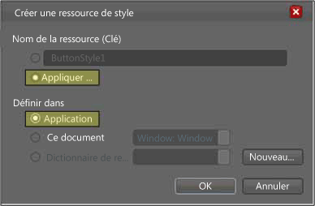
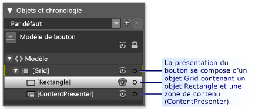
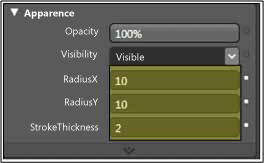
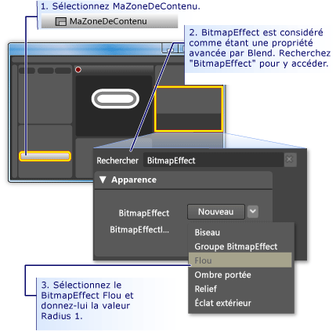
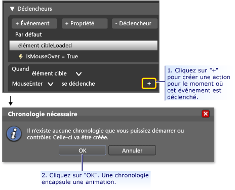
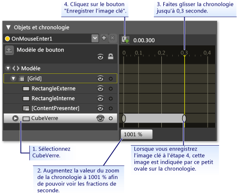
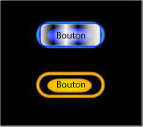

# Procédure pas à pas : création d'un bouton à l'aide de Microsoft Expression Blend
Cette procédure pas à pas vous guide tout au long des processus de création d’un [!INCLUDE[TLA2#tla_wpf](../../../../includes/tla2sharptla-wpf-md.md)] bouton personnalisé à l’aide de Microsoft Expression Blend.  
  
> [!IMPORTANT]
>  Microsoft Expression Blend fonctionne en générant [!INCLUDE[TLA#tla_xaml](../../../../includes/tlasharptla-xaml-md.md)] qui est ensuite compilé pour que le programme exécutable. Si vous préférez travailler avec [!INCLUDE[TLA#tla_xaml](../../../../includes/tlasharptla-xaml-md.md)] directement, il existe une autre procédure pas à pas qui crée la même application que celle-ci en utilisant [!INCLUDE[TLA#tla_xaml](../../../../includes/tlasharptla-xaml-md.md)] avec Visual Studio plutôt que Blend. Consultez [créer un bouton en XAML à l’aide de](../../../../docs/framework/wpf/controls/walkthrough-create-a-button-by-using-xaml.md) pour plus d’informations.  
  
 L’illustration suivante montre le bouton personnalisé que vous allez créer.  
  
   
  
## Convertir une forme en bouton  
 Dans la première partie de cette procédure pas à pas, vous créez l’apparence personnalisée du bouton personnalisé. Pour ce faire, vous convertissez tout d’abord un rectangle à un bouton. Vous ajoutez des formes supplémentaires au modèle du bouton, création d’un bouton qui recherchent plus complexe. Pourquoi ne pas commencer par un bouton normal et le personnaliser ? Étant donné qu’un bouton a des fonctionnalités intégrées, vous n’avez pas besoin ; pour les boutons personnalisés, il est plus facile de commencer avec un rectangle.  
  
#### Pour créer un nouveau projet dans Expression Blend  
  
1.  Démarrer Expression Blend. (Cliquez sur **Démarrer**, pointez sur **tous les programmes**, pointez sur **Microsoft Expression**, puis cliquez sur **Microsoft Expression Blend**.)  
  
2.  Optimiser l’application si nécessaire.  
  
3.  Dans le menu **Fichier**, cliquez sur **Nouveau projet**.  
  
4.  Sélectionnez **Application Standard (.exe)**.  
  
5.  Nommez le projet `CustomButton` et appuyez sur **OK**.  
  
 À ce stade, vous avez un espace [!INCLUDE[TLA2#tla_wpf](../../../../includes/tla2sharptla-wpf-md.md)] projet. Vous pouvez appuyer sur F5 pour exécuter l’application. Comme vous pouvez l’imaginer, l’application se compose d’uniquement une fenêtre vide. Ensuite, vous créez un rectangle arrondi et convertissez en un bouton.  
  
#### Pour convertir un Rectangle à un bouton  
  
1.  **Définissez la propriété d’arrière-plan de la fenêtre sur noir :** sélectionnez la fenêtre, cliquez sur le **onglet Propriétés**et définissez le <xref:System.Windows.Controls.Control.Background%2A> propriété `Black`.  
  
       
  
2.  **Dessiner un rectangle environ la taille d’un bouton dans la fenêtre :** sélectionner l’outil rectangle sur le panneau de l’outil de gauche et faites glisser le rectangle sur la fenêtre.  
  
       
  
3.  **Complètent les angles du rectangle :** faites glisser les points de contrôle du rectangle ou définir directement la <xref:System.Windows.Shapes.Rectangle.RadiusX%2A> et <xref:System.Windows.Shapes.Rectangle.RadiusY%2A> propriétés. Définissez les valeurs de <xref:System.Windows.Shapes.Rectangle.RadiusX%2A> et <xref:System.Windows.Shapes.Rectangle.RadiusY%2A> à 20.  
  
       
  
4.  **Modifier le rectangle en bouton :** sélectionnez le rectangle. Sur le **outils** menu, cliquez sur **créer un bouton**.  
  
       
  
5.  **Spécifier l’étendue du style/modèle :** une boîte de dialogue, comme ce qui suit s’affiche.  
  
       
  
     Pour **nom de la ressource (clé)**, sélectionnez **appliquer à tous les**.  Cela rendra le style qui en résulte et un modèle de bouton s’appliquent à tous les objets qui sont des boutons. Pour **définir dans**, sélectionnez **Application**. Cela rendra le modèle de bouton ont une portée sur l’application entière et de style qui en résulte. Lorsque vous définissez les valeurs dans ces deux zones, le style de bouton et le modèle s’appliquent à tous les boutons de l’application et n’importe quel bouton que vous créez dans l’application utilisera, par défaut, ce modèle.  
  
## Modifier le modèle de bouton  
 Vous avez maintenant un rectangle qui a été remplacé par un bouton. Dans cette section, vous allez modifier le modèle du bouton et personnaliser son apparence.  
  
#### Pour modifier le modèle de bouton pour modifier l’apparence du bouton  
  
1.  **Accédez à la vue de modèle de modification :** pour personnaliser davantage l’apparence de notre bouton, nous devons modifier le modèle de bouton. Ce modèle a été créé lorsque nous avons converti le rectangle dans un bouton. Pour modifier le modèle de bouton, cliquez avec le bouton droit et sélectionnez **modifier des parties du contrôle (modèle)** , puis **modifier le modèle**.  
  
       
  
     Dans l’éditeur de modèle, notez que le bouton est désormais divisé en un <xref:System.Windows.Shapes.Rectangle> et <xref:System.Windows.Controls.ContentPresenter>. Le <xref:System.Windows.Controls.ContentPresenter> est utilisé pour présenter le contenu dans le bouton (par exemple, la chaîne « Bouton »). Le rectangle et <xref:System.Windows.Controls.ContentPresenter> sont disposés à l’intérieur d’un <xref:System.Windows.Controls.Grid>.  
  
       
  
2.  **Modifier les noms des composants de modèle :** avec le bouton droit du rectangle dans l’inventaire de modèle, changer le <xref:System.Windows.Shapes.Rectangle> nom « [rectangle] » à « RectangleExterne » et « [ContentPresenter] » par « MaZoneDeContenu ».  
  
       
  
3.  **Modifiez le rectangle afin qu’il soit vide à l’intérieur (par exemple, un graphique en anneau) :** sélectionnez **RectangleExterne** et définissez <xref:System.Windows.Shapes.Shape.Fill%2A> sur « Transparent » et <xref:System.Windows.Shapes.Shape.StrokeThickness%2A> à 5.  
  
       
  
     Définissez ensuite la <xref:System.Windows.Shapes.Shape.Stroke%2A> à la couleur choisie pour le modèle. Pour ce faire, cliquez sur la petite case blanche en regard **Stroke**, sélectionnez **expression personnalisée**, tapez « {TemplateBinding Background} » dans la boîte de dialogue.  
  
       
  
4.  **Créer un rectangle interne :** maintenant, créez un autre rectangle (nommez-le « RectangleInterne ») et le positionner symétriquement à l’intérieur de **RectangleExterne** . Pour ce type de travail, vous souhaiterez probablement faire un zoom pour agrandir le bouton dans la zone d’édition.  
  
    > [!NOTE]
    >  Votre rectangle peut être différent de celui dans la figure (par exemple, il peut avoir des angles arrondis).  
  
       
  
5.  **Déplacez ContentPresenter vers le haut :** à ce stade, il est possible que le texte « Bouton » ne soit pas visible plus. Si tel est le cas, il s’agit, car **RectangleInterne** est en haut de la **MaZoneDeContenu**. Pour résoudre ce problème, faites glisser **MaZoneDeContenu** ci-dessous **RectangleInterne**. Repositionner les rectangles et **MaZoneDeContenu** à se présenter comme ci-dessous.  
  
    > [!NOTE]
    >  Ou bien, vous pouvez également positionner **MaZoneDeContenu** dessus par dessus et en appuyant sur **avancer**.  
  
       
  
6.  **Modifier l’apparence de RectangleInterne :** définir le <xref:System.Windows.Shapes.Rectangle.RadiusX%2A>, <xref:System.Windows.Shapes.Rectangle.RadiusY%2A>, et <xref:System.Windows.Shapes.Shape.StrokeThickness%2A> valeurs à 20. En outre, définissez le <xref:System.Windows.Shapes.Shape.Fill%2A> à l’arrière-plan du modèle à l’aide de l’expression personnalisée « {TemplateBinding Background} ») et définissez <xref:System.Windows.Shapes.Shape.Stroke%2A> « transparent ». Notez que les paramètres pour le <xref:System.Windows.Shapes.Shape.Fill%2A> et <xref:System.Windows.Shapes.Shape.Stroke%2A> de **RectangleInterne** sont l’opposé de ceux pour **RectangleExterne**.  
  
       
  
7.  **Ajouter une couche de verre en haut :** la dernière étape de personnalisation de l’apparence du bouton consiste à ajouter une couche de verre en haut. Cette couche de verre se compose d’un troisième rectangle. Étant donné que le verre recouvre tout le bouton, le rectangle transparent est similaire dans les dimensions pour la **RectangleExterne**. Par conséquent, créer le rectangle en effectuant simplement une copie de la **RectangleExterne**. Mettez en surbrillance **RectangleExterne** et utiliser CTRL + C et CTRL + V pour effectuer une copie. Nommez ce nouveau rectangle « glassCube ».  
  
8.  **Repositionner glassCube si nécessaire :** si **glassCube** est pas déjà positionné afin qu’il occupe tout le bouton, faites-le glisser en position.  
  
9. **Donner glassCube une forme légèrement différente de celle RectangleExterne :** modifier les propriétés de **glassCube**. Commencez par définir le <xref:System.Windows.Shapes.Rectangle.RadiusX%2A> et <xref:System.Windows.Shapes.Rectangle.RadiusY%2A> propriétés à 10 et le <xref:System.Windows.Shapes.Shape.StrokeThickness%2A> à 2.  
  
       
  
10. **Donner à glassCube verre :** définir le <xref:System.Windows.Shapes.Shape.Fill%2A> à un coup de œil vitreux en utilisant un dégradé linéaire qui est opaque à 75 % et alterne entre la couleur blanc et Transparent 6 environ uniformément espacées intervalles. C’est ce qu’il faut définir les points de dégradé :  
  
    -   Point de dégradé 1 : Blanc avec valeur Alpha de 75 %  
  
    -   Dégradé 2 : Transparent  
  
    -   Point de dégradé 3 : Blanc avec valeur Alpha de 75 %  
  
    -   Dégradé 4 : Transparent  
  
    -   Point de dégradé 5 : Blanc avec valeur Alpha de 75 %  
  
    -   Dégradé 6 : Transparent  
  
     Cette opération crée une apparence de verre « ondulé ».  
  
       
  
11. **Masquer la couche de verre :** maintenant que vous voyez à quoi ressemble la couche vitreux, aborde le **volet apparence** de la **panneau Propriétés** et définir l’opacité de 0 % pour le masquer. Dans les sections suivantes, nous allons utiliser des déclencheurs de propriété et d’événements pour afficher et manipuler la couche de verre.  
  
       
  
## Personnaliser le comportement du bouton  
 À ce stade, vous avez personnalisé la présentation du bouton en modifiant son modèle, mais le bouton ne réagit pas aux actions de l’utilisateur comme des boutons classiques (par exemple, changer d’apparence au pointage avec la souris, reçoit le focus et cliquez sur.) Les deux procédures suivantes montrent comment générer des comportements comme celles-ci dans le bouton personnalisé. Nous allons commencer par les déclencheurs de propriété simple et ajouter des animations et des déclencheurs d’événements.  
  
#### Pour définir des déclencheurs de propriété  
  
1.  **Créer un nouveau déclencheur de propriété :** avec **glassCube** sélectionnée, cliquez sur **+ propriété** dans le **déclencheurs** Panneau de configuration (voir la figure qui suit l’étape suivante). Cela crée un déclencheur de propriété avec un déclencheur de propriété par défaut.  
  
2.  **Rendre IsMouseOver la propriété utilisée par le déclencheur :** modifier la propriété à <xref:System.Windows.UIElement.IsMouseOver%2A>. Cela rend le déclencheur de propriété activer lorsque le <xref:System.Windows.UIElement.IsMouseOver%2A> propriété est `true` (lorsque l’utilisateur pointe sur le bouton avec la souris).  
  
       
  
3.  **IsMouseOver déclenche une opacité de 100 % glassCube :** Notez que la **l’enregistrement du déclencheur est activé** (voir la figure précédente). Cela signifie que les modifications apportées aux valeurs de propriété de **glassCube** tandis que l’enregistrement est activé devient une action qui a lieu lorsque <xref:System.Windows.UIElement.IsMouseOver%2A> est `true`. Lors de l’enregistrement, modifiez le <xref:System.Windows.UIElement.Opacity%2A> de **glassCube** à 100 %.  
  
       
  
     Vous venez de créer votre premier déclencheur de propriété. Notez que le **panneau déclencheurs** de l’éditeur a enregistré le <xref:System.Windows.UIElement.Opacity%2A> en cours de modification à 100 %.  
  
       
  
     Appuyez sur F5 pour exécuter l’application, puis déplacez le pointeur de la souris sur et hors du bouton. La couche de verre doit s’afficher lorsque le bouton de pointage avec la souris et disparaissent lorsque le pointeur quitte.  
  
4.  **IsMouseOver déclenche un trait modification de valeur :** associons certaines autres actions avec le <xref:System.Windows.UIElement.IsMouseOver%2A> déclencheur. Alors que l’enregistrement se poursuit, basculez votre sélection à partir de **glassCube** à **RectangleExterne**. Définissez ensuite la <xref:System.Windows.Shapes.Shape.Stroke%2A> de **RectangleExterne** l’expression personnalisée de « {DynamicResource {x : Static SystemColors.HighlightBrushKey}} ». Cela définit le <xref:System.Windows.Shapes.Shape.Stroke%2A> couleur utilisée par les boutons de sélection pour le type. Appuyez sur F5 pour voir l’effet lorsque vous déplacez la souris sur le bouton.  
  
       
  
5.  **IsMouseOver déclenche un texte flou :** associons une action supplémentaire pour le <xref:System.Windows.UIElement.IsMouseOver%2A> déclencheur de propriété. Vérifiez le contenu du bouton un peu flou lorsque le verre dessus. Pour ce faire, nous pouvons appliquer un effet de flou <xref:System.Windows.Media.Effects.BitmapEffect> à la <xref:System.Windows.Controls.ContentPresenter> (**MaZoneDeContenu**).  
  
       
  
    > [!NOTE]
    >  Pour retourner le **panneau Propriétés** à ce qu’il était avant que vous l’avez fait la recherche de <xref:System.Windows.Media.Effects.BitmapEffect>, effacez le texte à partir de la **zone de recherche**.  
  
     À ce stade, nous avons utilisé un déclencheur de propriété avec plusieurs actions associées pour créer le comportement de mise en surbrillance pour lorsque le pointeur de la souris entre et sort de la zone de bouton. Voici un autre comportement typique pour un bouton consiste à mettre en surbrillance lorsque celui-ci a le focus (comme après un clic). Nous pouvons ajouter ce comportement en ajoutant un autre déclencheur de propriété pour le <xref:System.Windows.UIElement.IsFocused%2A> propriété.  
  
6.  **Créer un déclencheur de propriété pour IsFocused :** à l’aide de la même procédure que pour <xref:System.Windows.UIElement.IsMouseOver%2A> (voir la première étape de cette section), créez un autre déclencheur de propriété pour le <xref:System.Windows.UIElement.IsFocused%2A> propriété. Bien que **l’enregistrement du déclencheur est activé**, ajoutez les actions suivantes au déclencheur :  
  
    -   **glassCube** Obtient un <xref:System.Windows.UIElement.Opacity%2A> de 100 %.  
  
    -   **RectangleExterne** Obtient un <xref:System.Windows.Shapes.Shape.Stroke%2A> valeur d’expression personnalisée de « {DynamicResource {x : Static SystemColors.HighlightBrushKey}} ».  
  
 La dernière étape dans cette procédure pas à pas, nous ajouterons des animations au bouton. Ces animations seront déclenchées par des événements, en particulier, le <xref:System.Windows.UIElement.MouseEnter> et <xref:System.Windows.Controls.Primitives.ButtonBase.Click> événements.  
  
#### Pour utiliser des déclencheurs d’événements et des animations pour ajouter une interactivité  
  
1.  **Créer un déclencheur d’événement MouseEnter :** ajouter un déclencheur d’événements, puis sélectionnez <xref:System.Windows.UIElement.MouseEnter> en tant que l’événement à utiliser dans le déclencheur.  
  
       
  
2.  **Créer une chronologie d’animation :** ensuite, associez une chronologie d’animation à la <xref:System.Windows.UIElement.MouseEnter> événement.  
  
       
  
     Une fois que vous appuyez sur **OK** pour créer une nouvelle chronologie, un **Panneau de chronologie** s’affiche et « Chronologie de l’enregistrement est activé » est visible dans le volet de conception. Cela signifie que nous pouvons commencer l’enregistrement des modifications apportées aux propriétés dans la chronologie (propriété animer les modifications).  
  
    > [!NOTE]
    >  Vous devrez peut-être redimensionner votre fenêtre et/ou des panneaux pour visualiser l’affichage.  
  
       
  
3.  **Créer une image clé :** pour créer une animation, sélectionnez l’objet que vous souhaitez animer, créez deux ou plusieurs images clés sur la chronologie et ces images clés, définissez les valeurs de propriété que vous souhaitez que l’animation interpole entre. La figure suivante vous guide tout au long de la création d’une image clé.  
  
       
  
4.  **Réduire glassCube à cette image clé :** avec la deuxième image clé sélectionnée, réduire la taille de la **glassCube** à 90 % de sa taille réelle à l’aide de la **taille transformer**.  
  
       
  
     Appuyez sur F5 pour exécuter l'application. Placez le pointeur de la souris sur le bouton. Notez que la couche de verre réduit sur le bouton.  
  
5.  **Créer un autre déclencheur d’événement et lui associer une autre animation :** nous allons ajouter une animation plus. Utilisez une procédure similaire à ce qui vous permet de créer l’animation de déclencheur d’événements précédent :  
  
    1.  Créer un nouvel événement déclencheur à l’aide de la <xref:System.Windows.Controls.Primitives.ButtonBase.Click> événement.  
  
    2.  Associez une nouvelle chronologie avec la <xref:System.Windows.Controls.Primitives.ButtonBase.Click> événement.  
  
       
  
    1.  Pour cette chronologie, créez deux images clés, une à 0,0 secondes et l’autre à 0,3 secondes.  
  
    2.  Avec l’image clé à 0,3 secondes mis en surbrillance, définir le **faire pivoter un Angle de transformation** à 360 degrés.  
  
       
  
    1.  Appuyez sur F5 pour exécuter l'application. Cliquez sur le bouton. Notez que la couche de verre tourne.  
  
## Conclusion  
 Vous avez terminé un bouton personnalisé. Vous l’avez fait à l’aide d’un modèle de bouton qui a été appliqué à tous les boutons dans l’application. Si vous quittez le mode de modification de modèle (voir la figure suivante) et créer des boutons de plus, vous verrez que leur apparence et le comportement de votre bouton personnalisé plutôt que comme le bouton par défaut.  
  
   
  
   
  
 Appuyez sur F5 pour exécuter l'application. Cliquez sur les boutons et notez la façon dont elles ont le même comportement.  
  
 N’oubliez pas que lorsque vous avez personnalisé le modèle, vous définissez le <xref:System.Windows.Shapes.Shape.Fill%2A> propriété de **RectangleInterne** et <xref:System.Windows.Shapes.Shape.Stroke%2A> propriété **RectangleExterne** à l’arrière-plan du modèle ({} TemplateBinding Background}). Pour cette raison, lorsque vous définissez la couleur d’arrière-plan des boutons individuels, l’arrière-plan que vous définissez servira pour chacune des propriétés. Essayez de changer les arrière-plans maintenant. Dans la figure suivante, différents dégradés sont utilisés. Par conséquent, même si un modèle est utile pour la personnalisation des contrôles comme bouton globale, contrôles avec modèles peuvent toujours être modifiés pour différer les uns des autres.  
  
   
  
 En conclusion, processus de personnalisation d’un modèle de bouton vous avez appris à effectuer les opérations suivantes Microsoft Expression Blend :  
  
-   Personnaliser l’apparence d’un contrôle.  
  
-   Définir des déclencheurs de propriété. Déclencheurs de propriété sont très utiles, car ils peuvent être utilisés sur la plupart des objets, pas seulement sur les contrôles.  
  
-   Définir des déclencheurs d’événements. Déclencheurs d’événements sont très utiles, car ils peuvent être utilisés sur la plupart des objets, pas seulement sur les contrôles.  
  
-   Créer des animations.  
  
-   Divers : créer des dégradés, ajouter des effets bitmap, utiliser des transformations et définir les propriétés de base des objets.  
  
## Voir aussi  
 [Créer un bouton avec XAML](../../../../docs/framework/wpf/controls/walkthrough-create-a-button-by-using-xaml.md)  
 [Application d’un style et création de modèles](../../../../docs/framework/wpf/controls/styling-and-templating.md)  
 [Vue d’ensemble de l’animation](../../../../docs/framework/wpf/graphics-multimedia/animation-overview.md)  
 [Vue d’ensemble de la peinture avec des couleurs unies ou des dégradés](../../../../docs/framework/wpf/graphics-multimedia/painting-with-solid-colors-and-gradients-overview.md)  
 [Vue d’ensemble des effets bitmap](../../../../docs/framework/wpf/graphics-multimedia/bitmap-effects-overview.md)
