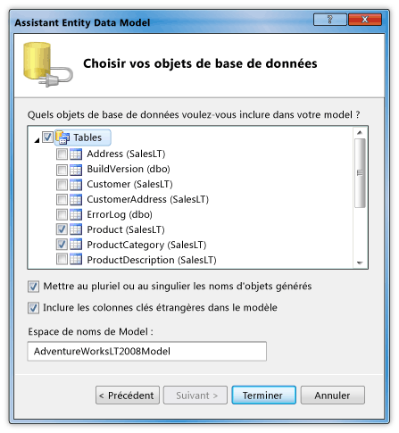
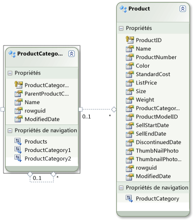

# Proc&#233;dure pas &#224; pas&#160;: affichage de donn&#233;es d&#39;une base de donn&#233;es SQL Server dans un contr&#244;le DataGrid
Dans cette procédure pas à pas, vous extrayez des données d'une base de données SQL Server et affichez ces données dans un contrôle <xref:System.Windows.Controls.DataGrid>.  Vous utilisez ADO.NET Entity Framework pour créer les classes d'entité qui représentent les données et utilisez LINQ pour écrire une requête qui extrait les données spécifiées d'une classe d'entité.  
  
## Composants requis  
 Pour exécuter cette procédure pas à pas, vous devez disposer des composants suivants :  
  
-   [!INCLUDE[vs_dev11_long](../../../../includes/vs-dev11-long-md.md)].  
  
-   Accès à une instance en cours d'exécution de SQL Server ou SQL Server Express à laquelle l'exemple de base de données AdventureWorksLT2008 est attaché.  Vous pouvez télécharger la base de données AdventureWorksLT2008 à partir du [site Web CodePlex \(éventuellement en anglais\)](http://go.microsoft.com/fwlink/?LinkId=159848).  
  
### Pour créer des classes d'entité  
  
1.  Créez un projet d'application WPF en Visual Basic ou C\#, et nommez\-le `DataGridSQLExample`.  
  
2.  Dans l'Explorateur de solutions, cliquez avec le bouton droit sur votre projet, pointez sur **Ajouter**, puis sélectionnez **Nouvel élément**.  
  
     La boîte de dialogue Ajouter un nouvel élément s'affiche.  
  
3.  Dans le volet Modèles installés, sélectionnez **Données**, puis dans la liste de modèles, choisissez **ADO.NET Entity Data Model**.  
  
       
  
4.  Renommez le fichier `AdventureWorksModel.edmx`, puis cliquez sur **Ajouter**.  
  
     L'Assistant Entity Data Model s'affiche.  
  
5.  Dans l'écran Choisir le contenu du Model, sélectionnez **Générer à partir de la base de données**, puis sur **Suivant**.  
  
       
  
6.  Dans l'écran Choisir votre connexion de données, fournissez la connexion à votre base de données AdventureWorksLT2008.  Pour plus d'informations, consultez [Boîte de dialogue Choisir votre connexion de données](http://go.microsoft.com/fwlink/?LinkId=160190).  
  
       
  
7.  Vérifiez que le nom est `AdventureWorksLT2008Entities` et que la case à cocher **Enregistrer les paramètres de connexion de l'entité dans App.Config en tant que** est activée, puis cliquez sur **Suivant**.  
  
8.  Dans l'écran Choisir vos objets de base de données, développez le nœud Tables, puis sélectionnez les tables **Product** et **ProductCategory**.  
  
     Vous pouvez générer des classes d'entité pour toutes les tables ; toutefois, vous extrayez seulement des données de ces deux tables dans cet exemple.  
  
       
  
9. Cliquez sur **Terminer**.  
  
     Les entités Product et ProductCategory sont affichées dans le concepteur d'entités.  
  
       
  
### Pour extraire et présenter les données  
  
1.  Ouvrez le fichier MainWindow.xaml.  
  
2.  Affectez à la propriété <xref:System.Windows.FrameworkElement.Width%2A> sur la <xref:System.Windows.Window> la valeur 450.  
  
3.  Dans l'éditeur XAML, ajoutez la balise <xref:System.Windows.Controls.DataGrid> suivante entre les balises `<Grid>` et `</Grid>` pour ajouter un <xref:System.Windows.Controls.DataGrid> nommé `dataGrid1`.  
  
     [!code-xml[DataGrid_SQL_EF_Walkthrough#3](../../../../samples/snippets/csharp/VS_Snippets_Wpf/DataGrid_SQL_EF_Walkthrough/CS/MainWindow.xaml#3)]  
  
       
  
4.  Sélectionnez la <xref:System.Windows.Window>.  
  
5.  À l'aide de la fenêtre Propriétés ou de l'éditeur XAML, créez un gestionnaire d'événements pour le <xref:System.Windows.Window> nommé `Window_Loaded` qui correspond à l'événement <xref:System.Windows.FrameworkElement.Loaded>.  Pour plus d'informations, consultez [Comment : créer un gestionnaire d'événements simple](http://msdn.microsoft.com/fr-fr/b1456e07-9dec-4354-99cf-18666b64f480).  
  
     Le code XAML correspondant à MainWindow.xaml est présenté ci\-dessous.  
  
    > [!NOTE]
    >  Si vous utilisez Visual Basic, dans la première ligne de MainWindow.xaml, remplacez `x:Class="DataGridSQLExample.MainWindow"` par `x:Class="MainWindow"`.  
  
     [!code-xml[DataGrid_SQL_EF_Walkthrough#1](../../../../samples/snippets/csharp/VS_Snippets_Wpf/DataGrid_SQL_EF_Walkthrough/CS/MainWindow.xaml#1)]  
  
6.  Ouvrez le fichier code\-behind \(MainWindow.xaml.vb ou MainWindow.xaml.cs\) correspondant à <xref:System.Windows.Window>.  
  
7.  Ajoutez le code suivant pour extraire uniquement des valeurs spécifiques des tables jointes et affecter à la propriété <xref:System.Windows.Controls.ItemsControl.ItemsSource%2A> de la <xref:System.Windows.Controls.DataGrid> les résultats de la requête.  
  
     [!code-csharp[DataGrid_SQL_EF_Walkthrough#2](../../../../samples/snippets/csharp/VS_Snippets_Wpf/DataGrid_SQL_EF_Walkthrough/CS/MainWindow.xaml.cs#2)]
     [!code-vb[DataGrid_SQL_EF_Walkthrough#2](../../../../samples/snippets/visualbasic/VS_Snippets_Wpf/DataGrid_SQL_EF_Walkthrough/VB/MainWindow.xaml.vb#2)]  
  
8.  Exécutez l'exemple.  
  
     Un <xref:System.Windows.Controls.DataGrid> présentant des données doit s'afficher.  
  
       
  
## Étapes suivantes  
  
## Voir aussi  
 <xref:System.Windows.Controls.DataGrid>   
 [Comment faire : Démarrer avec Entity Framework dans les applications WPF ?](http://go.microsoft.com/fwlink/?LinkId=159868)