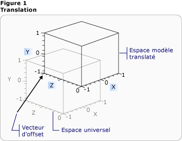
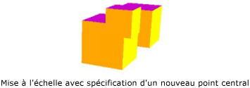
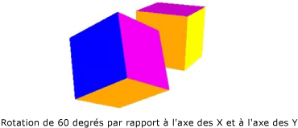

# Vue d'ensemble des transformations 3D
Cette rubrique décrit comment appliquer des transformations à des modèles 3D dans le système graphique [!INCLUDE[TLA#tla_winclient](../../../../includes/tlasharptla-winclient-md.md)]. Les transformations permettent au développeur de repositionner, redimensionner et réorienter des modèles sans modifier les valeurs de base qui les définissent.  

## Espace de coordonnées 3D  
 Contenu graphique 3D [!INCLUDE[TLA#tla_winclient](../../../../includes/tlasharptla-winclient-md.md)] est encapsulé dans un élément, <xref:System.Windows.Controls.Viewport3D>, qui peut participer à la structure de l’élément à deux dimensions. Le système graphique traite Viewport3D comme un élément visuel à deux dimensions comme de nombreux autres éléments dans [!INCLUDE[TLA#tla_winclient](../../../../includes/tlasharptla-winclient-md.md)]. Viewport3D fonctionne comme une fenêtre, ou plus précisément une fenêtre d’affichage, dans une scène 3D. Plus précisément, c’est une surface sur laquelle une scène 3D est projetée.  Bien que vous puissiez utiliser Viewport3D avec d’autres objets de dessin 2D dans le même graphique de scène, vous ne pouvez pas interpénétrer les objets 2D et 3D au sein d’un Viewport3D. Dans la discussion suivante, l’espace de coordonnées décrit est contenu par l’élément Viewport3D.  
  
 Le système de coordonnées [!INCLUDE[TLA#tla_winclient](../../../../includes/tlasharptla-winclient-md.md)] pour les graphiques 2D localise l’origine dans le coin supérieur gauche de la surface de rendu (en général l’écran). Dans le système 2D, les valeurs positives de l’axe des X continuent à droite et les valeurs positives de l’axe des Y positives continuent vers le bas. Dans le système de coordonnées 3D, toutefois, l’origine se trouve dans le centre de l’écran, avec les valeurs positives de l’axe des X continuant à droite mais celles de l’axe des Y continuant vers le haut à la place, alors que les valeurs positives de l’axe des Z continuent vers l’extérieur à partir de l’origine, vers le visionneur.  
  
   
Comparaison du système de coordonnées  
  
 L’espace défini par ces axes est le système de référence stationnaire pour les objets 3D dans [!INCLUDE[TLA#tla_winclient](../../../../includes/tlasharptla-winclient-md.md)]. Lorsque vous générez des modèles dans cet espace et créez des lumières et des caméras pour les consulter, il est utile de distinguer ce frame stationnaire de référence, ou « espace universel » du frame local de référence que vous créez pour chaque modèle lorsque vous lui appliquez des transformations. N’oubliez également pas que les objets dans l’espace universel peuvent sembler entièrement différents, ou ne pas du tout être visibles, en fonction des paramètres de lumière et de caméra, mais que la position de la caméra ne modifie pas l’emplacement des objets dans l’espace universel.  
  
## Transformation de modèles  
 Lorsque vous créez des modèles, ils ont un emplacement particulier dans la scène. Pour déplacer ces modèles dans la scène, pour les faire pivoter ou pour modifier leur taille, il n’est pas pratique de modifier les vertex qui définissent les modèles eux-mêmes. Au lieu de cela, tout comme dans 2D, vous appliquez des transformations aux modèles.  
  
 Chaque objet modèle a une <xref:System.Windows.Media.Media3D.Model3D.Transform%2A> propriété avec laquelle vous pouvez déplacer, réorienter ou redimensionner le modèle. Lorsque vous appliquez une transformation, vous décalez tous les points du modèle par le vecteur ou la valeur que la transformation spécifie. En d’autres termes, vous avez transformé l’espace de coordonnées dans lequel le modèle est défini (« espace de modèle »), mais vous n’avez pas modifié les valeurs qui composent la géométrie du modèle dans le système de coordonnées de la scène entière (« espace universel »).  
  
## Transformations de translation  
 Transformations 3D héritent de la classe de base abstraite <xref:System.Windows.Media.Media3D.Transform3D>; elles incluent les classes de transformation affines <xref:System.Windows.Media.Media3D.TranslateTransform3D>, <xref:System.Windows.Media.Media3D.ScaleTransform3D>, et <xref:System.Windows.Media.Media3D.RotateTransform3D>. Le [!INCLUDE[TLA#tla_winclient](../../../../includes/tlasharptla-winclient-md.md)] système 3D fournit également un <xref:System.Windows.Media.Media3D.MatrixTransform3D> classe qui vous permet de spécifier les mêmes transformations en opérations de matrice plus concises.  
  
 <xref:System.Windows.Media.Media3D.TranslateTransform3D> Déplace tous les points du Model3D dans la direction du vecteur de décalage que vous spécifiez avec la <xref:System.Windows.Media.Media3D.TranslateTransform3D.OffsetX%2A>, <xref:System.Windows.Media.Media3D.TranslateTransform3D.OffsetY%2A>, et <xref:System.Windows.Media.Media3D.TranslateTransform3D.OffsetZ%2A> propriétés. Par exemple, en prenant un vertex d’un cube à (2,2,2), un vecteur de décalage de (0, 1,6, 1) déplacerait ce vertex de (2,2,2) à (2, 3,6, 3). Le vertex du cube est toujours (2,2,2) dans l’espace du modèle, mais désormais l’espace du modèle a modifié sa relation à l’espace universel afin que (2,2,2) dans l’espace du modèle soit (2, 3,6, 3) dans l’espace universel.  
  
   
Translation avec décalage  
  
 Les exemples de code suivants montrent comment appliquer une translation.  
  
 [!code-xaml[animation3dgallery_snip#Translation3DAnimationExampleWholePage](~/samples/snippets/csharp/VS_Snippets_Wpf/Animation3DGallery_snip/CS/Translation3DAnimationExample.xaml#translation3danimationexamplewholepage)]  
  
## Transformations d’échelle  
 <xref:System.Windows.Media.Media3D.ScaleTransform3D> Modifie l’échelle du modèle par un vecteur d’échelle spécifié avec une référence à un point central. Spécifiez une échelle uniforme, qui met à l’échelle du modèle par la même valeur dans les axes X, Y et Z, pour modifier la taille du modèle proportionnellement. Par exemple, la définition de la transformation <xref:System.Windows.Media.ScaleTransform.ScaleX%2A>, <xref:System.Windows.Media.ScaleTransform.ScaleY%2A>, et <xref:System.Windows.Media.Media3D.ScaleTransform3D.ScaleZ%2A> propriétés 0,5 divise par deux la taille du modèle ; définition des mêmes propriétés sur 2 double son échelle dans les trois axes.  
  
   
Exemple de ScaleVector  
  
 En spécifiant une transformation d’échelle non uniforme, une transformation d’échelle dont les valeurs X, Y et Z ne sont pas toutes les mêmes, vous pouvez provoquer l’étirement ou la contraction d’un modèle dans une ou deux dimensions sans affecter les autres. Par exemple, la définition <xref:System.Windows.Media.ScaleTransform.ScaleX%2A> à 1, <xref:System.Windows.Media.ScaleTransform.ScaleY%2A> à 2, et <xref:System.Windows.Media.Media3D.ScaleTransform3D.ScaleZ%2A> 1 provoque le modèle transformé doubler en hauteur mais restent inchangés le long des axes X et Z.  
  
 Par défaut, ScaleTransform3D étire ou contracte les sommets par rapport à l’origine (0,0,0). Si le modèle que vous souhaitez transformer n’est pas dessiné depuis l’origine, cependant, la mise à l’échelle du modèle à partir de l’origine ne fait pas évoluer le modèle « sur place. » Au lieu de cela, lorsque les sommets du modèle sont multipliés par le vecteur d’échelle, l’opération de mise à l’échelle a pour effet de déplacer le modèle en plus de le mettre à l’échelle.  
  
   
Exemple de centre de mise à l’échelle  
  
 Pour faire évoluer un modèle « sur place », spécifiez le centre du modèle en définissant la ScaleTransform3D <xref:System.Windows.Media.ScaleTransform.CenterX%2A>, <xref:System.Windows.Media.ScaleTransform.CenterY%2A>, et <xref:System.Windows.Media.Media3D.ScaleTransform3D.CenterZ%2A> propriétés. Cela garantit que le système graphique met à l’échelle de l’espace du modèle et le traduit vers le centre spécifié <xref:System.Windows.Media.Media3D.Point3D>. À l’inverse, si vous avez généré le modèle par rapport à l’origine et que vous spécifiez un autre point, attendez-vous à ce que le modèle transformé soit déplacé par rapport à l’origine.  
  
## Transformations de rotation  
 Vous pouvez faire pivoter un modèle en 3D de différentes manières. Une rotation classique spécifie un axe et un angle de rotation autour de cet axe. Le <xref:System.Windows.Media.Media3D.RotateTransform3D> classe vous permet de définir un <xref:System.Windows.Media.Media3D.Rotation3D> avec son <xref:System.Windows.Media.Media3D.RotateTransform3D.Rotation%2A> propriété. Vous devez ensuite spécifier <xref:System.Windows.Media.Media3D.AxisAngleRotation3D.Axis%2A> et <xref:System.Windows.Media.Media3D.AxisAngleRotation3D.Angle%2A> propriétés sur la Rotation3D, dans ce cas un <xref:System.Windows.Media.Media3D.AxisAngleRotation3D>, pour définir la transformation. Les exemples suivants font pivoter un modèle de 60 degrés autour de l’axe Y.  
  
 [!code-xaml[animation3dgallery_snip#Rotate3DUsingAxisAngleRotation3DExampleWholePage](~/samples/snippets/csharp/VS_Snippets_Wpf/Animation3DGallery_snip/CS/Rotat3DUsingAxisAngleRotation3DExample.xaml#rotate3dusingaxisanglerotation3dexamplewholepage)]  
  
 Remarque :[!INCLUDE[TLA#tla_winclient](../../../../includes/tlasharptla-winclient-md.md)] 3D est un système droitier, ce qui signifie qu’une valeur d’angle positive pour une rotation entraîne une rotation horaire autour de l’axe.  
  
 Rotations axe / angle considèrent une rotation autour de l’origine si une valeur n’est pas spécifiée pour le <xref:System.Windows.Media.Media3D.RotateTransform3D.CenterX%2A>, <xref:System.Windows.Media.Media3D.RotateTransform3D.CenterY%2A>, et <xref:System.Windows.Media.Media3D.RotateTransform3D.CenterZ%2A> propriétés sur RotateTransform3D. Comme avec la mise à l’échelle, il est utile de garder l’esprit que la rotation transforme l’espace de coordonnées entier du modèle. Si le modèle n’a pas été créé par rapport à l’origine ou a été déplacé précédemment, la rotation peut « pivoter » autour de l’origine au lieu de tourner sur place.  
  
   
Rotation avec nouveau centre spécifié  
  
 Pour faire pivoter le modèle « sur place », spécifiez le centre réel du modèle en tant que centre de la rotation. Étant donné que la géométrie est généralement modelée par rapport à l’origine, vous pouvez généralement obtenir le résultat attendu d’un ensemble de transformations en redimensionnant d’abord le modèle (par mise à l’échelle), puis en définissant son orientation (par rotation) et enfin en le déplaçant vers l’emplacement souhaité (par translation).  
  
   
Exemple de rotation  
  
 Les rotations axe/angle fonctionnent bien pour les transformations statiques et certaines animations. Toutefois, envisagez la rotation d’un modèle de cube à 60 degrés autour de l’axe X, puis de 45 degrés autour de l’axe Z. Vous pouvez décrire cette transformation sous forme de deux transformations affines discrètes ou de matrice. Toutefois, il peut être difficile d’animer une rotation définie de cette façon. Même si les positions de début et de fin du modèle calculées par les deux approches sont les mêmes, les positions intermédiaires prises par le modèle sont incertaines en matière de calcul. Les quaternions représentent une autre façon de calculer l’interpolation entre le début et la fin d’une rotation.  
  
 Un quaternion représente un axe dans un espace 3D et une rotation autour de cet axe. Par exemple, un quaternion peut représenter un axe (1,1,2) et une rotation de 50 degrés. La capacité des quaternions à définir des rotations vient des opérations que vous pouvez effectuer dessus : composition et interpolation. La composition de deux quaternions appliqués à une géométrie signifie « faire pivoter la géométrie autour de l’axe2 par la rotation2, puis la faire pivoter autour de l’axe1 par la rotation1 ». En utilisant la composition, vous pouvez combiner les deux rotations sur la géométrie pour obtenir un seul quaternion qui représente le résultat. Étant donné que l’interpolation de quaternion peut calculer un chemin fluide et raisonnable d’un axe et d’une orientation à l’autre, vous pouvez interpoler de du quaternion d’origine vers le quaternion composé pour effectuer une transition en douceur d’un autre à l’autre, ce qui vous permet d’animer la transformation. Pour les modèles que vous souhaitez animer, vous pouvez spécifier une destination <xref:System.Windows.Media.Media3D.Quaternion> pour la rotation à l’aide un <xref:System.Windows.Media.Media3D.QuaternionRotation3D> pour le <xref:System.Windows.Media.Media3D.RotateTransform3D.Rotation%2A> propriété.  
  
## Utilisation des collections de transformations  
 Lorsque vous générez une scène, il est courant d’appliquer plusieurs transformations à un modèle. Ajouter des transformations à la <xref:System.Windows.Media.Media3D.Transform3DGroup.Children%2A> collection de la <xref:System.Windows.Media.Media3D.Transform3DGroup> classe pour regrouper les transformations aisément à appliquer aux différents modèles dans la scène. Il est souvent utile de réutiliser une transformation dans plusieurs groupes, de la même façon que vous pouvez réutiliser un modèle en appliquant un ensemble de transformations différent à chaque instance. Notez que l’ordre dans lequel les transformations sont ajoutées à la collection est important : les transformations de la collection sont appliquées de la première à la dernière.  
  
## Animation de transformations  
 L’implémentation 3D [!INCLUDE[TLA#tla_winclient](../../../../includes/tlasharptla-winclient-md.md)] participe au même système de minutage et d’animation que les graphiques 2D. En d’autres termes, pour animer une scène 3D, animez les propriétés de ses modèles. Il est possible d’animer directement des propriétés de primitives, mais il est généralement plus facile d’animer des transformations qui modifient la position ou l’apparence de modèles. Étant donné que les transformations peuvent être appliquées aux <xref:System.Windows.Media.Media3D.Model3DGroup> objets, ainsi que des modèles individuels, il est possible d’appliquer un ensemble d’animations à l’enfant d’un Model3Dgroup et un autre ensemble d’animations à un groupe d’objets.  Pour plus d’informations sur le minutage [!INCLUDE[TLA#tla_winclient](../../../../includes/tlasharptla-winclient-md.md)] et le système d’animation, consultez [Vue d'ensemble de l'animation](animation-overview.md) et [Vue d'ensemble des storyboards](storyboards-overview.md).  
  
 Pour animer un objet dans [!INCLUDE[TLA#tla_winclient](../../../../includes/tlasharptla-winclient-md.md)], créez une chronologie, définissez une animation (qui est en fait une modification de valeur de propriété dans le temps) et spécifiez la propriété à laquelle appliquer l’animation. Cette propriété doit être une propriété d’un FrameworkElement. Étant donné que tous les objets dans une scène 3D sont des enfants de Viewport3D, les propriétés ciblées par une animation que vous souhaitez appliquer à la scène sont des propriétés de Viewport3D. Il est important de déterminer le chemin d’accès de la propriété vers l’animation avec précaution, car la syntaxe peut être complexe.  
  
 Supposons que vous souhaitez faire pivoter un objet sur place, mais aussi appliquer un mouvement oscillant pour exposer une plus grande partie de l’objet à afficher. Vous pouvez choisir d’appliquer une RotateTransform3D.RotateTransform3D au modèle et animer son axe de rotation d’un vecteur à un autre. L’exemple de code suivant montre comment appliquer un <xref:System.Windows.Media.Animation.Vector3DAnimation> à la propriété Axis de la Rotation3D de la transformation, en supposant que le RotateTransform3D soit une des multiples transformations appliquées au modèle avec un <xref:System.Windows.Media.TransformGroup>.  
  
 [!code-csharp[3doverview#3DOverview3DN1](~/samples/snippets/csharp/VS_Snippets_Wpf/3DOverview/CSharp/Window1.xaml.cs#3doverview3dn1)]
 [!code-vb[3doverview#3DOverview3DN1](~/samples/snippets/visualbasic/VS_Snippets_Wpf/3DOverview/visualbasic/window1.xaml.vb#3doverview3dn1)]  
  
 [!code-csharp[3doverview#3DOverview3DN3](~/samples/snippets/csharp/VS_Snippets_Wpf/3DOverview/CSharp/Window1.xaml.cs#3doverview3dn3)]
 [!code-vb[3doverview#3DOverview3DN3](~/samples/snippets/visualbasic/VS_Snippets_Wpf/3DOverview/visualbasic/window1.xaml.vb#3doverview3dn3)]  
  
 Utilisez une syntaxe similaire pour cibler d’autres propriétés de transformation pour déplacer ou redimensionner l’objet.  Par exemple, vous pouvez appliquer un <xref:System.Windows.Media.Animation.Point3DAnimation> à la propriété ScaleCenter sur une mise à l’échelle pour entraîner un modèle de forme.  
  
 Bien que les exemples précédents transforment les propriétés de <xref:System.Windows.Media.Media3D.GeometryModel3D>, il est également possible de transformer les propriétés d’autres modèles dans la scène.  En animant des translations appliquées aux objets Light, par exemple, vous pouvez créer des effets de lumière et d’ombre qui peuvent modifier considérablement l’apparence de vos modèles.  
  
 Étant donné que les caméras sont également des modèles, il est aussi possible de transformer les propriétés de la caméra.  Même si vous pouvez tout à fait modifier l’apparence de la scène en transformant les distances sur le plan de la position de la caméra (en transformant ainsi la projection de scène entière), notez que beaucoup d’effets que vous obtenez de cette façon peuvent ne pas paraître aussi « visuellement cohérents » que les transformations appliquées à l’emplacement ou la position des modèles dans la scène.  
  
## Voir aussi

- [Vue d'ensemble des graphiques 3D](3-d-graphics-overview.md)
- [Vue d'ensemble des transformations](transforms-overview.md)
- [Exemple de transformations 2D](https://go.microsoft.com/fwlink/?LinkID=158252)
