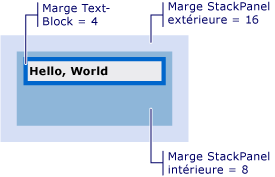

# Comment : obtenir le décalage d'un Visual
Ces exemples montrent comment récupérer la valeur de décalage d’un objet visuel qui est relatif à son parent, ou de n’importe quel ancêtre ou descendant.  
  
## Exemple  
 L’exemple de balise suivant montre un <xref:System.Windows.Controls.TextBlock> qui est défini avec <xref:System.Windows.FrameworkElement.Margin%2A> valeur 4.  
  
 [!code-xaml[VisualSnippets#VisualSnippet1](../../../../samples/snippets/csharp/VS_Snippets_Wpf/VisualSnippets/CSharp/Window1.xaml#visualsnippet1)]  
  
 L’exemple de code suivant montre comment utiliser le <xref:System.Windows.Media.VisualTreeHelper.GetOffset%2A> méthode pour récupérer le décalage de la <xref:System.Windows.Controls.TextBlock>. Les valeurs de décalage sont contenues dans la liste retournée <xref:System.Windows.Vector> valeur.  
  
 [!code-csharp[VisualSnippets#VisualSnippet2](../../../../samples/snippets/csharp/VS_Snippets_Wpf/VisualSnippets/CSharp/Window1.xaml.cs#visualsnippet2)]
 [!code-vb[VisualSnippets#VisualSnippet2](../../../../samples/snippets/visualbasic/VS_Snippets_Wpf/VisualSnippets/visualbasic/window1.xaml.vb#visualsnippet2)]  
  
 L’offset prend en compte la <xref:System.Windows.FrameworkElement.Margin%2A> valeur. Dans ce cas, <xref:System.Windows.Vector.X%2A> est 4, et <xref:System.Windows.Vector.Y%2A> est 4.  
  
 La valeur de décalage renvoyée est par rapport au parent de la <xref:System.Windows.Media.Visual>. Si vous souhaitez retourner une valeur de décalage par rapport au parent de n’est pas un <xref:System.Windows.Media.Visual>, utilisez le <xref:System.Windows.Media.Visual.TransformToAncestor%2A> (méthode).  
  
## Obtention de l’Offset relatif à un ancêtre  
 L’exemple de balise suivant montre un <xref:System.Windows.Controls.TextBlock> qui est imbriqué dans deux <xref:System.Windows.Controls.StackPanel> objets.  
  
 [!code-xaml[VisualSnippets#VisualSnippet7](../../../../samples/snippets/csharp/VS_Snippets_Wpf/VisualSnippets/CSharp/Window2.xaml#visualsnippet7)]  
  
 L’illustration suivante montre les résultats du balisage.  
  
   
TextBlock imbriqué dans deux StackPanels  
  
 L’exemple de code suivant montre comment utiliser le <xref:System.Windows.Media.Visual.TransformToAncestor%2A> méthode pour récupérer le décalage de la <xref:System.Windows.Controls.TextBlock> relatif au conteneur <xref:System.Windows.Window>. Les valeurs de décalage sont contenues dans la liste retournée <xref:System.Windows.Media.GeneralTransform> valeur.  
  
 [!code-csharp[VisualSnippets#VisualSnippet5](../../../../samples/snippets/csharp/VS_Snippets_Wpf/VisualSnippets/CSharp/Window1.xaml.cs#visualsnippet5)]
 [!code-vb[VisualSnippets#VisualSnippet5](../../../../samples/snippets/visualbasic/VS_Snippets_Wpf/VisualSnippets/visualbasic/window1.xaml.vb#visualsnippet5)]  
  
 L’offset prend en compte la <xref:System.Windows.FrameworkElement.Margin%2A> valeurs pour tous les objets dans le conteneur <xref:System.Windows.Window>. Dans ce cas, <xref:System.Windows.Vector.X%2A> 28 (16 + 8 + 4), et <xref:System.Windows.Vector.Y%2A> est 28.  
  
 La valeur de décalage renvoyée est relative à l’ancêtre de la <xref:System.Windows.Media.Visual>. Si vous souhaitez retourner une valeur de décalage relative au descendant d’un <xref:System.Windows.Media.Visual>, utilisez le <xref:System.Windows.Media.Visual.TransformToDescendant%2A> (méthode).  
  
## Obtention de l’Offset par rapport à un Descendant  
 L’exemple de balise suivant montre un <xref:System.Windows.Controls.TextBlock> qui est contenue dans un <xref:System.Windows.Controls.StackPanel> objet.  
  
 [!code-xaml[VisualSnippets#VisualSnippet4](../../../../samples/snippets/csharp/VS_Snippets_Wpf/VisualSnippets/CSharp/Window1.xaml#visualsnippet4)]  
  
 L’exemple de code suivant montre comment utiliser le <xref:System.Windows.Media.Visual.TransformToDescendant%2A> méthode pour récupérer le décalage de la <xref:System.Windows.Controls.StackPanel> par rapport à son enfant <xref:System.Windows.Controls.TextBlock>. Les valeurs de décalage sont contenues dans la liste retournée <xref:System.Windows.Media.GeneralTransform> valeur.  
  
 [!code-csharp[VisualSnippets#VisualSnippet9](../../../../samples/snippets/csharp/VS_Snippets_Wpf/VisualSnippets/CSharp/Window1.xaml.cs#visualsnippet9)]
 [!code-vb[VisualSnippets#VisualSnippet9](../../../../samples/snippets/visualbasic/VS_Snippets_Wpf/VisualSnippets/visualbasic/window1.xaml.vb#visualsnippet9)]  
  
 L’offset prend en compte la <xref:System.Windows.FrameworkElement.Margin%2A> valeurs pour tous les objets. Dans ce cas, <xref:System.Windows.Vector.X%2A> -4, et <xref:System.Windows.Vector.Y%2A> est -4. Les valeurs de décalage sont des valeurs négatives, étant donné que l’objet parent est décalé vers par rapport à son objet enfant.  
  
## Voir aussi  
 <xref:System.Windows.Media.Visual>  
 <xref:System.Windows.Media.VisualTreeHelper>  
 [Vue d’ensemble du rendu graphique de WPF](../../../../docs/framework/wpf/graphics-multimedia/wpf-graphics-rendering-overview.md)
