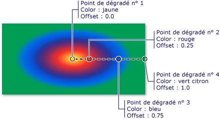

# Comment : peindre une zone avec un dégradé radial
Cet exemple montre comment utiliser la <xref:System.Windows.Media.RadialGradientBrush> classe pour peindre une zone avec un dégradé radial.  
  
## Exemple  
 L’exemple suivant utilise un <xref:System.Windows.Media.RadialGradientBrush> pour peindre un rectangle avec un dégradé radial qui passe du jaune au rouge au bleu au citron vert.  
  
 [!code-csharp[BrushesIntroduction_snip#SimpleRadialGradientExampleWholePage](../../../../samples/snippets/csharp/VS_Snippets_Wpf/BrushesIntroduction_snip/CSharp/RadialGradientBrushSnippet.cs#simpleradialgradientexamplewholepage)]
 [!code-vb[BrushesIntroduction_snip#SimpleRadialGradientExampleWholePage](../../../../samples/snippets/visualbasic/VS_Snippets_Wpf/BrushesIntroduction_snip/visualbasic/radialgradientbrushsnippet.vb#simpleradialgradientexamplewholepage)]
 [!code-xaml[BrushesIntroduction_snip#SimpleRadialGradientExampleWholePage](../../../../samples/snippets/xaml/VS_Snippets_Wpf/BrushesIntroduction_snip/XAML/RadialGradientBrushSnippet.xaml#simpleradialgradientexamplewholepage)]  
  
 L’illustration suivante montre le dégradé de l’exemple précédent. Le nom du dégradé ont été mis en surbrillance.  
  
   
  
> [!NOTE]
>  Les exemples dans cette rubrique utilisent le système de coordonnées par défaut pour la définition de points de contrôle. Le système de coordonnées par défaut est relative à une zone englobante : 0 indique 0 % de la zone englobante, et 1 indique 100 % de la zone englobante. Vous pouvez modifier ce système de coordonnées en définissant le <xref:System.Windows.Media.GradientBrush.MappingMode%2A> valeur à la propriété <xref:System.Windows.Media.BrushMappingMode.Absolute>. Un système de coordonnées absolu n’est pas relatif à un rectangle englobant. Les valeurs sont interprétées directement dans l’espace local.  
  
 Pour plus <xref:System.Windows.Media.RadialGradientBrush> obtenir des exemples, consultez la [pinceaux, exemple](http://go.microsoft.com/fwlink/?LinkID=159973). Pour plus d’informations sur les dégradés et les autres types de pinceaux, consultez [peinture avec des couleurs unies et vue d’ensemble des dégradés](../../../../docs/framework/wpf/graphics-multimedia/painting-with-solid-colors-and-gradients-overview.md).
