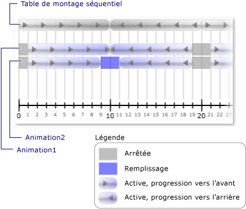

# Comment&#160;: recevoir une notification en cas de changement d&#39;&#233;tat de l&#39;horloge
L'événement <xref:System.Windows.Media.Animation.Clock.CurrentStateInvalidated> d'une horloge se produit lorsque son <xref:System.Windows.Media.Animation.Clock.CurrentState%2A> devient non valide, lorsque l'horloge démarre ou s'arrête, par exemple.  Vous pouvez inscrire directement cet événement en utilisant <xref:System.Windows.Media.Animation.Clock>, ou vous pouvez effectuer cette opération en utilisant <xref:System.Windows.Media.Animation.Timeline>.  
  
 Dans l'exemple suivant, un <xref:System.Windows.Media.Animation.Storyboard> et deux objets <xref:System.Windows.Media.Animation.DoubleAnimation> sont utilisés pour animer la largeur de deux rectangles.  L'événement <xref:System.Windows.Media.Animation.Timeline.CurrentStateInvalidated> est utilisé pour écouter les modifications de l'état de l'horloge.  
  
## Exemple  
 [!code-xml[timingbehaviors_snip#_graphicsmm_StateExampleMarkupWholePage](../../../../samples/snippets/csharp/VS_Snippets_Wpf/timingbehaviors_snip/CSharp/StateExample.xaml#_graphicsmm_stateexamplemarkupwholepage)]  
  
 [!code-csharp[timingbehaviors_snip#_graphicsmm_StateEventHandlers](../../../../samples/snippets/csharp/VS_Snippets_Wpf/timingbehaviors_snip/CSharp/StateExample.xaml.cs#_graphicsmm_stateeventhandlers)]
 [!code-vb[timingbehaviors_snip#_graphicsmm_StateEventHandlers](../../../../samples/snippets/visualbasic/VS_Snippets_Wpf/timingbehaviors_snip/visualbasic/stateexample.xaml.vb#_graphicsmm_stateeventhandlers)]  
  
 L'illustration suivante montre les différents états des animations au cours de l'avancement de la chronologie parente \(*Table de montage séquentiel*\).  
  
   
  
 Le tableau suivant répertorie les moments où l'événement de *Animation1* <xref:System.Windows.Media.Animation.Timeline.CurrentStateInvalidated> se déclenche :  
  
||||||||  
|-|-|-|-|-|-|-|  
|Délai \(secondes\)|1|10|19|21|30|39|  
|État|Active|Active|Arrêté|Active|Active|Arrêté|  
  
 Le tableau suivant répertorie les moments où l'événement de *Animation2* <xref:System.Windows.Media.Animation.Timeline.CurrentStateInvalidated> se déclenche :  
  
||||||||||  
|-|-|-|-|-|-|-|-|-|  
|Délai \(secondes\)|1|9|11|19|21|29|31|39|  
|État|Active|Remplissage|Active|Arrêté|Active|Remplissage|Active|Arrêté|  
  
 Notez que l'événement de *Animation1* <xref:System.Windows.Media.Animation.Timeline.CurrentStateInvalidated> se déclenche dans un délai de 10 secondes bien que son état reste <xref:System.Windows.Media.Animation.ClockState>.  Cela s'explique par le fait que son état a changé dans un délai de 10 secondes, mais il est passé de <xref:System.Windows.Media.Animation.ClockState> à <xref:System.Windows.Media.Animation.ClockState> puis il est repassé à <xref:System.Windows.Media.Animation.ClockState> dans le même battement.