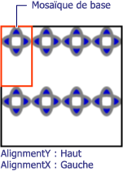
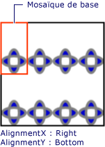

# Comment&#160;: d&#233;finir l&#39;alignement horizontal et vertical d&#39;un TileBrush
Cet exemple montre comment contrôler l'alignement horizontal et vertical du contenu d'une mosaïque.  Pour contrôler l'alignement horizontal et vertical d'un <xref:System.Windows.Media.TileBrush>, utilisez ses propriétés <xref:System.Windows.Media.TileBrush.AlignmentX%2A> et <xref:System.Windows.Media.TileBrush.AlignmentY%2A>.  
  
 Les propriétés <xref:System.Windows.Media.TileBrush.AlignmentX%2A> et <xref:System.Windows.Media.TileBrush.AlignmentY%2A> d'un <xref:System.Windows.Media.TileBrush> sont utilisées lorsque l'une des conditions suivantes est vérifiée :  
  
-   La propriété <xref:System.Windows.Media.TileBrush.Stretch%2A> est <xref:System.Windows.Media.Stretch> ou <xref:System.Windows.Media.Stretch> et le <xref:System.Windows.Media.TileBrush.Viewbox%2A> et le <xref:System.Windows.Media.TileBrush.Viewport%2A> ont des [proportions](GTMT) différentes.  
  
-   La propriété <xref:System.Windows.Media.TileBrush.Stretch%2A> est <xref:System.Windows.Media.Stretch> et le <xref:System.Windows.Media.TileBrush.Viewbox%2A> et le <xref:System.Windows.Media.TileBrush.Viewport%2A> n'ont pas la même taille.  
  
## Exemple  
 L'exemple suivant aligne le contenu d'un <xref:System.Windows.Media.DrawingBrush>, un type de <xref:System.Windows.Media.TileBrush>, dans l'angle supérieur gauche de sa mosaïque.  Pour aligner le contenu, l'exemple affecte la valeur <xref:System.Windows.Media.AlignmentX> à la propriété <xref:System.Windows.Media.TileBrush.AlignmentX%2A> du <xref:System.Windows.Media.DrawingBrush> et la valeur <xref:System.Windows.Media.AlignmentY> à la propriété <xref:System.Windows.Media.TileBrush.AlignmentY%2A>.  Cet exemple génère la sortie suivante.  
  
   
TileBrush avec un contenu aligné dans l'angle supérieur gauche  
  
 [!code-csharp[brushoverviewexamples_snip#TileBrushTopLeftAlignmentInline](../../../../samples/snippets/csharp/VS_Snippets_Wpf/BrushOverviewExamples_snip/CSharp/TileBrushAlignmentExample.cs#tilebrushtopleftalignmentinline)]
 [!code-vb[brushoverviewexamples_snip#TileBrushTopLeftAlignmentInline](../../../../samples/snippets/visualbasic/VS_Snippets_Wpf/BrushOverviewExamples_snip/visualbasic/tilebrushalignmentexample.vb#tilebrushtopleftalignmentinline)]
 [!code-xml[brushoverviewexamples_snip#TileBrushTopLeftAlignmentInline](../../../../samples/snippets/xaml/VS_Snippets_Wpf/BrushOverviewExamples_snip/XAML/TileBrushAlignmentExample.xaml#tilebrushtopleftalignmentinline)]  
  
## Exemple  
 L'exemple suivant aligne le contenu d'un <xref:System.Windows.Media.DrawingBrush> dans l'angle inférieur droit de sa mosaïque en affectant la valeur <xref:System.Windows.Media.AlignmentX> à la propriété <xref:System.Windows.Media.TileBrush.AlignmentX%2A> et la valeur <xref:System.Windows.Media.AlignmentY> à la propriété <xref:System.Windows.Media.TileBrush.AlignmentY%2A>.  Cet exemple donne les résultats suivants.  
  
   
TileBrush avec un contenu aligné dans l'angle inférieur droit  
  
 [!code-csharp[brushoverviewexamples_snip#TileBrushBottomRightAlignmentInline](../../../../samples/snippets/csharp/VS_Snippets_Wpf/BrushOverviewExamples_snip/CSharp/TileBrushAlignmentExample.cs#tilebrushbottomrightalignmentinline)]
 [!code-vb[brushoverviewexamples_snip#TileBrushBottomRightAlignmentInline](../../../../samples/snippets/visualbasic/VS_Snippets_Wpf/BrushOverviewExamples_snip/visualbasic/tilebrushalignmentexample.vb#tilebrushbottomrightalignmentinline)]
 [!code-xml[brushoverviewexamples_snip#TileBrushBottomRightAlignmentInline](../../../../samples/snippets/xaml/VS_Snippets_Wpf/BrushOverviewExamples_snip/XAML/TileBrushAlignmentExample.xaml#tilebrushbottomrightalignmentinline)]  
  
## Exemple  
 L'exemple suivant aligne le contenu d'un <xref:System.Windows.Media.DrawingBrush> dans l'angle supérieur gauche de sa mosaïque en affectant la valeur <xref:System.Windows.Media.AlignmentX> à la propriété <xref:System.Windows.Media.TileBrush.AlignmentX%2A> et la valeur <xref:System.Windows.Media.AlignmentY> à la propriété <xref:System.Windows.Media.TileBrush.AlignmentY%2A>.  Il définit également le <xref:System.Windows.Media.TileBrush.Viewport%2A> et le <xref:System.Windows.Media.TileBrush.TileMode%2A> du <xref:System.Windows.Media.DrawingBrush> pour produire un modèle de mosaïque.  Cet exemple donne les résultats suivants.  
  
   
Modèle de mosaïque avec un contenu aligné dans l'angle supérieur gauche de la mosaïque de base  
  
 L'illustration met en évidence une mosaïque de base afin que vous puissiez voir comment son contenu est aligné.  Notez que le paramètre <xref:System.Windows.Media.TileBrush.AlignmentX%2A> n'a aucun effet car le contenu du <xref:System.Windows.Media.DrawingBrush> remplit horizontalement toute la mosaïque de base.  
  
 [!code-csharp[brushoverviewexamples_snip#TileBrushTopLeftAlignmentTiledInline](../../../../samples/snippets/csharp/VS_Snippets_Wpf/BrushOverviewExamples_snip/CSharp/TileBrushAlignmentExample.cs#tilebrushtopleftalignmenttiledinline)]
 [!code-vb[brushoverviewexamples_snip#TileBrushTopLeftAlignmentTiledInline](../../../../samples/snippets/visualbasic/VS_Snippets_Wpf/BrushOverviewExamples_snip/visualbasic/tilebrushalignmentexample.vb#tilebrushtopleftalignmenttiledinline)]
 [!code-xml[brushoverviewexamples_snip#TileBrushTopLeftAlignmentTiledInline](../../../../samples/snippets/xaml/VS_Snippets_Wpf/BrushOverviewExamples_snip/XAML/TileBrushAlignmentExample.xaml#tilebrushtopleftalignmenttiledinline)]  
  
## Exemple  
 Le dernier exemple aligne le contenu d'un <xref:System.Windows.Media.DrawingBrush> en mosaïque dans l'angle inférieur droit de sa mosaïque de base en affectant la valeur <xref:System.Windows.Media.AlignmentX> à la propriété <xref:System.Windows.Media.TileBrush.AlignmentX%2A> et la valeur <xref:System.Windows.Media.AlignmentY> à la propriété <xref:System.Windows.Media.TileBrush.AlignmentY%2A>.  Cet exemple donne les résultats suivants.  
  
   
Modèle de mosaïque avec un contenu aligné dans l'angle inférieur droit de la mosaïque de base  
  
 Le paramètre <xref:System.Windows.Media.TileBrush.AlignmentX%2A> n'a toujours aucun effet car le contenu du <xref:System.Windows.Media.DrawingBrush> remplit horizontalement toute la mosaïque de base.  
  
 [!code-csharp[brushoverviewexamples_snip#TileBrushBottomRightAlignmentInline](../../../../samples/snippets/csharp/VS_Snippets_Wpf/BrushOverviewExamples_snip/CSharp/TileBrushAlignmentExample.cs#tilebrushbottomrightalignmentinline)]
 [!code-vb[brushoverviewexamples_snip#TileBrushBottomRightAlignmentInline](../../../../samples/snippets/visualbasic/VS_Snippets_Wpf/BrushOverviewExamples_snip/visualbasic/tilebrushalignmentexample.vb#tilebrushbottomrightalignmentinline)]
 [!code-xml[brushoverviewexamples_snip#TileBrushBottomRightAlignmentInline](../../../../samples/snippets/xaml/VS_Snippets_Wpf/BrushOverviewExamples_snip/XAML/TileBrushAlignmentExample.xaml#tilebrushbottomrightalignmentinline)]  
  
 Les exemples utilisent des objets <xref:System.Windows.Media.DrawingBrush> pour montrer comment sont utilisées les propriétés <xref:System.Windows.Media.TileBrush.AlignmentX%2A> et <xref:System.Windows.Media.TileBrush.AlignmentY%2A>.  Ces propriétés se comportent de la même manière pour tous les pinceaux mosaïque : <xref:System.Windows.Media.DrawingBrush>, <xref:System.Windows.Media.ImageBrush> et <xref:System.Windows.Media.VisualBrush>.  Pour plus d'informations sur les pinceaux mosaïque, consultez [Peinture avec des objets d'image, de dessin et visuels](../../../../docs/framework/wpf/graphics-multimedia/painting-with-images-drawings-and-visuals.md).  
  
## Voir aussi  
 <xref:System.Windows.Media.DrawingBrush>   
 <xref:System.Windows.Media.ImageBrush>   
 <xref:System.Windows.Media.VisualBrush>   
 [Peinture avec des objets d'image, de dessin et visuels](../../../../docs/framework/wpf/graphics-multimedia/painting-with-images-drawings-and-visuals.md)