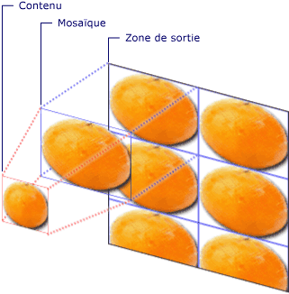
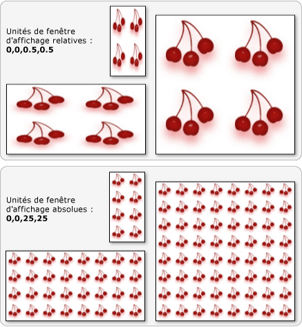

# Vue d&#39;ensemble de TileBrush
Les objets <xref:System.Windows.Media.TileBrush> vous offrent de nombreux outils pour contrôler la peinture d'une zone à l'aide d'une image, d'un <xref:System.Windows.Media.Drawing> ou d'un <xref:System.Windows.Media.Visual>.  Cette rubrique décrit comment utiliser les fonctionnalités de <xref:System.Windows.Media.TileBrush> pour mieux contrôler la façon de peindre une zone avec <xref:System.Windows.Media.ImageBrush>, <xref:System.Windows.Media.DrawingBrush> ou <xref:System.Windows.Media.VisualBrush>.  
  
 [!INCLUDE[autoOutline](../Token/autoOutline_md.md)]  
  
   
## Composants requis  
 Pour aborder cette rubrique, il est important de comprendre comment utiliser les fonctionnalités de base de la classe <xref:System.Windows.Media.ImageBrush>, <xref:System.Windows.Media.DrawingBrush> ou <xref:System.Windows.Media.VisualBrush>.  Pour une introduction à ces types, consultez [Peinture avec des objets d'image, de dessin et visuels](../../../../docs/framework/wpf/graphics-multimedia/painting-with-images-drawings-and-visuals.md).  
  
   
## Peinture d'une zone avec des mosaïques  
 <xref:System.Windows.Media.ImageBrush>, <xref:System.Windows.Media.DrawingBrush> ou <xref:System.Windows.Media.VisualBrush> sont des types d'objets <xref:System.Windows.Media.TileBrush>.  Les pinceaux mosaïque vous permettent de bien contrôler la peinture d'une zone à l'aide d'une image, d'un dessin ou d'un visuel.  Par exemple, au lieu de simplement peindre une zone à l'aide d'une seule image étendue, vous pouvez utiliser une série de mosaïques d'images qui créent un motif.  
  
 La peinture d'une zone à l'aide d'un pinceau mosaïque fait appel à trois composants : le contenu, la mosaïque de base et la zone de sortie.  
  
   
Composants d'un TileBrush avec une seule mosaïque  
  
   
Composants d'un TileBrush avec un TileMode de Tile  
  
 La zone de sortie correspond à la zone en cours de peinture, telle que le <xref:System.Windows.Shapes.Shape.Fill%2A> d'une <xref:System.Windows.Shapes.Ellipse> ou l' <xref:System.Windows.Controls.Control.Background%2A> d'un <xref:System.Windows.Controls.Button>.  Les sections suivantes décrivent les deux autres composants d'un <xref:System.Windows.Media.TileBrush>.  
  
   
## Contenu d'un pinceau  
 Il existe trois différents types de <xref:System.Windows.Media.TileBrush>, qui peignent chacun avec un type de contenu différent.  
  
-   Si le pinceau est un <xref:System.Windows.Media.ImageBrush>, ce contenu est une image. La propriété <xref:System.Windows.Media.ImageBrush.ImageSource%2A> spécifie le contenu de l'<xref:System.Windows.Media.ImageBrush>.  
  
-   Si le pinceau est un <xref:System.Windows.Media.DrawingBrush>, ce contenu est un dessin.  La propriété <xref:System.Windows.Media.DrawingBrush.Drawing%2A> spécifie le contenu du <xref:System.Windows.Media.DrawingBrush>.  
  
-   Si le pinceau est un <xref:System.Windows.Media.VisualBrush>, ce contenu est un visuel.  La propriété <xref:System.Windows.Media.VisualBrush.Visual%2A> spécifie le contenu du <xref:System.Windows.Media.VisualBrush>.  
  
 Vous pouvez spécifier la position et les dimensions du contenu de <xref:System.Windows.Media.TileBrush> à l'aide de la propriété <xref:System.Windows.Media.TileBrush.Viewbox%2A>, bien qu'il soit courant de conserver la valeur par défaut de <xref:System.Windows.Media.TileBrush.Viewbox%2A>.  Par défaut, <xref:System.Windows.Media.TileBrush.Viewbox%2A> est configuré de manière à englober intégralement le contenu du pinceau.  Pour plus d'informations sur la configuration de <xref:System.Windows.Controls.Viewbox>, consultez la page de propriétés de <xref:System.Windows.Controls.Viewbox>.  
  
   
## La mosaïque de base  
 Un <xref:System.Windows.Media.TileBrush> projette son contenu sur une mosaïque de base.  La propriété <xref:System.Windows.Media.TileBrush.Stretch%2A> contrôle la manière dont le contenu de <xref:System.Windows.Media.TileBrush> est étiré pour remplir la mosaïque de base.  La propriété <xref:System.Windows.Media.TileBrush.Stretch%2A> accepte les valeurs suivantes, qui sont définies par l'énumération <xref:System.Windows.Media.Stretch> :  
  
-   <xref:System.Windows.Media.Stretch>: Le contenu du pinceau n'est pas étiré pour remplir la mosaïque.  
  
-   <xref:System.Windows.Media.Stretch> : le contenu du pinceau est mis à l'échelle pour s'ajuster à la mosaïque.  Comme la hauteur et la largeur du contenu sont mises à l'échelle indépendamment, les proportions d'origine du contenu ne sont pas nécessairement conservées.  Autrement dit, le contenu du pinceau peut être retracé pour remplir complètement la mosaïque de sortie.  
  
-   <xref:System.Windows.Media.Stretch> : le contenu du pinceau est mis à l'échelle de manière à s'ajuster complètement à la mosaïque.  Les proportions du contenu sont conservées.  
  
-   <xref:System.Windows.Media.Stretch> : le contenu du pinceau est mis à l'échelle de manière à remplir complètement la zone de sortie mais conserve ses proportions d'origine.  
  
 L'illustration suivante montre les différents paramètres <xref:System.Windows.Media.TileBrush.Stretch%2A>.  
  
   
  
 Dans l'exemple suivant, le contenu d'un <xref:System.Windows.Media.ImageBrush> est défini afin qu'il ne soit pas étiré de manière à remplir la zone de sortie.  
  
 [!code-xml[BrushOverviewExamples_snip#GraphicsMMNoStretchExample](../../../../samples/snippets/xaml/VS_Snippets_Wpf/BrushOverviewExamples_snip/XAML/StretchExample.xaml#graphicsmmnostretchexample)]  
  
 [!code-csharp[BrushOverviewExamples_procedural_snip#GraphicsMMNoStretchExample](../../../../samples/snippets/csharp/VS_Snippets_Wpf/BrushOverviewExamples_procedural_snip/CSharp/StretchExample.cs#graphicsmmnostretchexample)]
 [!code-vb[BrushOverviewExamples_procedural_snip#GraphicsMMNoStretchExample](../../../../samples/snippets/visualbasic/VS_Snippets_Wpf/BrushOverviewExamples_procedural_snip/visualbasic/stretchexample.vb#graphicsmmnostretchexample)]  
  
 Par défaut, un <xref:System.Windows.Media.TileBrush> génère une seule mosaïque \(la mosaïque de base\) et étire cette mosaïque afin qu'elle remplisse entièrement la zone de sortie.  Vous pouvez modifier la taille et la position de la mosaïque de base en définissant les propriétés <xref:System.Windows.Media.TileBrush.Viewport%2A> et <xref:System.Windows.Media.TileBrush.ViewportUnits%2A>.  
  
   
### Taille de la mosaïque de base  
 La propriété <xref:System.Windows.Media.TileBrush.Viewport%2A> détermine si la taille et la position de la mosaïque de base, et la propriété <xref:System.Windows.Media.TileBrush.ViewportUnits%2A> détermine si <xref:System.Windows.Media.TileBrush.Viewport%2A> est spécifié à l'aide de coordonnées absolues ou relatives.  Si les coordonnées sont relatives, elles le sont par rapport à la taille de la zone de sortie.  Le point \(0,0\) représente l'angle supérieur gauche de la zone de sortie, et \(1,1\) en représente l'angle inférieur droit.  Pour spécifier que la propriété <xref:System.Windows.Media.TileBrush.Viewport%2A> utilise des coordonnées absolues, attribuez la valeur <xref:System.Windows.Media.BrushMappingMode> à la propriété <xref:System.Windows.Media.TileBrush.ViewportUnits%2A>.  
  
 L'illustration suivante montre la différence de résultat selon que vous définissez la propriété <xref:System.Windows.Media.TileBrush.ViewportUnits%2A> d'un <xref:System.Windows.Media.TileBrush> comme étant relative ou absolue.  Remarquez que chaque illustration représente un modèle en mosaïque ; la section suivante explique comment spécifier un tel modèle.  
  
   
  
 Dans l'exemple suivant, une image est utilisée pour créer une mosaïque qui a une largeur et une hauteur de 50 %.  La mosaïque de base se trouve à \(0,0\) de la zone de sortie.  
  
 [!code-xml[BrushOverviewExamples_snip#GraphicsMMRelativeViewportUnitsExample1](../../../../samples/snippets/xaml/VS_Snippets_Wpf/BrushOverviewExamples_snip/XAML/TileSizeExample.xaml#graphicsmmrelativeviewportunitsexample1)]  
  
 [!code-csharp[BrushOverviewExamples_procedural_snip#GraphicsMMRelativeViewportUnitsExample1](../../../../samples/snippets/csharp/VS_Snippets_Wpf/BrushOverviewExamples_procedural_snip/CSharp/TileSizeExample.cs#graphicsmmrelativeviewportunitsexample1)]
 [!code-vb[BrushOverviewExamples_procedural_snip#GraphicsMMRelativeViewportUnitsExample1](../../../../samples/snippets/visualbasic/VS_Snippets_Wpf/BrushOverviewExamples_procedural_snip/visualbasic/tilesizeexample.vb#graphicsmmrelativeviewportunitsexample1)]  
  
 Dans l'exemple suivant, la valeur définie pour les mosaïques <xref:System.Windows.Media.ImageBrush> est de 25 par 25 [pixels indépendants du périphérique](GTMT).  Comme les <xref:System.Windows.Media.TileBrush.ViewportUnits%2A> sont définies comme absolues, les mosaïques <xref:System.Windows.Media.ImageBrush> sont toujours de 25 sur 25 pixels, quelle que soit la taille de la zone peinte.  
  
 [!code-xml[BrushOverviewExamples_snip#GraphicsMMAbsoluteViewportUnitsExample1](../../../../samples/snippets/xaml/VS_Snippets_Wpf/BrushOverviewExamples_snip/XAML/TileSizeExample.xaml#graphicsmmabsoluteviewportunitsexample1)]  
  
 [!code-csharp[BrushOverviewExamples_procedural_snip#GraphicsMMAbsoluteViewportUnitsExample1](../../../../samples/snippets/csharp/VS_Snippets_Wpf/BrushOverviewExamples_procedural_snip/CSharp/TileSizeExample.cs#graphicsmmabsoluteviewportunitsexample1)]
 [!code-vb[BrushOverviewExamples_procedural_snip#GraphicsMMAbsoluteViewportUnitsExample1](../../../../samples/snippets/visualbasic/VS_Snippets_Wpf/BrushOverviewExamples_procedural_snip/visualbasic/tilesizeexample.vb#graphicsmmabsoluteviewportunitsexample1)]  
  
   
### Comportement des mosaïques  
 <xref:System.Windows.Media.TileBrush> produit un modèle en mosaïque lorsque sa mosaïque de base ne remplit pas entièrement la zone de sortie et qu'un mode de mosaïque autre que <xref:System.Windows.Media.TileMode> est spécifié.  Lorsque le résultat d'un pinceau mosaïque ne remplit pas complètement la zone de sortie, sa propriété <xref:System.Windows.Media.TileBrush.TileMode%2A> spécifie si la mosaïque de base doit être reproduite pour effectuer ce remplissage et, si tel est le cas, comment effectuer la reproduction.  La propriété <xref:System.Windows.Media.TileBrush.TileMode%2A> accepte les valeurs suivantes, qui sont définies par l'énumération <xref:System.Windows.Media.TileMode> :  
  
-   <xref:System.Windows.Media.TileMode> : seule la mosaïque de base est dessinée.  
  
-   <xref:System.Windows.Media.TileMode> : la mosaïque de base est dessinée et la zone restante est remplie par reproduction de la mosaïque de base de telle sorte que le bord droit d'une mosaïque soit adjacent au bord gauche de la suivante, le même principe étant appliqué aux bords du haut et du bas.  
  
-   <xref:System.Windows.Media.TileMode> : identique à <xref:System.Windows.Media.TileMode>, à cette différence près que les autres colonnes de mosaïques sont retournées horizontalement.  
  
-   <xref:System.Windows.Media.TileMode> : identique à <xref:System.Windows.Media.TileMode> à cette différence près que les autres rangées de mosaïques sont retournées verticalement.  
  
-   <xref:System.Windows.Media.TileMode> : combinaison de <xref:System.Windows.Media.TileMode> et <xref:System.Windows.Media.TileMode>.  
  
 L'illustration suivante montre les différents modes de mosaïque.  
  
   
  
 Dans l'exemple suivant, une image est utilisée pour peindre un rectangle de 100 pixels de large sur 100 pixels de haut.  Les valeurs définies pour <xref:System.Windows.Media.TileBrush.Viewport%2A> étant 0,0,0.25,0.25, la mosaïque de base du pinceau est égale à 1\/4 de la zone de sortie.  La propriété <xref:System.Windows.Media.TileBrush.TileMode%2A> du pinceau a la valeur <xref:System.Windows.Media.TileMode>.  afin qu'il remplisse le rectangle de lignes de mosaïques.  
  
 [!code-xml[BrushOverviewExamples_snip#GraphicsMMFlipXYExample](../../../../samples/snippets/xaml/VS_Snippets_Wpf/BrushOverviewExamples_snip/XAML/TilingExample.xaml#graphicsmmflipxyexample)]  
  
 [!code-csharp[BrushOverviewExamples_procedural_snip#GraphicsMMFlipXYExample](../../../../samples/snippets/csharp/VS_Snippets_Wpf/BrushOverviewExamples_procedural_snip/CSharp/TilingExample.cs#graphicsmmflipxyexample)]
 [!code-vb[BrushOverviewExamples_procedural_snip#GraphicsMMFlipXYExample](../../../../samples/snippets/visualbasic/VS_Snippets_Wpf/BrushOverviewExamples_procedural_snip/visualbasic/tilingexample.vb#graphicsmmflipxyexample)]  
  
## Voir aussi  
 <xref:System.Windows.Media.ImageBrush>   
 <xref:System.Windows.Media.DrawingBrush>   
 <xref:System.Windows.Media.VisualBrush>   
 <xref:System.Windows.Media.TileBrush>   
 [Peinture avec des objets d'image, de dessin et visuels](../../../../docs/framework/wpf/graphics-multimedia/painting-with-images-drawings-and-visuals.md)   
 [Rubriques Comment](../../../../docs/framework/wpf/graphics-multimedia/brushes-how-to-topics.md)   
 [Vue d'ensemble des objets Freezable](../../../../docs/framework/wpf/advanced/freezable-objects-overview.md)   
 [ImageBrush, exemple \(page éventuellement en anglais\)](http://go.microsoft.com/fwlink/?LinkID=160005)   
 [VisualBrush, exemple \(page éventuellement en anglais\)](http://go.microsoft.com/fwlink/?LinkID=160049)