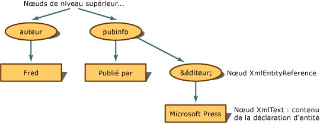

# <a name="entity-references-are-preserved"></a>Conservation des références d'entité
Une fois que la référence d’entité n’est pas développée, mais préservée, le modèle d’objet Document (DOM) XML crée un **XmlEntityReference** nœud lorsqu’il rencontre une référence d’entité.  
  
 À l'aide du code XML suivant,  
  
```xml  
<author>Fred</author>  
<pubinfo>Published by &publisher;</pubinfo>  
```  
  
 le DOM crée un **XmlEntityReference** nœud lorsqu’il rencontre le `&publisher;` référence. Le **XmlEntityReference** contient des nœuds enfants copiés à partir du contenu dans la déclaration d’entité. L’exemple de code précédent contient du texte dans la déclaration d’entité, par conséquent, un **XmlText** nœud est créé en tant que le nœud enfant du nœud de référence d’entité.  
  
   
Structure d’arborescence avec références d’entité préservées  
  
 Les nœuds enfants de la **XmlEntityReference** sont des nœuds créés à partir de copies de tous les enfants du **XmlEntity** nœud lors de la déclaration d’entité a été rencontrée.  
  
> [!NOTE]
>  Les nœuds copiés à partir de la **XmlEntity** ne sont pas toujours des copies exactes une fois placés sous le nœud de référence d’entité. Il peut y avoir des espaces de noms qui sont dans la portée au niveau du nœud de référence d'entité et qui ont une incidence sur la configuration finale des nœuds enfants.  
  
 Par défaut, des entités générales telles que `&abc;` sont conservés et **XmlEntityReference** nœuds toujours créés.  
  
## <a name="see-also"></a>Voir aussi  
 [Document Object Model (DOM) XML](../../../../docs/standard/data/xml/xml-document-object-model-dom.md)
