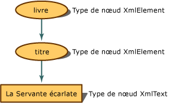

# <a name="mapping-the-object-hierarchy-to-xml-data"></a>Mappage de la hiérarchie d'objets à des données XML
Quand un document XML est en mémoire, sa représentation conceptuelle est une arborescence. Pour la programmation, vous disposez d'une hiérarchie d'objets pour accéder aux nœuds de l'arborescence. L'exemple suivant illustre la manière dont le contenu XML se transforme en nœuds.  
  
 Lorsque le contenu XML est lu dans le DOM (Document Object Model) XML, ses fragments sont convertis en nœuds, et ces nœuds conservent des métadonnées supplémentaires à leur propre sujet, telles que leur type de nœud et leurs valeurs. Le type de nœud est son objet et est l'élément qui détermine les actions pouvant être réalisées ainsi que les propriétés pouvant être définies ou extraites.  
  
 Supposons l'exemple de code XML simple suivant :  
  
 **Entrée**  
  
```xml  
<book>  
    <title>The Handmaid's Tale</title>  
</book>  
```  
  
 L’entrée est représentée dans la mémoire sous la forme de l’arborescence de nœuds suivante, avec la propriété de type de nœud assignée :  
  
   
Représentation sous forme d’arborescence de nœuds book et title  
  
 L'élément `book` devient un objet **XmlElement**, tout comme l'élément suivant `title` devient aussi un objet **XmlElement**, tandis que le contenu de l'élément devient un objet **XmlText**. Si vous examinez les méthodes et propriétés de **XmlElement**, vous constaterez qu'elles sont différentes des méthodes et propriétés disponibles pour un objet **XmlText**. Il est donc vital de connaître le type de nœud dans lequel le balisage XML se transforme, puisque ce type de nœud détermine les actions possibles.  
  
 L'exemple suivant lit dans les données XML et écrit le texte différent, en fonction du type de nœud. En utilisant comme entrée le fichier de données XML **items.xml** :  
  
 **Entrée**  
  
```xml  
<?xml version="1.0"?>  
<!-- This is a sample XML document -->  
<!DOCTYPE Items [<!ENTITY number "123">]>  
<Items>  
  <Item>Test with an entity: &number;</Item>  
  <Item>test with a child element <more/> stuff</Item>  
  <Item>test with a CDATA section <![CDATA[<456>]]> def</Item>  
  <Item>Test with a char entity: A</Item>  
  <!-- Fourteen chars in this element.-->  
  <Item>1234567890ABCD</Item>  
</Items>  
```  
  
 L'exemple de code suivant lit le fichier **items.xml** et affiche des informations pour chaque type de nœud.  
  
```vb  
Imports System  
Imports System.IO  
Imports System.Xml  
  
Public Class Sample  
    Private Const filename As String = "items.xml"  
  
    Public Shared Sub Main()  
  
        Dim reader As XmlTextReader = Nothing  
  
        Try  
            ' Load the reader with the data file and   
            'ignore all white space nodes.   
            reader = New XmlTextReader(filename)  
            reader.WhitespaceHandling = WhitespaceHandling.None  
  
            ' Parse the file and display each of the nodes.  
            While reader.Read()  
                Select Case reader.NodeType  
                    Case XmlNodeType.Element  
                        Console.Write("<{0}>", reader.Name)  
                    Case XmlNodeType.Text  
                        Console.Write(reader.Value)  
                    Case XmlNodeType.CDATA  
                        Console.Write("<![CDATA[{0}]]>", reader.Value)  
                    Case XmlNodeType.ProcessingInstruction  
                        Console.Write("<?{0} {1}?>", reader.Name, reader.Value)  
                    Case XmlNodeType.Comment  
                        Console.Write("<!--{0}-->", reader.Value)  
                    Case XmlNodeType.XmlDeclaration  
                        Console.Write("<?xml version='1.0'?>")  
                    Case XmlNodeType.Document  
                    Case XmlNodeType.DocumentType  
                        Console.Write("<!DOCTYPE {0} [{1}]", reader.Name, reader.Value)  
                    Case XmlNodeType.EntityReference  
                        Console.Write(reader.Name)  
                    Case XmlNodeType.EndElement  
                        Console.Write("</{0}>", reader.Name)  
                End Select  
            End While  
  
        Finally  
            If Not (reader Is Nothing) Then  
                reader.Close()  
            End If  
        End Try  
    End Sub 'Main ' End class  
End Class 'Sample  
```  
  
```csharp  
using System;  
using System.IO;  
using System.Xml;  
  
public class Sample  
{  
    private const String filename = "items.xml";  
  
    public static void Main()  
    {  
        XmlTextReader reader = null;  
  
        try  
        {  
            // Load the reader with the data file and ignore   
            // all white space nodes.  
            reader = new XmlTextReader(filename);  
            reader.WhitespaceHandling = WhitespaceHandling.None;  
  
            // Parse the file and display each of the nodes.  
            while (reader.Read())  
            {  
                switch (reader.NodeType)  
                {  
                    case XmlNodeType.Element:  
                        Console.Write("<{0}>", reader.Name);  
                        break;  
                    case XmlNodeType.Text:  
                        Console.Write(reader.Value);  
                        break;  
                    case XmlNodeType.CDATA:  
                        Console.Write("<![CDATA[{0}]]>", reader.Value);  
                        break;  
                    case XmlNodeType.ProcessingInstruction:  
                        Console.Write("<?{0} {1}?>", reader.Name, reader.Value);  
                        break;  
                    case XmlNodeType.Comment:  
                        Console.Write("<!--{0}-->", reader.Value);  
                        break;  
                    case XmlNodeType.XmlDeclaration:  
                        Console.Write("<?xml version='1.0'?>");  
                        break;  
                    case XmlNodeType.Document:  
                        break;  
                    case XmlNodeType.DocumentType:  
                        Console.Write("<!DOCTYPE {0} [{1}]", reader.Name, reader.Value);  
                        break;  
                    case XmlNodeType.EntityReference:  
                        Console.Write(reader.Name);  
                        break;  
                    case XmlNodeType.EndElement:  
                        Console.Write("</{0}>", reader.Name);  
                        break;  
                }  
            }  
        }  
  
        finally  
        {  
            if (reader != null)  
                reader.Close();  
        }  
    }  
} // End class  
```  
  
 La sortie de cet exemple révèle le mappage des données aux types de nœud.  
  
 **Sortie**  
  
```xml  
<?xml version='1.0'?><!--This is a sample XML document --><!DOCTYPE Items [<!ENTITY number "123">]<Items><Item>Test with an entity: 123</Item><Item>test with a child element <more> stuff</Item><Item>test with a CDATA section <![CDATA[<456>]]> def</Item><Item>Test with a char entity: A</Item><--Fourteen chars in this element.--><Item>1234567890ABCD</Item></Items>  
```  
  
 En prenant l'entrée une ligne à la fois et en utilisant la sortie générée par le code, vous pouvez vous servir du tableau suivant pour analyser quel nœud test a généré quelles lignes de sortie, ce qui vous aidera à déterminer plus clairement quelles données XML se sont transformées en quelle catégorie de types de nœud.  
  
|Entrée|Sortie|Type de nœud test|  
|-----------|------------|--------------------|  
|\<?xml version="1.0"?>|\<?xml version='1.0'?>|XmlNodeType.XmlDeclaration|  
|\<!-- Exemple de document XML -->|\<!--Exemple de document XML -->|XmlNodeType.Comment|  
|\<!DOCTYPE Items [\<!ENTITY number "123">]>|\<!DOCTYPE Items [\<!ENTITY number "123">]|XmlNodeType.DocumentType|  
|\<Items>|\<Items>|XmlNodeType.Element|  
|\<Item>|\<Item>|XmlNodeType.Element|  
|Test with an entity: &number;|Test with an entity: 123|XmlNodeType.Text|  
|\</Item>|\</Item>|XmlNodeType.EndElement|  
|\<Item>|\<Item>|XmNodeType.Element|  
|test with a child element|test with a child element|XmlNodeType.Text|  
|\<more>|\<more>|XmlNodeType.Element|  
|stuff|stuff|XmlNodeType.Text|  
|\</Item>|\</Item>|XmlNodeType.EndElement|  
|\<Item>|\<Item>|XmlNodeType.Element|  
|test with a CDATA section|test with a CDATA section|XmlTest.Text|  
|<![CDATA[\<456>]]\>|<![CDATA[\<456>]]\>|XmlTest.CDATA|  
|def|def|XmlNodeType.Text|  
|\</Item>|\</Item>|XmlNodeType.EndElement|  
|\<Item>|\<Item>|XmlNodeType.Element|  
|Test with a char entity: &\#65;|Test with a char entity: A|XmlNodeType.Text|  
|\</Item>|\</Item>|XmlNodeType.EndElement|  
|\<!-- Quatorze caractères dans cet élément.-->|\<--Quatorze caractères dans cet élément.-->|XmlNodeType.Comment|  
|\<Item>|\<Item>|XmlNodeType.Element|  
|1234567890ABCD|1234567890ABCD|XmlNodeType.Text|  
|\</Item>|\</Item>|XmlNodeType.EndElement|  
|\</Items>|\</Items>|XmlNodeType.EndElement|  
  
 Il est essentiel de savoir quel type de nœud est assigné, puisque le type de nœud régit les actions valides et les types de propriétés qu'il est possible de définir et d'extraire.  
  
 La création de nœuds pour l'espace blanc est contrôlée au moment du chargement des données dans le DOM par l'indicateur **PreserveWhitespace**. Pour plus d'informations, consultez [Gestion des espaces blancs significatifs ou non lors du chargement du DOM](../../../../docs/standard/data/xml/white-space-and-significant-white-space-handling-when-loading-the-dom.md).  
  
 Pour ajouter de nouveaux nœuds au DOM, voir [Insertion de nœuds dans un document XML](../../../../docs/standard/data/xml/inserting-nodes-into-an-xml-document.md). Pour supprimer des nœuds du DOM, voir [Suppression de nœuds, de contenu et de valeurs d'un document XML](../../../../docs/standard/data/xml/removing-nodes-content-and-values-from-an-xml-document.md). Pour modifier le contenu de nœuds dans le DOM, voir [Modification de nœuds, de contenu et de valeurs dans un document XML](../../../../docs/standard/data/xml/modifying-nodes-content-and-values-in-an-xml-document.md).  
  
## <a name="see-also"></a>Voir aussi  
 [DOM (Document Object Model) XML](../../../../docs/standard/data/xml/xml-document-object-model-dom.md)
