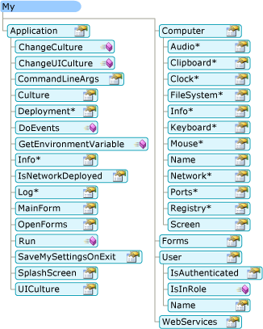

# How My Depends on Project Type (Visual Basic)
[!INCLUDE[vs2017banner](../../../csharp/includes/vs2017banner.md)]

`My` expose uniquement les objets requis par un type de projet particulier.  Par exemple, l'objet `My.Forms` est disponible dans une application Windows Forms et non dans une application console.  Cette rubrique décrit les objets `My` qui sont disponibles dans différents types de projet.  
  
## My dans les applications Windows et les sites Web  
 `My` expose uniquement les objets qui sont utiles dans le type de projet actuel ; il supprime ceux qui sont non applicables.  Par exemple, l'image suivante affiche le modèle d'objet `My` dans un projet Windows Forms.  
  
   
  
 Dans un projet de site Web, `My` expose les objets qui concernent un développeur Web \(tel que les objets `My.Request` et `My.Response`\) en supprimant ceux qui ne le sont pas \(tels que l'objet `My.Forms`\).  L'image suivante affiche le modèle d'objet `My` dans un projet de site Web :  
  
   
  
## Détails du projet  
 Le tableau suivant affiche les objets `My` qui sont activés par défaut pour huit types de projet : application Windows, bibliothèque de classes, application console, bibliothèque de contrôles Windows, bibliothèque de contrôles Web, service Windows, vide et site Web.  
  
 Il existe trois versions de l'objet `My.Application`, deux versions de l'objet `My.Computer` et deux versions de l'objet `My.User`. Les détails de ces versions sont fournis dans les notes de bas de page après le tableau.  
  
||||||||||  
|-|-|-|-|-|-|-|-|-|  
|Objet My|Application Windows|Bibliothèque de classes|Application console|Bibliothèque de contrôles Windows|Bibliothèque de contrôles Web|Service Windows|Vide|Site Web|  
|`My.Application`|**Oui** 1|**Oui** 2|**Oui** 3|**Oui** 2|Non|**Oui** 3|Non|Non|  
|`My.Computer`|**Oui** 4|**Oui** 4|**Oui** 4|**Oui** 4|**Oui** 5|**Oui** 4|Non|**Oui** 5|  
|`My.Forms`|**Oui**|Non|Non|**Oui**|Non|Non|Non|Non|  
|`My.Log`|Non|Non|Non|Non|Non|Non|Non|**Oui**|  
|`My.Request`|Non|Non|Non|Non|Non|Non|Non|**Oui**|  
|`My.Resources`|**Oui**|**Oui**|**Oui**|**Oui**|**Oui**|**Oui**|Non|Non|  
|`My.Response`|Non|Non|Non|Non|Non|Non|Non|**Oui**|  
|`My.Settings`|**Oui**|**Oui**|**Oui**|**Oui**|**Oui**|**Oui**|Non|Non|  
|`My.User`|**Oui** 6|**Oui** 6|**Oui** 6|**Oui** 6|**Oui** 7|**Oui** 6|Non|**Oui** 7|  
|`My.WebServices`|**Oui**|**Oui**|**Oui**|**Oui**|**Oui**|**Oui**|Non|Non|  
  
 1 Version Windows Forms de `My.Application`.  Dérive de la version de la console \(voir Remarque 3\), ajoute une prise en charge pour interagir avec les fenêtres de l'application et fournit le modèle d'application [!INCLUDE[vbprvb](../../../csharp/programming-guide/concepts/linq/includes/vbprvb_md.md)].  
  
 2 Version de bibliothèque de `My.Application`.  Fournit les fonctionnalités de base requises par une application : fournit des membres pour l'écriture dans le journal des applications et l'accès aux informations de cette dernière.  
  
 3 Version de console de `My.Application`.  Dérive de la version de la bibliothèque \(voir Remarque 2\) et ajoute des membres supplémentaires pour accéder aux arguments de ligne de commande de l'application et aux informations de déploiement ClickOnce.  
  
 4 Version Windows de `My.Computer`.  Dérive de la version du serveur \(voir Remarque 5\) et fournit l'accès aux objets utiles d'un ordinateur client, tels que le clavier, l'écran et la souris.  
  
 5 Version du serveur de `My.Computer`.  Fournit des informations de base sur l'ordinateur, tels que le nom, l'accès à l'horloge, etc.  
  
 6 Version Windows de `My.User`.  Cet objet est associé à l'identité actuelle du thread.  
  
 7 Version Web de `My.User`.  Cet objet est associé à l'identité de l'utilisateur de la demande HTTP actuelle de l'application.  
  
## Voir aussi  
 <xref:Microsoft.VisualBasic.ApplicationServices.ApplicationBase>   
 <xref:Microsoft.VisualBasic.Devices.Computer>   
 <xref:Microsoft.VisualBasic.Logging.Log>   
 <xref:Microsoft.VisualBasic.ApplicationServices.User>   
 [Customizing Which Objects are Available in My](../../../visual-basic/developing-apps/customizing-extending-my/customizing-which-objects-are-available-in-my.md)   
 [Conditional Compilation](../../../visual-basic/programming-guide/program-structure/conditional-compilation.md)   
 [\/define](../../../visual-basic/reference/command-line-compiler/define.md)   
 [My.Forms Object](../../../visual-basic/language-reference/objects/my-forms-object.md)   
 [My.Request Object](../../../visual-basic/language-reference/objects/my-request-object.md)   
 [My.Response Object](../../../visual-basic/language-reference/objects/my-response-object.md)   
 [My.WebServices Object](../../../visual-basic/language-reference/objects/my-webservices-object.md)