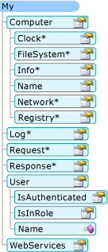

# Comment My dépend du type de projet (Visual Basic)
`My`expose uniquement les objets requis par un type de projet particulier. Par exemple, le `My.Forms` objet est disponible dans une application Windows Forms et non dans une application console. Cette rubrique explique ce qui `My` objets sont disponibles dans différents types de projet.  
  
## Mon Windows dans les Applications et Sites Web  
 `My`expose uniquement les objets qui sont utiles dans le type de projet actuel ; Il supprime les objets qui ne sont pas applicables. Par exemple, l’illustration suivante montre la `My` modèle objet dans un projet Windows Forms.  
  
   
  
 Dans un projet de site Web, `My` expose les objets qui correspondent à un développeur Web (telles que la `My.Request` et `My.Response` objets) lors de la suppression des objets qui ne sont pas pertinents (tels que le `My.Forms` objet). L’illustration suivante montre la `My` modèle objet dans un projet de site Web :  
  
   
  
## Détails du projet  
 Le tableau suivant indique les `My` objets activés par défaut pour huit types de projet : application Windows, bibliothèque de classes, application console, bibliothèque de contrôles Windows, bibliothèque de contrôles Web, service Windows, vide et site Web.  
  
 Il existe trois versions de la `My.Application` (objet), les deux versions de la `My.Computer` objet et les deux versions de `My.User` de l’objet ; plus d’informations sur ces versions sont fournies dans les pieds de page après le tableau.  
  
|My (objet)|Application Windows|Bibliothèque de classes|Application console|Bibliothèque de contrôles Windows|Bibliothèque de contrôles Web|Service Windows|Empty|Site web|  
|---|---|---|---|---|---|---|---|---|  
|`My.Application`|**Oui** 1|**Oui** 2|**Oui** 3|**Oui** 2|Non|**Oui** 3|Non|Non|  
|`My.Computer`|**Oui** 4|**Oui** 4|**Oui** 4|**Oui** 4|**Oui** 5|**Oui** 4|Non|**Oui** 5|  
|`My.Forms`|**Oui**|Non|Non|**Oui**|Non|Non|Non|Non|  
|`My.Log`|Non|Non|Non|Non|Non|Non|Non|**Oui**|  
|`My.Request`|Non|Non|Non|Non|Non|Non|Non|**Oui**|  
|`My.Resources`|**Oui**|**Oui**|**Oui**|**Oui**|**Oui**|**Oui**|Non|Non|  
|`My.Response`|Non|Non|Non|Non|Non|Non|Non|**Oui**|  
|`My.Settings`|**Oui**|**Oui**|**Oui**|**Oui**|**Oui**|**Oui**|Non|Non|  
|`My.User`|**Oui** 6|**Oui** 6|**Oui** 6|**Oui** 6|**Oui** 7|**Oui** 6|Non|**Oui** 7|  
|`My.WebServices`|**Oui**|**Oui**|**Oui**|**Oui**|**Oui**|**Oui**|Non|Non|  
  
 1 version Windows Forms de `My.Application`. Dérive de la version de la console (voir Remarque 3) ; Ajoute la prise en charge pour interagir avec les fenêtres de l’application et fournit le [!INCLUDE[vbprvb](~/includes/vbprvb-md.md)] modèle d’Application.  
  
 2 version de la bibliothèque de `My.Application`. Fournit les fonctionnalités de base requises par une application : fournit des membres pour l’écriture dans le journal des applications et l’accès aux informations de l’application.  
  
 3 version de la console de `My.Application`. Dérive de la version de la bibliothèque (voir Remarque 2), et ajoute des membres supplémentaires pour accéder aux arguments de ligne de commande de l’application et les informations de déploiement ClickOnce.  
  
 4 version Windows de `My.Computer`. Dérive de la version du serveur (voir Remarque 5) et fournit l’accès aux objets utiles sur un ordinateur client, telles que le clavier, écran et la souris.  
  
 5 version du serveur de `My.Computer`. Fournit des informations de base sur l’ordinateur, telles que le nom, l’accès à l’horloge et ainsi de suite.  
  
 6 version Windows de `My.User`. Cet objet est associé à l’identité du thread actuel.  
  
 7 version web de `My.User`. Cet objet est associé à l’identité de la requête HTTP actuelle de l’application.  
  
## Voir aussi  
 <xref:Microsoft.VisualBasic.ApplicationServices.ApplicationBase>  
 <xref:Microsoft.VisualBasic.Devices.Computer>  
 <xref:Microsoft.VisualBasic.Logging.Log>  
 <xref:Microsoft.VisualBasic.ApplicationServices.User>  
 [Personnalisation de la disponibilité ou non des objets dans My](../../../visual-basic/developing-apps/customizing-extending-my/customizing-which-objects-are-available-in-my.md)  
 [Compilation conditionnelle](../../../visual-basic/programming-guide/program-structure/conditional-compilation.md)  
 [/define (Visual Basic)](../../../visual-basic/reference/command-line-compiler/define.md)  
 [My.Forms (objet)](../../../visual-basic/language-reference/objects/my-forms-object.md)  
 [My.Request (objet)](../../../visual-basic/language-reference/objects/my-request-object.md)  
 [My.Response (objet)](../../../visual-basic/language-reference/objects/my-response-object.md)  
 [My.WebServices (objet)](../../../visual-basic/language-reference/objects/my-webservices-object.md)
